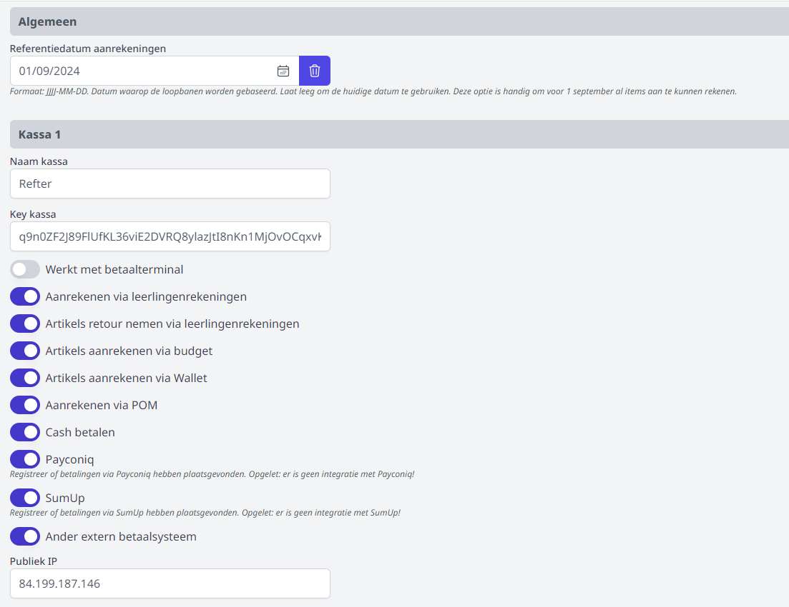

Alvorens met de module Kassa te kunnen starten, dienen de nodige kassa's te worden aangemaakt in de module **Instellingen => Kassa** van de Toolbox. Hiervoor zijn beheersrechten vereist die toegang geven tot deze module. Je kan tot 8 verschillende kassa's instellen. 

### Kassa instellen

**Referentiedatum aanrekeningen** blijft in de meeste gevallen leeg. Deze datum kan ingevuld worden om verkopen te organiseren voor leerlingen die ingeschreven zijn met een datum in de toekomst. Bv. voor het organiseren van een verkoop van turngerief in de zomervakantie voor leerlingen die pas op 1 september officieel zijn ingeschreven in de school. In dit geval vul je bij de referentiedatum 01/09/20** in.

**Naam kassa**: Vul hier een gepaste naam in voor je kassa, bv. cafetaria, schoolwinkel, ...

**Key en Publiek IP** moeten enkel worden ingevuld indien je met een fysieke kassa werkt. Deze gegevens horen bij het specifieke toestel en zal je daar terugvinden. Als je werkt met een pc, laptop of mobiel toestel zoals tablet of smartphone, is het niet nodig om deze gegevens in te vullen.

### Betaalmodaliteiten instellen

**Werkt met betaalterminal**: Deze functie wordt niet meer ondersteund door Toolbox en wordt best op 'nee' gezet. Weldra zal deze keuzemogelijkheid verdwijnen. 

**Aanrekenen of retour nemen via de leerlingenrekeningen**:  De artikelen kunnen via de leerlingenrekeningen worden aangerekend/gecrediteerd door gebruik te maken van de functie 'importeer' in de module leerlingenrekeningen. 

**Artikels aanrekenen via budget** biedt de mogelijkheid om in de kassamodule budgetten aan te maken, bv. voor bepaalde vakken of activiteiten. Wanneer bv. een leerkracht niet specifiek voor een leerling, maar wel voor een vak materiaal ophaalt in het schoolwinkeltje, kan hiervoor de betaalmethode 'budget' gebruikt worden. Deze budgetten kunnen steeds worden opgevolgd in de kassamodule. 

**Artikels aanrekenen via Wallet**: Deze functie werkt enkel in combinatie met de module Wallet in Toolbox. Leerlingen (of hun ouders) en personeelsleden kunnen geld opladen in hun digitale wallet en kunnen hun aankopen hiermee betalen. De wallet werkt in combinatie met een scanapparaat en een unieke barcode per persoon. Meer info over de module Wallet vind je [hier](/wallet).

**Aanrekenen via POM**: Er wordt een QR code gegenereerd die men kan scannen via Payconiq of in de eigen bankapp. POM is echter wel betalend en zal pas functioneel zijn van zodra het contract is geactiveerd. Tarieven raadplegen en activeren kan via https://app.pom.be/nl/connect/koba-toolbox/tarieven. De transactiekost kan indien gewenst via de kassa worden doorgerekend aan de 'klant'. Stel hiervoor helemaal onderaan de 'transactiekost' in. Je kan tot slot ook opgeven dat deze kost vanaf een bepaald aankoopbedrag wegvalt.  

**Cash betalen** biedt de mogelijkheid om aankopen via de kassa met cash geld te betalen. Een verrichting kan gekoppeld worden aan een leerling, maar er kan ook anoniem betaald worden. Dit maakt het mogelijk om ook aan externen te verkopen via de kassa. Voor cash betalingen is er **geen** koppeling met de module Kas voorzien. De kassa zal periodiek geledigd moeten worden. Via de rubriek [Opvolging verkopen](/kassa/gebruik_verwerking/verkopen_opvolgen/) is het mogelijk om voor een bepaalde periode een overzicht van alle cashverrichtingen te genereren. Dit document geldt als verantwoordingsstuk en zal in de module Kas als document aan de verrichting (geld uit de kassa naar de kas) toegevoegd moeten worden. De cashverrichtingen voor een bepaalde periode kunnen in één verrichting als één groot bedrag worden ingegeven. Het is niet nodig om elke verrichting apart in te geven in de module Kas. 

**Payconiq | SumUp | Exern betaalsysteem**: Hiermee registreer je enkel dat de betaling heeft plaatsgevonden via een bepaald systeem. Deze registraties kunnen per betaalmiddel opgevolgd worden in het menu [Opvolging verkopen](/kassa/gebruik_verwerking/verkopen_opvolgen/). Er is echter geen koppeling voorzien met deze externe systemen. 

### Boekhoudkundige parameters
Elke kassa kan via de module Instellingen gekoppeld worden aan een [kas](/kas) uit Toolbox. Zijn er verrichtingen in de kassa die cash betaald worden, dan worden die automatisch ook geregistreerd in de geselecteerde kas. Je kan optioneel ook een standaard grootboekrekening en/of kostendrager ingeven. 

Wanneer de verkoop gekoppeld wordt aan een leerling of leraar, wordt die relatie ook meegenomen naar de kas. In dat geval wordt de grootboekrekening van de kasinstellingen overgenomen voor dat type van relatie (bv. Leerling = 4020000).

Indien POM geactiveerd is als betaalmiddel, is het mogelijk om de transactiekost door te rekenen aan de 'klant'. Dat kan helemaal onderaan ingesteld worden, onder de instellingen voor de 8 mogelijke kassa's. Behalve het bedrag van de transactiekost kan je optioneel ook ingeven vanaf welk aankoopbedrag de transactiekost wegvalt. Wil je geen transactiekosten doorrekenen, dan laat je deze velden gewoon leeg. 

Verder kunnen er een aantal boekhoudkundige parameters ingesteld worden voor het verwerken van de transactiekost naar Exact Online. 

De verkopen die betaald worden via POM zijn niet op naam en kunnen bijgevolg in Exact Online niet geboekt worden op de relatiefiche van de leerling of leraar. Om de POM-verkopen uit de module kassa over te kunnen zetten naar Exact Online, moet er in Exact een fictieve klant (bv. kassa) worden aangemaakt. Alle kassaverkopen die betaald werden via POM, worden bijgevolg op deze klant geboekt. Nadat de klant is aangemaakt in Exact, vul je het klantnummer aan in Toolbox. 

 