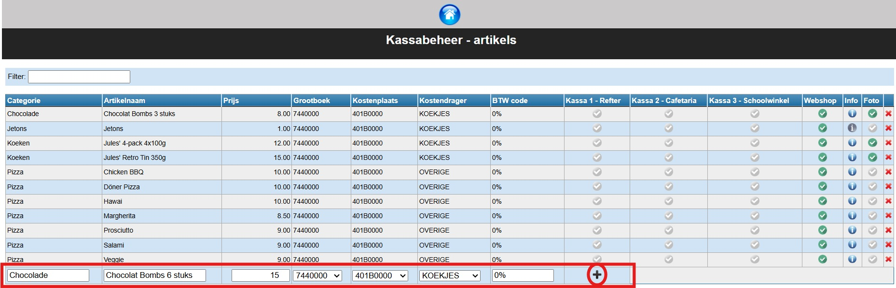

De kassa heeft een eigen artikel beheersysteem. Dit systeem staat los van de leerlingenrekeningen. Als de artikelen worden geïmporteerd in de leerlingenrekeningen zullen de artikelinstellingen steeds worden overgenomen zoals ze in de kassa zijn ingesteld.

Klik op <LegacyAction img="winkelwagen.png" text="Beheer artikels" /> om artikels toe te voegen, te wijzigen of te verwijderen. 

## Artikel toevoegen

Je kan een artikel toevoegen door de gegevens in de onderste (lege) rij te typen. 

Om naderhand gemakkelijk een artikel terug te vinden, worden de artikels gegroepeerd onder zelf te kiezen categorieën (bv. schoolgerief, uniform, broodjes, drank, ...). Deze kunnen eenvoudig worden aangemaakt door in het witte vak van de kolom “Categorie” een zelf te kiezen naam in te typen. Eenmaal je een categorie voor de eerste keer hebt opgegeven, zal je die in de toekomst kunnen selecteren via het dropdown menu.

Op een soortgelijke wijze kan ook een artikelnaam worden opgegeven, een prijs en de boekhoudkundige parameters. De boekhoudkundige parameters worden gekozen vanuit een lijst met gegevens die in het verbonden Exact Online dossier beschikbaar zijn. Dit om ervoor te zorgen dat Exact Online naderhand de factuur zal accepteren en correct kan verwerken.

:::caution
Grootboekrekening, Kostenplaats en Kostendrager zijn verplicht! Vraag de correcte gegevens na bij de boekhouding. 
::: 

Klik  vervolgens op <LegacyAction img="plus.png"/> om de lijn met het artikel aan het beheersysteem toe te voegen.

Duid tot slot aan in welke kassa of webshop het artikel beschikbaar moet zijn. Klik hiervoor op <LegacyAction img="vinkjeGrijsRond.png"/>.  Als het artikel succesvol is gekoppeld aan de kassa dan zal dit symbool groen kleuren .

## Artikel aanpassen

Om een artikel aan te passen dubbelklik je op het te wijzigen vak. Het tekstvak zal weer invulbaar zijn. Klik vervolgens op <LegacyAction img="potlood.png"/> om de wijziging te bewaren. Je kan de wijzing ongedaan maken door te klikken op <LegacyAction img="undo.png"/>. 

## Artikel verwijderen
Om een artikel te verwijderen klik je op <LegacyAction img="remove.png"/> aan het eind van de regel.

 