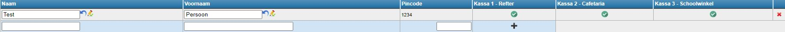

Om een kassa te kunnen gebruiken, moeten de gebruikers worden geregistreerd en krijgen zij een persoonlijke pincode. Op deze wijze is de kassa afgeschermd voor onbevoegde gebruikers. Bovendien zal de naam van de kassier steeds mee worden geregistreerd bij elke verkoop. Het is dus steeds mogelijk om exact te weten wie wat heeft verkocht aan wie en op welk moment.

## Een kassier toevoegen
Klik op <LegacyAction img="kassier.png" text="Beheer kassiers" /> om het beheer van de kassiers te openen.

Vul in de lege velden respectievelijk de naam en de voornaam in van de kassier en kies een pincode.

Klik vervolgens op <LegacyAction img="plus.png"/> om de kassier toe te voegen.

Duid tot slot aan tot welke kassa de kassier rechten heeft. Klik hiervoor op <LegacyAction img="vinkjeGrijsRond.png"/>.  Als de kassier succesvol is gekoppeld aan de kassa dan zal dit symbool groen kleuren .

## Gegevens kassier aanpassen
Om de gegevens van een kassier aan te passen, dubbelklik je op het te wijzigen vak. Het tekstvak zal weer invulbaar zijn. Klik vervolgens op <LegacyAction img="potlood.png"/> om de wijziging te bewaren. Om de wijzing ongedaan te maken, klik je op <LegacyAction img="undo.png"/>. 

## Kassier verwijderen
Om een kassier uit de lijst te verwijderen klik je op <LegacyAction img="remove.png"/> van het eind van de regel.