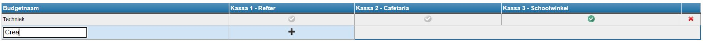

De mogelijkheid bestaat om budgetten aan te maken, bv. voor bepaalde vakken of activiteiten. Wanneer een leerkracht niet specifiek voor een leerling, maar wel bv. voor een vak materiaal ophaalt in het schoolwinkeltje, kan hiervoor de betaalmethode 'budget' gebruikt worden. Deze budgetten kunnen steeds worden opgevolgd in de kassamodule via <LegacyAction img="budget.png" text="Opvolging budgetten" />. Opgelet! Indien items aangerekend moeten worden aan individuele leerlingen of klassen, kies je beter voor de optie 'aanrekenen via leerlingenrekeningen'. 

Ga naar <LegacyAction img="budget.png" text="Beheer budgetten" /> om een budget aan te maken. 

Typ in het lege tekstvak en zelfgekozen budgetnaam en klik op <LegacyAction img="plus.png"/> om toe te voegen.

Duid tot slot aan voor welke kassa('s) het budget beschikbaar moet zijn. Klik hiervoor op <LegacyAction img="vinkjeGrijsRond.png"/>.  Als het budget succesvol is gekoppeld aan de kassa dan zal dit symbool groen kleuren <LegacyAction img="vinkjeGroenRond.png"/>.

Om het budget volledig te verwijderen, klik je achteraan op <LegacyAction img="remove.png"/>.

 