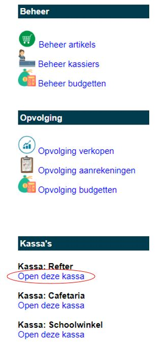
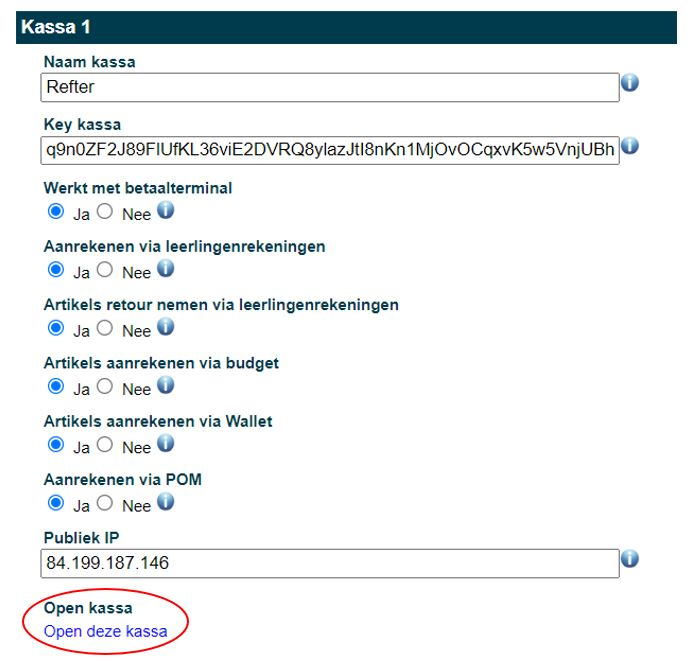
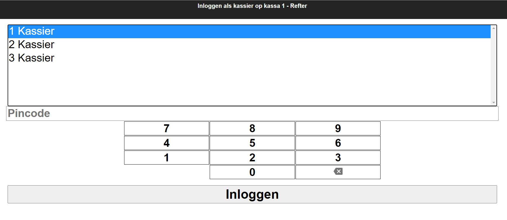
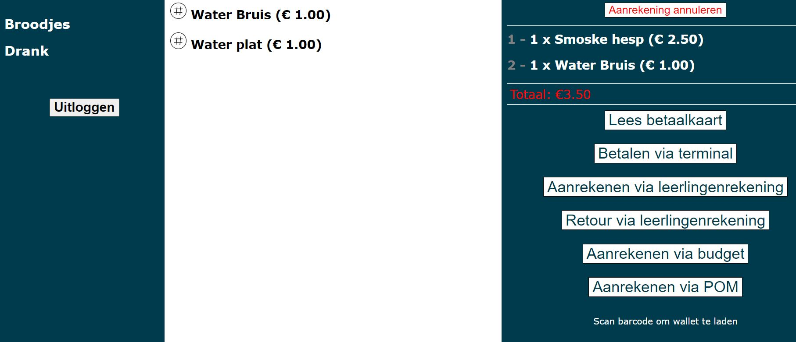

De interface van de kassa is geoptimaliseerd voor het gebruik via een aanraakscherm of een tablet. De interface werkt onafhankelijk van de Toolbox in een apart scherm, waardoor eens de interface is geopend de eindgebruikers geen gebruikers van de Toolbox hoeven te zijn. Een kassa openen kan op verschillende manieren.

## Via de module Kassa

Voor deze module zijn specifieke rechten nodig. Zie ook: [rechten toekennen aan gebruikers](/kassa/opstart_configuratie/rechten_toekennen/). Klik op de kassa die je wil openen.

## Via de module Instellingen Toolbox

Voor deze module zijn beheerdersrechten nodig in Toolbox. 

## Via de link van de kassa

Als je vanuit één van de bovenstaande modules een kassa opent, kan je de hyperlink naar de kassa kopiëren en aan de kassiers bezorgen. Zij hebben geen toegang tot Toolbox of tot de module Kassa nodig om de kassa te kunnen bedienen.

Het volstaat om de link aan te klikken, de kassier te selecteren en in te loggen met behulp van de pincode die is ingesteld bij <LegacyAction img="kassier.png" text="Beheer kassiers" />. 

Vervolgens kan de geselecteerde kassier verkopen registreren. 

