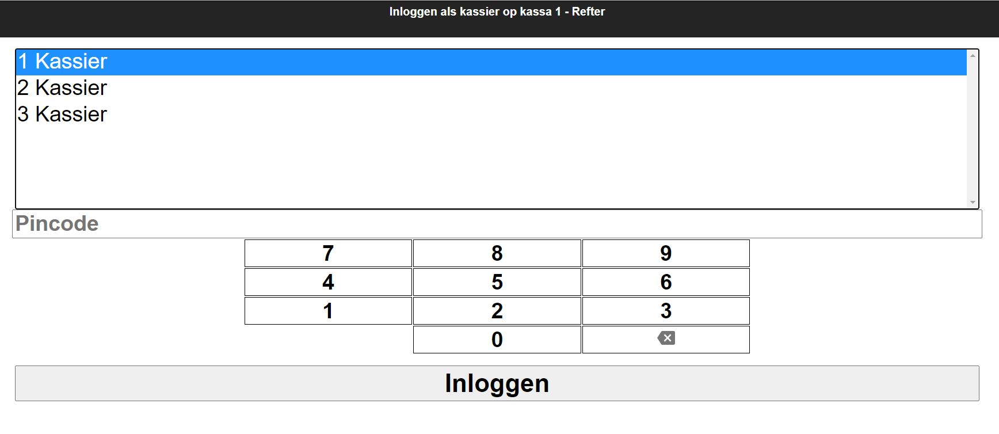
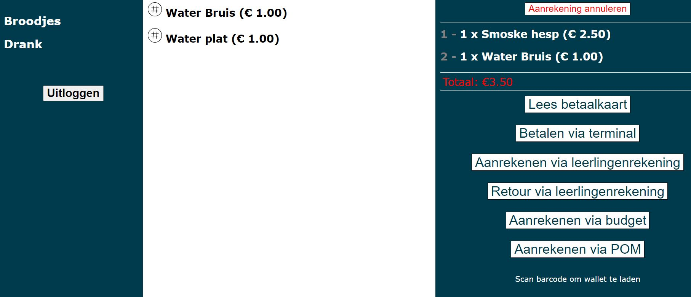
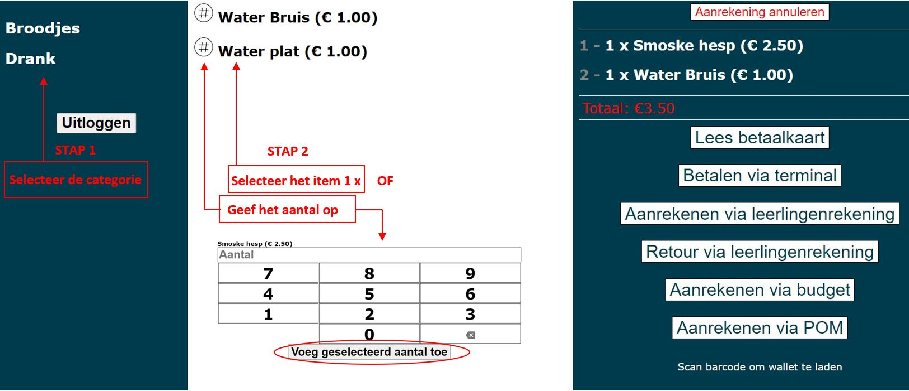
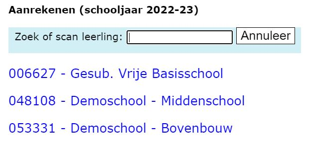
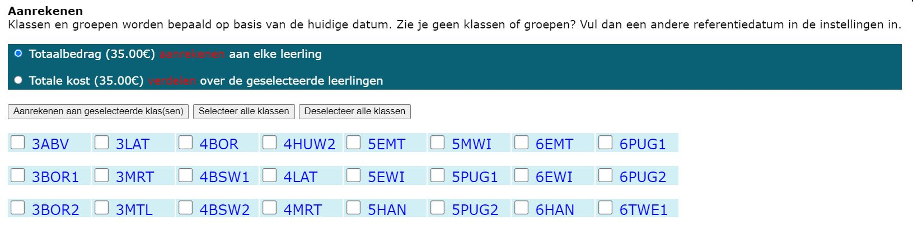
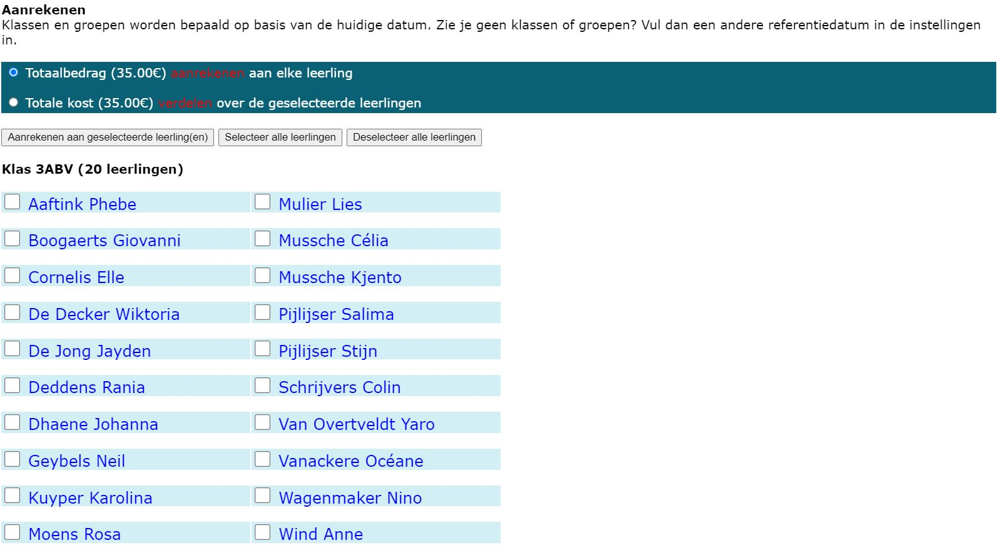

## Inloggen

Eens de kassa is geopend zie je onderstaand scherm. Selecteer hier je naam, toets je pincode in en druk op de balk met “Inloggen”.

Vervolgens opent een scherm dat lijkt op onderstaande. Nu kan je artikels gaan aanrekenen. 

## Artikels aanrekenen

### Stap 1: Selecteer de categorie
Links in beeld staan de categorieën opgesomd waar de artikels in zijn ondergebracht. Druk op een categorie. De onderhavige artikels worden direct in het midden van het scherm getoond. In het bovenstaande scherm is er op 'Drank' gedrukt en kan er vervolgens 'Water Bruis' en 'Water Plat' als artikel worden geselecteerd.

### Stap 2: Selecteer het gewenste artikel
Druk op de naam van het artikel om 1 item aan te rekenen. Klik op <LegacyAction img="aantal.png"/> om meer dan 1 aan te rekenen. Een pop-up scherm verschijnt, waarop het gewenste aantal kan worden opgegeven.

Het gekozen aantal zal worden weergegeven in het vak 'Aantal'. Nadat het aantal is toegevoegd, zal er direct rechts in beeld het aantal worden opgesomd en het totaalbedrag worden berekend. In ons voorbeeld is er 1 smoske hesp en 1 bruiswater opgegeven.

Is er een item teveel opgegeven, dan kan dit eenvoudig worden geschrapt door op het aangerekende artikel rechts op het scherm te klikken. Het artikel zal direct van de lijst worden verwijderd. Moet de hele lijst met artikels gewist worden, druk dan op 'aanrekening annuleren'.

### Stap 3: Selecteer een betaalmethode
Afhankelijk van de ingestelde betaalmodaliteit (in de module Instellingen Toolbox) kan er op verschillende manieren betaald worden. 

- **Betalen via terminal**

Om deze methode te kunnen gebruiken moet de kassa zijn aangesloten op een terminal (kaartlezer) en moet het systeem van de betaalkaarten voor leerlingen actief zijn. Het bedrag van de aanrekening zal direct op het saldo van de betaalkaart in mindering worden gebracht. De aanrekening is logischerwijs altijd individueel en volledig ten laste van de betaalkaarthouder.

- **Aanrekenen of retour via leerlingenrekening** 

Via deze methode zullen de aangerekende artikels worden bijgeschreven op de schoolfactuur. Aangezien het hier een uitgestelde betaling betreft kan er veel flexibeler worden omgegaan met aan wie wordt aangerekend en wanneer de betaling wordt gevorderd. Zo kan er naast de individuele aanrekening ook aan volledige klassen worden aangerekend of een groep personen van een welbepaalde klas.

Nadat er gedrukt is op 'Aanrekenen via leerlingenrekening' verschijnt onderstaande pop-up.

**_a. Aanrekenen aan een individuele leerling_**

Een individuele leerling kan eenvoudig gevonden worden door in het witte tekstvak enkele opeenvolgde karakters uit de naam op te geven. Het systeem zal vervolgens filteren op leerlingen die de opgegeven karaktersequentie in hun naam hebben. Er wordt gezocht op zowel naam als voornaam.

Het is ook mogelijk om een leerling op te geven door een betaalkaart te scannen die is aangemaakt via de module Betaalkaarten van de Toolbox.

**_b. Aanrekenen aan een volledige klas of meerdere leerlingen uit een klas_** 

Om één of meerdere klassen of enkele leerlingen uit een klas te selecteren moet er op de blauwe hyperlink met de naam van de school gedrukt worden. 

Vervolgens krijg je een overzicht van alle klassen die verbonden zijn aan deze school. Bovenaan kan je kiezen of je het totaalbedrag wil aanrekenen aan elke leerling. Elke leerling krijgt in dit geval een aanrekening van 35 euro. Je kan de totale kost van 35 euro ook verdelen over de geselecteerde leerlingen. Achterliggend zal het systeem berekenen hoeveel elke leerling moet betalen. Dit bedrag zal getoond worden op de individuele leerlingenrekening.

Selecteer één of meerdere klassen door ze aan te vinken of gebruik de knoppen bovenaan om alle klassen ineens te (de)selecteren.

Druk tot slot op 'Aanrekenen aan geselecteerde klas(sen)' om de aanrekening te vervolledigen.

Het is ook mogelijk om uit een bepaalde klas één of meerdere leerlingen te selecteren. Druk hiervoor op de gewenste klasnaam (blauwe link) en vink vervolgens de leerlingen aan. Ook hier zullen de geselecteerde leerlingen direct worden toegevoegd als er op 'Aanrekenen aan geselecteerde klas(sen)' wordt gedrukt.

- **Betalen via budget**
Je krijgt een overzicht te zien van de beschikbare budgetten. Klik op het betreffende budget en bevestig met OK. Je kan het budget opvolgen via <LegacyAction img="budget.png" text="Beheer budgetten"/>. 

- **Betalen via POM**
Er wordt een QR code gegenereerd die men kan scannen via Payconiq of in de eigen bankapp. POM is echter wel betalend en zal pas functioneel zijn van zodra het contract is geactiveerd. Tarieven raadplegen en activeren kan via https://app.pom.be/nl/connect/koba-toolbox/tarieven. De transactiekost kan indien gewenst via de kassa worden doorgerekend aan de 'klant'. Dit kan ingesteld worden in de module Instellingen Toolbox. 

- **Betalen via Wallet**
Deze functie werkt enkel in combinatie met de module Wallet in Toolbox. Leerlingen (of hun ouders) en personeelsleden kunnen geld opladen in hun digitale wallet en kunnen hun aankopen hiermee betalen. De wallet werkt ook in combinatie met een scanapparaat en een unieke barcode per persoon. 
