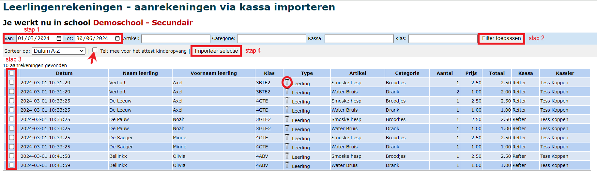

## Inloggen

Eens de kassa is geopend zie je onderstaand scherm. Selecteer hier je naam, toets je pincode in en druk op de balk met “Inloggen”.

Vervolgens opent een scherm dat lijkt op onderstaande. Nu kan je artikels gaan aanrekenen. 

## Artikels aanrekenen

### Stap 1: Selecteer de categorie
Links in beeld staan de categorieën opgesomd waar de artikels in zijn ondergebracht. Druk op een categorie. De onderhavige artikels worden direct in het midden van het scherm getoond. In het bovenstaande scherm is er op 'Drank' gedrukt en kan er vervolgens 'Water Bruis' en 'Water Plat' als artikel worden geselecteerd.

### Stap 2: Selecteer het gewenste artikel
Druk op de naam van het artikel om 1 item aan te rekenen. Klik op <LegacyAction img="aantal.png"/> om meer dan 1 aan te rekenen. Een pop-up scherm verschijnt, waarop het gewenste aantal kan worden opgegeven.

Het gekozen aantal zal worden weergegeven in het vak 'Aantal'. Nadat het aantal is toegevoegd, zal er direct rechts in beeld het aantal worden opgesomd en het totaalbedrag worden berekend. In ons voorbeeld is er 1 smoske hesp en 1 bruiswater opgegeven.

Is er een item teveel opgegeven, dan kan dit eenvoudig worden geschrapt door op het aangerekende artikel rechts op het scherm te klikken. Het artikel zal direct van de lijst worden verwijderd. Moet de hele lijst met artikels gewist worden, druk dan op 'aanrekening annuleren'.

### Stap 3: Selecteer een betaalmethode
Afhankelijk van de ingestelde betaalmodaliteit (in de module Instellingen Toolbox) kan er op verschillende manieren betaald worden. 

#### 1. Aanrekenen of retour via leerlingenrekening

Via deze methode zullen de aangerekende artikels worden bijgeschreven op de schoolfactuur. Aangezien het hier een uitgestelde betaling betreft kan er veel flexibeler worden omgegaan met aan wie wordt aangerekend en wanneer de betaling wordt gevorderd. Zo kan er naast de individuele aanrekening ook aan volledige klassen worden aangerekend of een groep personen van een welbepaalde klas.

Nadat er gedrukt is op 'Aanrekenen via leerlingenrekening' verschijnt onderstaande pop-up.

#### **_a. Aanrekenen aan een individuele leerling_**

Een individuele leerling kan eenvoudig gevonden worden door in het witte tekstvak enkele opeenvolgde karakters uit de naam op te geven. Het systeem zal vervolgens filteren op leerlingen die de opgegeven karaktersequentie in hun naam hebben. Er wordt gezocht op zowel naam als voornaam.

Het is ook mogelijk om een leerling op te geven door een betaalkaart te scannen die is aangemaakt via de module Betaalkaarten van de Toolbox.

#### **_b. Aanrekenen aan een volledige klas of meerdere leerlingen uit een klas_** 

Om één of meerdere klassen of enkele leerlingen uit een klas te selecteren moet er op de blauwe hyperlink met de naam van de school gedrukt worden. 

Vervolgens krijg je een overzicht van alle klassen die verbonden zijn aan deze school. Bovenaan kan je kiezen of je het totaalbedrag wil aanrekenen aan elke leerling. Elke leerling krijgt in dit geval een aanrekening van 35 euro. Je kan de totale kost van 35 euro ook verdelen over de geselecteerde leerlingen. Achterliggend zal het systeem berekenen hoeveel elke leerling moet betalen. Dit bedrag zal getoond worden op de individuele leerlingenrekening.

Selecteer één of meerdere klassen door ze aan te vinken of gebruik de knoppen bovenaan om alle klassen ineens te (de)selecteren.

Druk tot slot op 'Aanrekenen aan geselecteerde klas(sen)' om de aanrekening te vervolledigen.

Het is ook mogelijk om uit een bepaalde klas één of meerdere leerlingen te selecteren. Druk hiervoor op de gewenste klasnaam (blauwe link) en vink vervolgens de leerlingen aan. Ook hier zullen de geselecteerde leerlingen direct worden toegevoegd als er op 'Aanrekenen aan geselecteerde klas(sen)' wordt gedrukt.

#### **_c. Aanrekeningen importeren op de schoolrekening_** 

Aanrekeningen die via deze betaalmethode worden geregistreerd, verschijnen niet automatisch op de schoolrekening. Ze kunnen in de module **Leerlingenrekeningen** via het menu **Importeer** geïmporteerd worden door te klikken op 'Aanrekeningen via de kassa'. Alvorens dit te doen, is het belangrijk om in het startscherm de gewenste school, het gewenste schooljaar en de gewenste notagroep te selecteren. 

- **Stap 1**: Stel de periode in waarvoor je de aanrekeningen wil importeren op de schoolrekening.
- **Stap 2**: Je kan filteren op artikel, categorie, kassa, klas of een combinatie hiervan. Klik achteraan op 'Filter toepassen' om de gefilterde resultaten weer te geven. Indien je alle aanrekeningen van de ingestelde periode ineens wil tonen, stel je geen filters in en klik je meteen achteraan op 'Filter toepassen'. 
- **Stap 3**: Selecteer de aanrekeningen die je wenst te importeren of vink ineens alles aan m.b.v. de bovenste checkbox. 
- **Stap 4**: Klik op 'Importeer selectie'.
- **Stap 5**: Je kan de geïmporteerde aanrekeningen terugvinden bij 'Aanrekenen artikel'. Daar kan je nog aanpassingen doorvoeren indien nodig.

:::caution OPGELET
Aanrekeningen uit de kassa kunnen slechts eenmalig geïmporteerd worden. 
:::

#### 2. Aanrekenen via leerlingenrekening IN BULK
Met behulp van deze betaalmethode kan je in combinatie met een scanapparaat heel snel één artikel of een vaste set aan artikels aanrekenen aan meerdere leerlingen. Een voorbeeld: 's Middags wordt er soep verkocht wordt in de refter. Selecteer in de kassa éénmalig het artikel 'soep' en kies voor 'Aanrekenen via leerlingenrekening in bulk'. Er verschijnt een pop-up waarna je de leerlingenkaarten kan beginnen scannen. Voor elke gescande leerling wordt de portie soep aangerekend via de leerlingenrekening. Er is een controle ingebouwd dat er niet dubbel gescand kan worden. Indien je een leerling een tweede keer probeert te scannen, krijg je de melding dat die leerling reeds gescand is. 

:::caution OPGELET! 
Indien je meerdere artikels tegelijk wil aanrekenen, gaat het steeds om een vaste set aan artikels. M.a.w. deze artikels worden steeds aan alle gescande leerlingen aangerekend. Indien men een keuze kan maken tussen de artikels, kan het aanrekenen in bulk niet gebruikt worden. Dan is de gewone aanrekening via de leerlingenrekeningen beter geschikt. 
:::

Aanrekeningen die via deze betaalmethode worden geregistreerd, verschijnen niet automatisch op de schoolrekening. Klik [hier](/kassa/gebruik_verwerking/bedienen/#c-aanrekeningen-importeren-op-de-schoolrekening) om te lezen hoe je de aanrekeningen importeert in de module Leerlingenrekeningen.

#### 3. Aanrekenen via budget
Je krijgt een overzicht te zien van de beschikbare budgetten. Klik op het betreffende budget en bevestig met OK. Je kan het budget opvolgen via <LegacyAction img="budget.png" text="Beheer budgetten"/>. 

#### 4. Aanrekenen via POM
Er wordt een QR code gegenereerd die men kan scannen via Payconiq of in de eigen bankapp. POM is echter wel betalend en zal pas functioneel zijn van zodra het contract met POM is geactiveerd. Tarieven raadplegen en activeren kan via https://app.pom.be/nl/connect/koba-toolbox/tarieven. De transactiekost kan indien gewenst via de kassa worden doorgerekend aan de 'klant'. Dit kan ingesteld worden in de module **Instellingen => Toolbox**. 

#### 5. Cash betalen
Een verrichting kan gekoppeld worden aan een leerling, maar er kan ook anoniem betaald worden. Dit maakt het mogelijk om ook aan externen te verkopen via de kassa. Het wisselgeld wordt automatisch berekend na het invoeren van het ontvangen bedrag.

Voor cash betalingen is er **geen** koppeling met de module Kas voorzien. De kassa zal periodiek geledigd moeten worden. Via de rubriek [Opvolging verkopen](/kassa/gebruik_verwerking/verkopen_opvolgen/) is het mogelijk om voor een bepaalde periode een overzicht van alle cashverrichtingen te genereren. Dit document geldt als verantwoordingsstuk en zal in de module Kas als document aan de verrichting (geld uit de kassa naar de kas) toegevoegd moeten worden. De cashverrichtingen voor een bepaalde periode kunnen in één verrichting als één groot bedrag worden ingegeven. Het is niet nodig om elke verrichting apart in te geven in de module Kas. 

#### 6. Betaald via Payconiq, SumUp of extern betaalsysteem
Je kan de betaling anoniem registreren of op naam van de leerling. Hiermee registreer je enkel dat de betaling heeft plaatsgevonden via een bepaald systeem. Deze registraties kunnen per betaalmiddel opgevolgd worden in het menu [Opvolging verkopen](/kassa/gebruik_verwerking/verkopen_opvolgen/). Er is echter geen koppeling voorzien met deze externe systemen.

#### 7. Betalen via Wallet
Deze functie werkt enkel in combinatie met de module [Wallet](/wallet) in Toolbox. Leerlingen (of hun ouders) en personeelsleden kunnen geld opladen in hun digitale wallet en kunnen hun aankopen hiermee betalen. De wallet werkt in combinatie met een scanapparaat en een unieke barcode per persoon. Om een aankoop te betalen met de wallet volstaat het om de barcode of QR code te scannen van de leerlingenkaart, identiteitskaart van de leraar of pasje de externe. Het bedrag zal onmiddellijk in mindering worden gebracht. Na de aankoop wordt het beschikbare saldo op de wallet getoond. 

