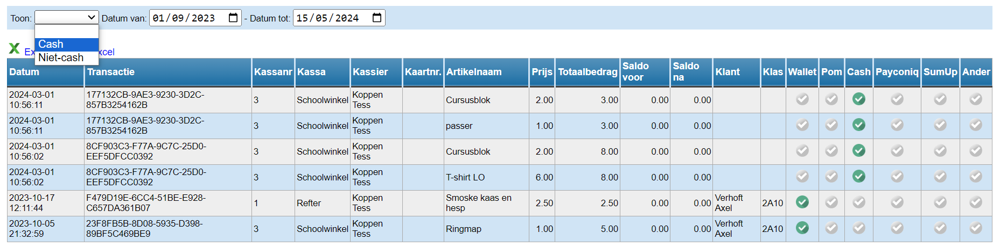
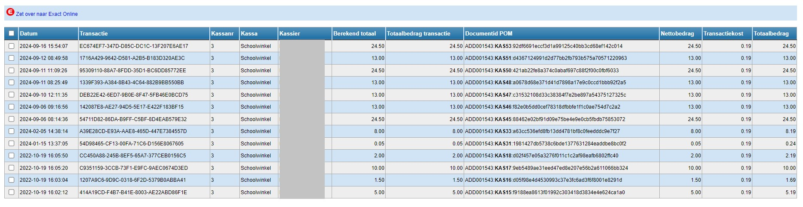

De opvolging van de verkopen is steeds op het niveau van de betaalmodaliteit.

## <LegacyAction img="verkopen.png"/> Opvolging verkopen 

Is er gekozen om **cash** te betalen of via de **wallet, POM, Payconiq, SumUp of een extern betaalsysteem**? Dan kunnen de verkopen via deze weg worden opgevolgd. Je kan ook filteren op enkel de cash betalingen óf de niet-cash betalingen voor een bepaalde periode. Deze gegevens kunnen worden geëxporteerd naar Excel door op de knop <LegacyAction img="excel.png" text="Exporteer naar Excel"/> te klikken. Standaard worden enkel de verkopen van vandaag getoond. Je kan de periode wijzigen door bovenaan de datumvelden aan te passen. De groene vinkjes achteraan geven meer info over het type betaalmiddel. 

Voor cash betalingen is er geen koppeling met de module Kas voorzien. De kassa zal periodiek geledigd moeten worden. Het gegenereerde Exceldocument geldt als verantwoordingsstuk en zal in de module [Kas](/kas) als document aan de verrichting (geld uit de kassa naar de kas) toegevoegd moeten worden. De cashverrichtingen voor een bepaalde periode kunnen in één verrichting als één groot bedrag worden ingegeven. Het is niet nodig om elke verrichting apart in te geven in de module Kas.

## <LegacyAction img="klembord.png"/> Opvolging aanrekeningen (via leerlingenrekeningen) 

Verkopen/retouren die mee opgenomen moeten worden in de leerlingenrekeningen worden via deze weg opgevolgd.

Je kan kiezen om de verwerkte of de niet-verwerkte transacties te tonen over een bepaalde periode. Daarnaast kan je ook instellen hoeveel transacties één pagina moet tonen.

Via dit icoon <LegacyAction img="detail.png"/> vooraan elke transactielijn kan je de details van de transactie opvragen.

Tot slot kan je dit overzicht exporteren naar Excel door op het icoon of op de blauwe link te klikken. 

Het verder verwerken van de verkopen dient te gebeuren in de module Leerlingenrekeningen van Toolbox. Meerbepaald door de transacties te importeren. 

In de module [Leerlingenrekeningen](/leerlingenrekeningen) moet de juiste notagroep zijn geselecteerd. De import zal in die specifieke notagroep plaatsvinden, waardoor de kassaverkopen mee op de betreffende schoolfactuur worden opgenomen. Indien voor deze verkopen een aparte factuur gewenst is, dient er een aparte notagroep te worden aangemaakt. Klik [hier](/kassa/gebruik_verwerking/bedienen/#c-aanrekeningen-importeren-op-de-schoolrekening) voor meer info over het importeren van de kassaverkopen. 

## <LegacyAction img="budget.png"/> Opvolging budgetten

Indien er budgetten zijn ingesteld, kan hier per budget opgevolgd worden welke verkopen er hebben plaatsgevonden in een bepaalde periode.

Deze periode kan bovenaan worden ingesteld. De lijst kan eveneens geëxporteerd worden naar Excel. 

## <LegacyAction img="pom.png"/> Opvolging POM betalingen

Via deze weg kunnen alle verkopen die betaald werden met POM worden overgezet naar Exact Online. Daar worden ze automatisch afgepunt nadat de bankbestanden zijn ingelezen. Vink vooraan de transacties aan die je wil overzetten en klik bovenaan op 'Zet over naar Exact Online'. Om de transacties correct over te kunnen zetten, moeten de boekhoudkundige parameters en de fictieve klant in EOL zijn ingevuld in de module [Instellingen > Kassa](/kassa/opstart_configuratie/kassa_aanmaken/#boekhoudkundige-parameters). 

