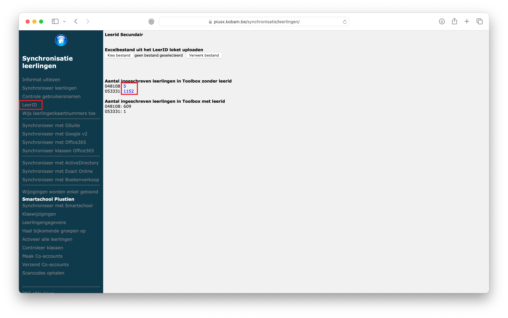
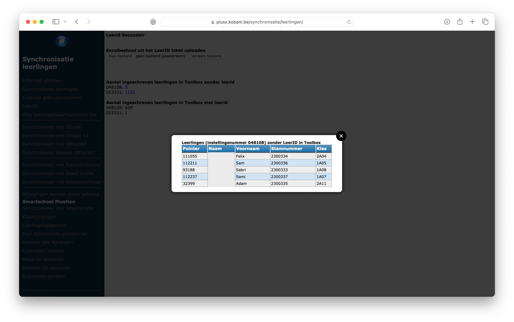
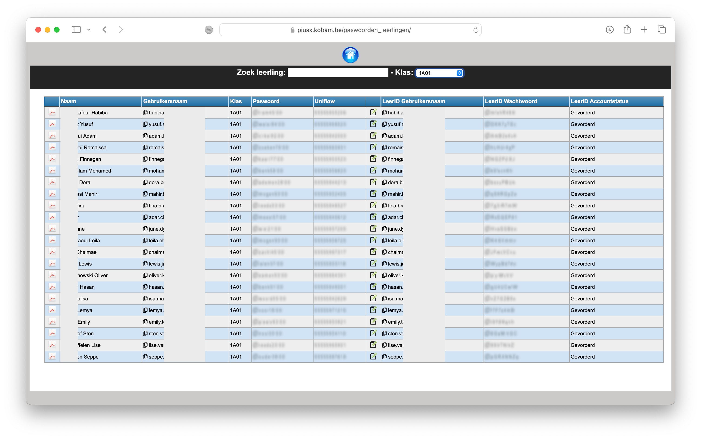
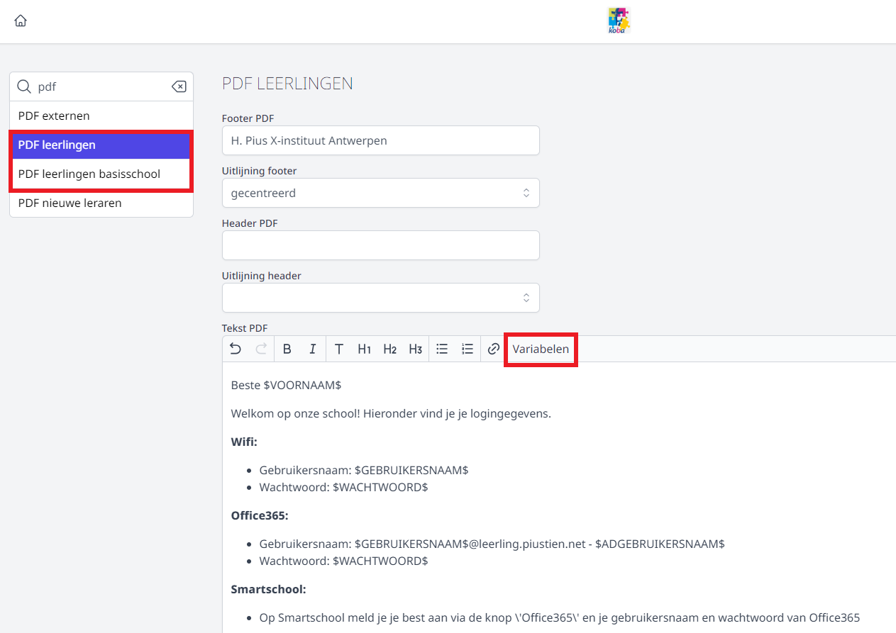
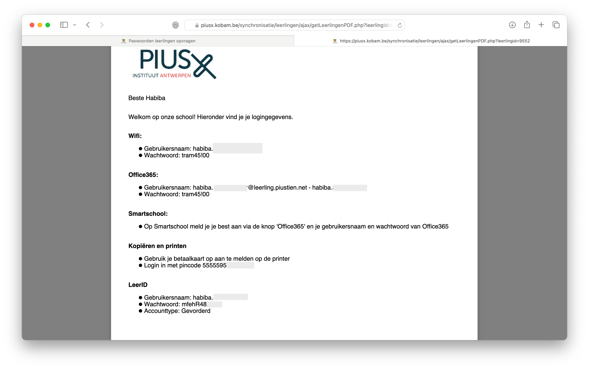

 
<ImageTitle img="leerid.svg"></ImageTitle> 

In het [LeerID loket](https://schoolloket-leerid.vlaanderen.be/p/aanmelden) kan je per instellingsnummer (mits je hier rechten op hebt) de LeerID accounts activeren. Van zodra dat in orde is, kan je een Excel-bestand downloaden met daarin de gebruikersnamen en wachtwoorden waarmee de leerlingen kunnen inloggen op LeerID of gelinkte toepassingen.

## 1. LeerID importeren in Toolbox

In de modules **Synchronisatie leerlingen** en **Synchronisatie leerlingen basis** kan je via de **optie LeerID** de Excelbestanden uploaden en zo de informatie in Toolbox importeren. Op die manier krijg je meteen inzicht of er voor elke leerling - per instellingsnummer - een LeerID account werd aangemaakt. Je kan ook opvragen voor welke leerlingen er geen informatie in het Exceldocument zit. Daarvoor klik je bij het 'Aantal ingeschreven leerlingen in Toolbox zonder leerID' op het blauwe aantal. Het kan zijn dat de leerling niet correct werd doorgestuurd omwille van Discimusfouten, maar het kan ook voorkomen dat de leerling reeds een account ontving in een vorige school. Voor die laatste groep leerlingen moet je in het LeerID loket het wachtwoord resetten indien de leerling dit niet meer kent. Ook daar kan je vervolgens een Excel-bestand van downloaden en importeren in Toolbox.

## 2. LeerID gebruikersnaam en paswoord opvragen in Toolbox

Van zodra de LeerID gebruikersnamen en wachtwoorden zijn opgeladen in Toolbox (zie punt 1) kan je deze gegevens ook opvragen in de module **Paswoorden leerlingen**.

:::caution let op
Het gaat hier steeds om het initiële wachtwoord. Van zodra een leerling zijn wachtwoord heeft gewijzigd, komt dat niet meer overeen. Resetten van het paswoord dient steeds in het LeerID loket te gebeuren. 
:::

## 3. PDF-document per leerling met inloggegevens 

De inloggegevens voor LeerID kunnen mee opgenomen worden op het PDF-document voor leerlingen, samen met de andere inloggegevens. Dit PDF-document kan je op maat van de school ingestellen via de module **Instellingen > PDF leerlingen (basisschool)**. 

Net boven het tekstveld kan je via de knop 'Variabelen' de volgende variabelen toevoegen: 
- $LEERID_GEBRUIKERSNAAM$
- $LEERID_WACHTWOORD$
- $LEERID_ACCOUNTTYPE$

