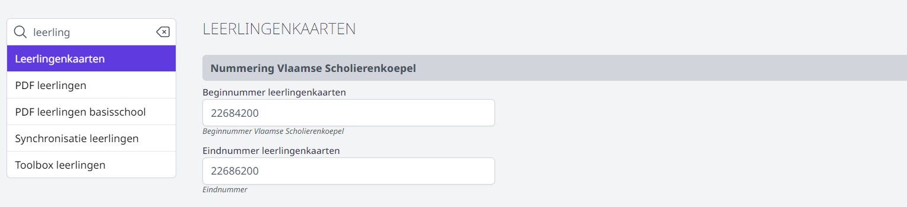

<ImageTitle img="leerlingenkaart.png">Leerlingenkaarten</ImageTitle>

Toolbox biedt de mogelijkheid om leerlingenkaarten aan te maken of te synchroniseren met de digitale leerlingenkaarten uit Smartschool. Op zo'n leerlingenkaart wordt een barcode of QR-code getoond. Deze code kan in Toolbox voor verschillende doeleinden gebruikt worden. Leerlingen kunnen bv. via de **Wallet** aankopen doen of je kan leerlingen onder de middag scannen via de module **Buitengaan**. Op de leerlingenkaart kan ook automatisch het nummer van de Vlaamse Scholierenkoepel toegevoegd worden, waardoor leerlingen op vertoon van deze kaart tal van kortingen kunnen genieten. 

De module Leerlingenkaarten kan ook gebruikt worden **in combinatie met** de digitale leerlingenkaarten van Smartschool. Zo kan je leerlingen die niet beschikken over een smartphone een leerlingenkaart uit Toolbox bezorgen. Daarop wordt dezelfde info getoond als in Smartschool, op voorwaarde dat er een aantal gegevens gesynchroniseerd werden.  

## Instelling van de module

Om de module Leerlingenkaarten te kunnen gebruiken, moeten er eerst een aantal zaken worden ingesteld in de module Instellingen in Toolbox > Leerlingenkaarten. 



Elk schooljaar kan je bij de Vlaamse Scholierenkoepel (VSK) een reeks nummers opvragen (afhankelijk van het aantal leerlingen op de school). In de Instellingen van Toolbox vul je het begin- en eindnummer in dat je hebt ontvangen. Via de module Synchronisatie leerlingen > 'Wijs leerlingenkaartnummers toe' zal Toolbox aan elke leerling een nummer toewijzen dat binnen de opgegeven reeks valt. 

Als de nummers zijn toegewezen aan de leerlingen, kunnen ze gesynchroniseerd worden met Smartschool. Daarvoor moet er in Smartschool een extra profielveld voorzien worden. In Toolbox vul je in de module Instellingen > 'Smartschool' de naam van dit profielveld in. Vervolgens synchroniseer je in de module 'Synchronisatie leerlingen' de leerlingengegevens. De nummers van de VSK zullen in Smartschool toegevoegd worden en getoond worden op de digitale leerlingenkaart. 


Verder kan je bepalen wat er op de leerlingenkaart getoond moet worden en hoe die eruit moet zien. Je kan bv. het intern nummer tonen, het nummer van de VSK, ... Indien je gebruik maakt van de module **Buitengaan**, kan je de dagen tonen waarop een leerling toelating heeft om onder de middag de school te verlaten. Je kan ook een barcode aan de leerlingenkaart toevoegen. In de module Leerlingenkaarten kan je verder bepalen of dat een eigen (door Toolbox gegenereerde) barcode moet zijn of de QR code vanuit Smartschool. De tekstkleuren kan je wijzigen door op het gekleurde vakje te klikken. 


Tot slot kan je nog de grootte  en de marges van de etiketten alsook de grootte van de foto en barcode aanpassen. 


## Gebruikersbeheer

Om toegang te krijgen tot de module Leerlingenkaarten, moet een gebruiker beschikken over de juiste rechten, nl. 'voorlopige_leerlingenkaarten'. Dit gebruikersrecht kan worden toegekend via de tegel [gebruikersbeheer](/gebruikersbeheer). 

## Leerlingenkaarten aanmaken

### Barcodes of QR codes genereren


Indien je op de leerlingenkaarten een barcode wil tonen, klik je op de eerste mogelijkheid <LegacyAction text ="Genereer barcodes"/>. Toolbox zal dan voor elke leerling een eigen unieke barcode genereren. Die barcode kan vervolgens gescand worden om aankopen te betalen via de module [Kassa](/kassa). Indien de school werkt met de module **Wallet**, kunnen ook betalingen via de Wallet plaatsvinden door de barcode te scannen. 

Toolbox biedt ook de mogelijkheid om de QR codes van de digitale leerlingenkaart uit Smartschool te tonen. Dit kan handig zijn wanneer je de digitale leerlingenkaart uit Smartschool wil gebruiken voor de module Buitengaan of om betalingen te doen via de Wallet. Leerlingen die niet beschikken over een smartphone, kunnen gebruik maken van de afgedrukte leerlingenkaart uit Toolbox. Die bevat dezelfde gegevens als de digitale versie in Smartschool. De QR codes moeten eerst en vooral opgehaald worden uit Smartschool via de module Synchronisatie leerlingen > Scancodes ophalen. Daarna klik je in de module Leerlingenkaarten op <LegacyAction text ="Genereer Smartschool QR codes"/>.

### Foto's ophalen uit Smartschool

Indien je op de leerlingenkaarten foto's wil tonen, haal je de foto's op uit Smartschool. Dat kan rechtstreeks vanuit de module Leerlingenkaarten. In het begin van het schooljaar kan je **alle nieuwe foto's ophalen**. Wanneer leerlingen later inschrijven, kan je ervoor kiezen om enkel de nieuwe foto's op te halen. Dat laatste zal veel sneller gaan, omdat er veel minder gegevens opgehaald moeten worden. 

### Leerlingenkaarten afdrukken 

Je kan leerlingenkaarten in bulk afdrukken voor de hele school, per klas of per individuele leerling. Je kan ook enkel leerlingenkaarten afdrukken voor leerlingen die de school onder de middag mogen verlaten. 

Om de kaarten af te drukken per klas, zoek je bovenaan via het zoekveld een klas op. Je kan ook alle klassen ineens selecteren via de checkbox bovenaan (naast klas). Het is ook mogelijk om slechts 1 of enkele klassen aan te vinken. Klik vervolgens onder de lijst met klassen op 'Druk geselecteerde klassen af'.


Om leerlingenkaarten af te drukken voor individuele leerlingen, moet je deze leerlingen eerst toevoegen aan de 'Tijdelijke selectie'. Via het zoekveld kan je zoeken op de naam van een leerling. Vervolgens selecteer je de gewenste leerling(en) en voeg je die toe aan de 'Tijdelijke selectie'. Je kan steeds nagaan hoeveel leerlingen er toegevoegd zijn via het aantal achteraan. Indien je voor andere leerlingen etiketten wil afdrukken, maak je de tijdelijke selectie leeg en voeg je de gewenste leerlingen toe. Klik op de blauwe link <LegacyAction text="Tijdelijke selectie"/> om de etiketten effectief af te printen. 

<Thumbnails img={[
    require('./kaart8.png').default, 
]} />

### Aangepaste etiketten of kaartprinter

Wil je gebruik maken van andere etiketten of beschik je over een kaartprinter die op bankkaartformaat kan afdrukken, dan kan je via de Toolbox API de nodige gegevens uitlezen. Die kan je dan in een Exceldocument binnenhalen en dat document kan je koppelen aan bv. Word of de applicatie waarmee je de kaartprinter kan aansturen.

Je kan de API aanspreken vanuit een eigen applicatie of je kan gebruik maken van het powershell script hieronder. Om de API te kunnen gebruiken, vraag je aan de Toolbox helpdesk eerst credentials. Die vul je in het powershell script in bij $username en $password (lijnen 4 en 5). In de variabele $strURL (lijn1) vervang je 'toolbox.be' door het adres van je eigen Toolbox.

:::info powershell script
Klik [hier](./Powershell.zip) om het powershell script te downloaden.  
:::

Als je het Powershell script nu laat lopen, wordt er een bestand aangemaakt met de naam ‘leerlingenkaarten.json’. Dit bestand bevat alle informatie om de leerlingenkaarten aan te kunnen maken in json formaat.

Dit json bestand kan je vervolgens koppelen aan bv. een Excel document. In Excel kan dat via de optie Gegevens > Gegevens ophalen (power query). Daar selecteer je dan het json bestand. Dat bestand kan je vervolgens in je excel importeren. 

Zijn er nieuwe leerlingen? Voer dan opnieuw het powershell script uit en klik in het exceldocument op ‘gegevens vernieuwen’. Excel leest nu het bijgewerkt json bestand in.

Op basis van het Excel document kan je nu een mailmerge maken in Word. Je kan de velden die in het excelbestand voorkomen op de juiste plaats slepen en op die manier je etiket/leerlingenkaart vorm geven.

Je kan ook de foto’s van de leerlingen invoegen op basis van de URL die in het excelbestand zit. Daarvoor gebruik je de optie ‘includepicture’ die je kan vinden via invoegen - veld. De syntax wordt dan deze:

```js
{INCLUDEPICTURE { IF TRUE "{ MERGEFIELD foto }" } \d}
```

Kies vervolgens om alle documenten afzonderlijk te bewerken, vervolgens select All en op F9 drukken. Dan pas worden alle foto's ingelezen en getoond.


