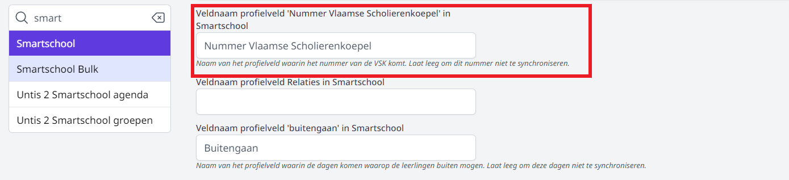

<ImageTitle img="leerlingenkaart.png">Leerlingenkaarten</ImageTitle>

Toolbox biedt de mogelijkheid om leerlingenkaarten aan te maken. Op zo'n leerlingenkaart wordt een barcode of QR-code getoond. Deze code kan in Toolbox voor verschillende doeleinden gebruikt worden. Leerlingen kunnen bv. via de **Wallet** aankopen doen of je kan leerlingen onder de middag scannen via de module **Buitengaan**. Op de leerlingenkaart kan ook automatisch het nummer van de Vlaamse Scholierenkoepel toegevoegd worden, waardoor leerlingen op vertoon van deze kaart tal van kortingen kunnen genieten. 

De module Leerlingenkaarten kan ook gebruikt worden **in combinatie met** de digitale leerlingenkaarten van Smartschool. Zo kan je leerlingen die niet beschikken over een smartphone een leerlingenkaart uit Toolbox bezorgen. Daarop wordt dezelfde info getoond als in Smartschool, op voorwaarde dat er een aantal gegevens gesynchroniseerd werden.  

## Instelling van de module

Om de module Leerlingenkaarten te kunnen gebruiken, moeten er eerst een aantal zaken worden ingesteld in de module Instellingen in Toolbox > Leerlingenkaarten. 


Elk schooljaar kan je bij de Vlaamse Scholierenkoepel (VSK) een reeks nummers opvragen (afhankelijk van het aantal leerlingen op de school). In de Instellingen van Toolbox vul je het begin- en eindnummer in dat je hebt ontvangen. Via de module Synchronisatie leerlingen > 'Wijs leerlingenkaartnummers toe' zal Toolbox aan elke leerling een nummer toewijzen dat binnen de opgegeven reeks valt. 

Als de nummers zijn toegewezen aan de leerlingen, kunnen ze gesynchroniseerd worden met Smartschool. Daarvoor moet er in Smartschool een extra profielveld voorzien worden. In Toolbox vul je in de module Instellingen > 'Smartschool'> 'uw platform' de naam van dit profielveld in. Vervolgens synchroniseer je in de module 'Synchronisatie leerlingen' de leerlingengegevens. De nummers van de VSK zullen in Smartschool toegevoegd worden en getoond worden op de digitale leerlingenkaart. 




## Gebruikersbeheer

Om toegang te krijgen tot de module Leerlingenkaarten, moet een gebruiker beschikken over de juiste rechten, nl. 'leerlingenkaarten'. Dit gebruikersrecht kan worden toegekend via de tegel [gebruikersbeheer](/gebruikersbeheer). 

## Leerlingenkaarten aanmaken
### Printen

Je kan leerlingenkaarten in bulk afdrukken voor de hele school, per klas of per leerling. U kunt individuele leerlingen of enkel leerlingen die de school onder de middag mogen verlaten toevoegen aan je selectie kan je via de knop **Leerlingen toevoegen**. 

Eens er een selectie is gemaakt kan je via de knop **print** de leerlingenkaarten gaan afdrukken. Hoe uw leerlingenkaarten eruit zullen zien is afhankelijk van het [leerlingenkaarten template](#templates-beheren).

### Templates beheren
Via de knop **Toevoegen** kan je een nieuw leerlingenkaart template aanmaken. Een leerlingenkaart template is altijd verbonden aan een [etiketten template](./gebouwen_lokalen/#etiketten-templates ).  Gebruik het **potlood** icoon om je template te bewerken. Met het vuilbak icoon kan je een template **verwijderen**.

Bij het **bewerken van een template** krijg je een preview van een leerlingenkaart te zien. Hou er rekening mee dat de weergave kan afwijken van de exacte grootte van je etiket.
Via de knop **Toevoegen** kan je beginnen met het opmaken van de leerlingenkaarten. Hier kan je een keuze maken wat voor inhoud je wilt toevoegen.

- **Vaste tekst:** Zelf in te vullen tekst die op elke leerlingenkaart hetzelfde zal zijn.
- **Variabele tekst:** Tekst die variabel is per leerling (naam, klas, ...). Hou hierbij rekening dat je genoeg ruimte voorziet, bv. niet elke naam is even lang.
- **Barcode:** Een barcode of QR-code die vervolgens gescand kunnen worden om aankopen te betalen via de module [Kassa](/kassa). Indien de school werkt met de module **Wallet**, kunnen ook betalingen via de Wallet plaatsvinden door deze te scannen, of je kan leerlingen onder de middag scannen via de module Buitengaan.
- **Foto leerling:** Foto van de leerling, variabel per leerling. Deze dienen eerst opgehaald te worden via [fotos ophalen](#fotos-ophalen).
- **Afbeelding:** Logo's of een vrije afbeelding via een URL.
- **Buitengaan:** De weergave of een leerling wel of niet buiten mag tijdens de middag, variabel per leerling.

Per toegevoegd element krijg je enkele opmaak opties (hoogte, breedte, tekstkleur, ...). De optie **ankerpunt** beslist het originepunt van je element. bv. kies je *links boven* als ankerpunt en staan zowel *afstand vanaf linkerkant* en *afstand vanaf bovenkant* op 0, dan zal je element zich in de linker boven hoek van je etiket bevinden.


### Foto's ophalen

Indien je op de leerlingenkaarten foto's wil tonen, haal je eerst de foto's op uit Smartschool of Informat. Dat kan rechtstreeks vanuit de module Leerlingenkaarten onder de tab foto's ophalen. Hier heb je de keuze om alle foto's op te halen of enkel de nieuwe foto's.

### Oude module
Het zal tijdelijk nog mogelijk zijn om de oudere versie van de module te gebruiken deze vind je terug via de tab *Oude module*.

### Aangepaste etiketten of kaartprinter

Wil je gebruik maken van andere etiketten of beschik je over een kaartprinter die op bankkaartformaat kan afdrukken, dan kan je via de Toolbox API de nodige gegevens uitlezen. Die kan je dan in een Exceldocument binnenhalen en dat document kan je koppelen aan bv. Word of de applicatie waarmee je de kaartprinter kan aansturen.

Je kan de API aanspreken vanuit een eigen applicatie of je kan gebruik maken van het powershell script hieronder. Om de API te kunnen gebruiken, vraag je aan de Toolbox helpdesk eerst credentials. Die vul je in het powershell script in bij $username en $password (lijnen 4 en 5). In de variabele $strURL (lijn1) vervang je 'toolbox.be' door het adres van je eigen Toolbox.

:::info powershell script
Klik [hier](./Powershell.zip) om het powershell script te downloaden.  
:::

Als je het Powershell script nu laat lopen, wordt er een bestand aangemaakt met de naam ‘leerlingenkaarten.json’. Dit bestand bevat alle informatie om de leerlingenkaarten aan te kunnen maken in json formaat.

Dit json bestand kan je vervolgens koppelen aan bv. een Excel document. In Excel kan dat via de optie Gegevens > Gegevens ophalen (power query). Daar selecteer je dan het json bestand. Dat bestand kan je vervolgens in je excel importeren. 

Zijn er nieuwe leerlingen? Voer dan opnieuw het powershell script uit en klik in het exceldocument op ‘gegevens vernieuwen’. Excel leest nu het bijgewerkt json bestand in.

Op basis van het Excel document kan je nu een mailmerge maken in Word. Je kan de velden die in het excelbestand voorkomen op de juiste plaats slepen en op die manier je etiket/leerlingenkaart vorm geven.

Je kan ook de foto’s van de leerlingen invoegen op basis van de URL die in het excelbestand zit. Daarvoor gebruik je de optie ‘includepicture’ die je kan vinden via invoegen - veld. De syntax wordt dan deze:

```js
{INCLUDEPICTURE { IF TRUE "{ MERGEFIELD foto }" } \d}
```

Kies vervolgens om alle documenten afzonderlijk te bewerken, vervolgens select All en op F9 drukken. Dan pas worden alle foto's ingelezen en getoond.

