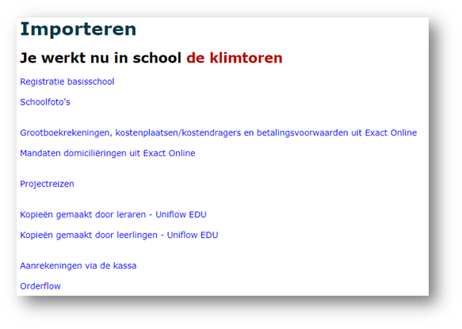
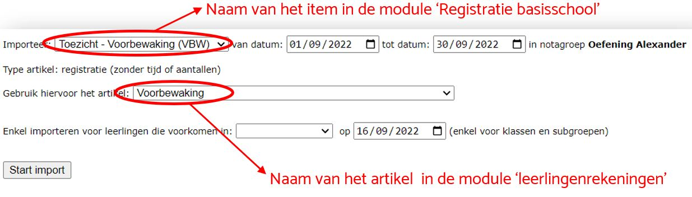

Toolbox heeft de mogelijkheid om gegevens uit externe software op te halen en meteen om te zetten naar een aanrekening (artikel). Hierdoor wordt tijd bespaard aangezien er niet meer overgetypt moet worden. Bijkomend voordeel is dat er geen fouten meer kunnen sluipen in het overtypen.

Volgende imports zijn momenteel beschikbaar:

**Registratie basisschool**: deze module in Toolbox laat toe om het verbruik van bepaalde items per leerling te registreren. Voorbeelden zijn: voor- en nabewaking, drankje tijdens de middagpauze, ... Alle zaken die via die module werden geregistreerd, kunnen langs hier worden geïmporteerd. Om correct te kunnen importeren moet er in de leerlingenrekeningen een artikel bestaan (bv. voorbewaking) dat aan de importgegevens gekoppeld kan worden. Dit maak je eenmalig aan bij 'artikelen'. Als je nu gaat importeren, kan je aangeven welke geregistreerde items je wil importeren en welk artikel je wil gebruiken om aan te rekenen. Verder kan je ook de registratieperiode en de klas of groep selecteren waarvoor gegevens geïmporteerd moeten worden.
Wanneer de gegevens geïmporteerd zijn, zijn ze terug te vinden bij 'aanrekenen artikel'. Door op het potloodje vooraan te klikken, kan je allerlei aanpassingen doen in de aanrekening. Meer info hierover onder Artikels in aanrekening wijzigen in de Handleiding leerlingenrekeningen.

 

De module **schoolfoto's** laat toe om pakketten met foto's die de fotograaf aflevert uit te delen aan leerlingen en te registreren wie welke foto's (delen van het pakket) terug inlevert. Op die manier kan Toolbox berekenen wat de totale waarde van het pakket is en voor welke waarde de leerling terug inlevert. Het verschil wordt dan aangerekend. Deze module kan ook bijbestellingen registreren.
 

**Grootboekrekeningen, kostenplaatsen/kostendragers en betalingsvoorwaarden**: in de module leerlingenrekeningen moet je bij artikels en aanrekeningen de grootboekrekeningen en de analytische informatie invullen. Deze importmodule haalt die informatie op uit Exact Online en zorgt er voor dat je ze maar aan te klikken hebt.
 

**Mandaten domiciliëringen uit Exact Online**: Meer info over domiciliëring is te vinden onder Inschrijvingen in de Handleiding leerlingenrekeningen. Wanneer het mandaat is opgeladen in Exact Online kan het via deze weg geïmporteerd worden in de leerlingenrekeningen. Vanaf dan kan de factuur voor de betreffende leerlingen betaald worden via domiciliëring. Het sjabloon voor de factuur met domiciliëring moet aangemaakt zijn bij 'school' onder het tabblad facturen.  Zie ook School aanmaken en parameters instellen in de Handleiding leerlingenrekeningen.
    

**Kopieën/Aanrekeningen via de kassa/Orderflow**: Toolbox is in staat om de geregistreerde kopieën (gemaakt door leraren of door leerlingen zelf), items aangerekend via de kassa of orderflow te importeren en aan te rekenen. Hierdoor wordt het verwerken van die zaken een werkje van slechts enkele seconden.
 