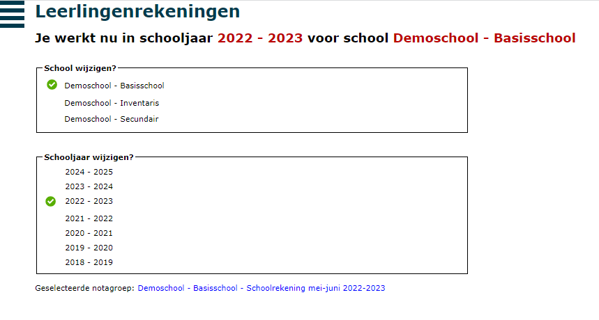

Bij het openen van de module Leerlingenrekeningen kom je automatisch in het startscherm terecht. Je kan dit scherm ook bereiken door via het menu <LegacyAction img="menu.JPG"/> op **Start** te klikken. 

Navigeren in de module leerlingenrekeningen doe je steeds via het menu. Dit kan je oproepen door te klikken op <LegacyAction img="menu.JPG"/> of terug verbergen door te klikken op <LegacyAction img="home.png"/>. 

In dit scherm kan je de school en het schooljaar selecteren waarin je wil werken, alsook de notagroep. Aan de hand van de groene vinkjes vooraan zie je in één oogopslag welke school en welk schooljaar je geselecteerd hebt. Je kan eenvoudig en snel wisselen van school of schooljaar door met de cursor achter het gewenste item te bewegen. Volgende opties verschijnen: <LegacyAction img="start.PNG"/>.

- Permanent: Je kan een school en/of een schooljaar permanent instellen. Dit is de school en/of het schooljaar waar je standaard in wil werken. Als je uitlogt en opnieuw inlogt, kiest het systeem steeds de permanente selectie en niet de eenmalige selectie.
- Eenmalig: Als je snel iets wil opzoeken in een andere school of een ander schooljaar, kan je dit ook eenmalig instellen. De keuze is enkel geldig voor deze sessie. 

Deze instellingen zijn gebonden aan de gebruiker en zijn niet algemeen voor de module. Verschillende gebruikers kunnen dus verschillende scholen permanent instellen. 

Helemaal onderaan zie je in welke notagroep je aan het werken bent. Een notagroep is een facturatieperiode waarvoor per leerling een verzamelfactuur kan worden aangemaakt.  Als dat de juiste notagroep is, hoef je hier verder niets meer te doen. Als er nog geen notagroep is gedefinieerd of je wil een andere notagroep selecteren of wijzigingen aanbrengen aan de huidige notagroep dan klik je op de blauwe linktekst. Je kan dezelfde acties uitvoeren door via het menu <LegacyAction img="menu.JPG"/> op **Notagroepen** te klikken.

Meer info hierover vind je bij [Notagroepen](/leerlingenrekeningen/Notagroepen/).

