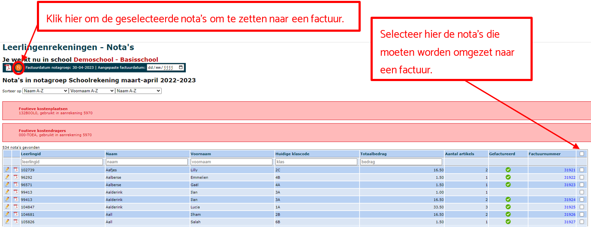

Bij de nota's vind je op niveau van de individuele leerling een overzicht van alle aangerekende kosten van een bepaalde notagroep. Een nota is eigenlijk de kladversie van de uiteindelijke factuur. Als een nota volledig in orde is, kan je hem omzetten naar een factuur.

- Zolang er nog **geen factuur** is gemaakt van de nota, kan je nog wijzigingen aanbrengen in de aanrekeningen of rechtstreeks in de nota van de leerling. 
- Als de factuur nog **niet is overgezet naar Exact Online**, kan je enkel nog wijzigingen doorvoeren in de nota. Wijzigingen zijn vanaf dat moment dus enkel nog mogelijk op niveau van de individuele leerling. 
- Wanneer de factuur is overgezet naar Exact, moet je werken met een bijkomende aanrekening of een creditnota. Dat kan in dezelfde notagroep. Je hoeft dus geen aparte notagroep voor creditnota's aan te maken. Een creditnota is in principe een negatieve aanrekening. Die maak je op dezelfde manier als een gewone aanrekening (via ['Aanrekenen' of 'Aanrekenen artikel'](/leerlingenrekeningen/Aanrekenen/)). Je wijzigt in de aanrekening het artikel naar een negatief aantal of een negatieve prijs (beide opties zijn mogelijk). Vervolgens wordt er voor de leerling een nieuwe (tweede) nota aangemaakt die je ook kan omzetten naar een factuur.  

Volgende acties zijn mogelijk bij Nota's:

- Klik op het pdf icoon <LegacyAction img="pdf.png"/> om een nota van een leerling in pdf te bekijken.

- Klik op het potlood <LegacyAction img="potlood2.png"/> om de nota te openen en in detail te bekijken. 
- In de geopende nota kan je op niveau van de leerling:

  - artikels wijzigingen (prijs, aantal, boekhoudkundige parameters) door te klikken op <LegacyAction img="potlood2.png"/>.

  - artikels toevoegen door te klikken op <LegacyAction img="pluscircleblue.png"/>. 
  - artikels verwijderen door te klikken op <LegacyAction img="remove3.png"/>
  
  Als er reeds een factuur is gemaakt van de nota, dan wordt dit bovenaan vermeld. Wanneer de factuur reeds is overgezet naar Exact Online, kunnen er geen items meer worden gewijzigd of toegevoegd. 

Indien er aanrekeningen zijn die niet zijn omgezet naar een nota, zal dit bovenaan in het rood verschijnen. Je kijkt dan best na bij de aanrekeningen of dat zo bedoeld was. Ook wanneer er in een aanrekening een **foutieve kostenplaats of kostendrager** is gebruikt, zal je bovenaan een rode melding zien verschijnen. De foutmelding geeft weer welke kostenplaatsen of -dragers foutief zijn en in welke aanrekening die gebruikt zijn. Op die manier kan je snel aanpassingen doorvoeren. Die aanpassing doe je rechtstreeks in de aanrekening. Voor meer info zie ['Aanrekenen' of 'Aanrekenen artikel'](/leerlingenrekeningen/Aanrekenen/). Indien de correcte boekhoudkundige paramaters nog niet beschikbaar zijn in Toolbox, zal je die nog moeten [importeren](/leerlingenrekeningen/Importeren/). Dit kan enkel door iemand met rechten in Exact Online. Zorg ook dat je meteen de parameters bij het sjabloonartikel aanpast via het menu [Artikels](/leerlingenrekeningen/Artikels%20en%20artikelgroepen/). 

Vanuit het overzicht van de nota's kan je door middel van de vinkjes achteraan de gewenste nota's selecteren. Vervolgens kan je ze als PDF afdrukken of factureren via het oranje icoon <LegacyAction img="factuur.png"/>.

Standaard is bij de nota’s de factuurdatum van de notagroep ingevuld. Indien de **algemene facturatiedatum** gewijzigd moet worden, doe je dat in de **notagroep**. Bij de nota's kan je ook een **aangepaste factuurdatum** invullen. Die kan je gebruiken wanneer je voor één (of enkele leerlingen) nog iets achterna moet factureren. De aangepaste factuurdatum kan ook gebruikt worden wanneer er een creditnota wordt aangemaakt binnen een bestaande notagroep die op deze manier toch op een andere datum in de boekhouding kan worden gezet.

