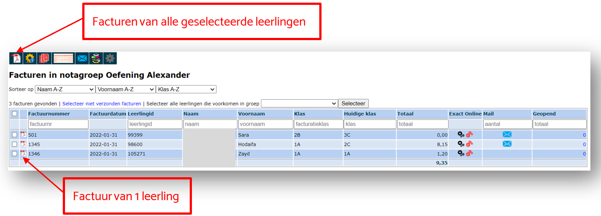
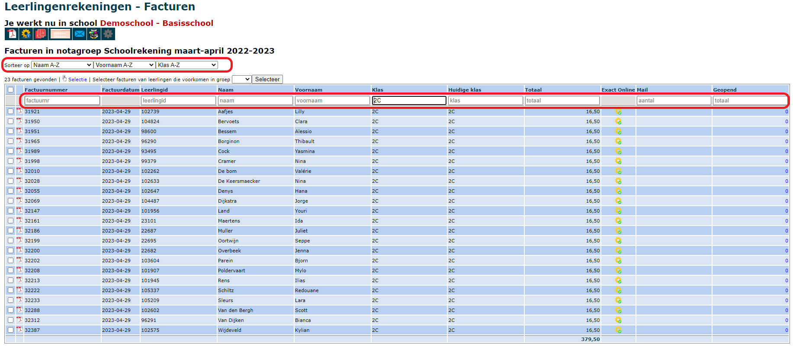
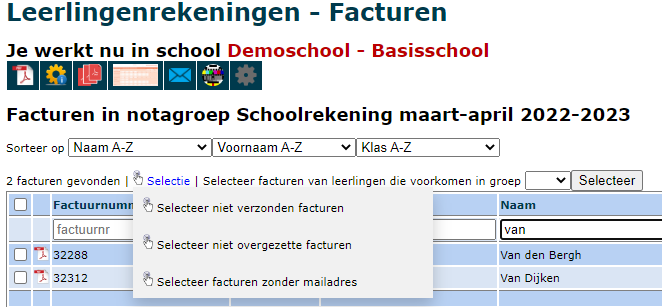

Eens een nota is omgezet naar een factuur, wordt er een (Toolbox) factuurnummer aangemaakt én een gestructureerde mededeling (OGM). Dit factuurnummer is niet gelijk aan dat in Exact Online.

Vanuit het Facturen-scherm kan je de facturen afdrukken in PDF. Dat kan per aparte factuur door middel van het PDF icoon vóór elk factuurnummer of in bulk door middel van de vinkjes en de PDF knop bovenaan. 

Klik op <LegacyAction img="verwerking.png"/> bovenaan om de geselecteerde facturen in bulk overzetten naar Exact Online. Je hebt hiervoor wel een account nodig in Exact Online. Je kan facturen ook apart overzetten door het zwarte tandwiel <LegacyAction img="verwerking_0.png"/> te gebruiken bij de betreffende factuur in de tabel. Wil je een factuur **niet overzetten**, dan gebruik je het rode tandwiel <LegacyAction img="verwerking_2.png"/>. 

Klik op <LegacyAction img="mailEnveloppe.png"/> <LegacyAction img="smartschool.png"/> <LegacyAction img="parentcom.png"/> bovenaan om de geselecteerde facturen te verzenden via e-mail, Smartschool of Parentcom, naar gelang wat er is ingesteld bij [Scholen](/leerlingenrekeningen/Scholen/#3-e-mail-smartschool-parentcom-en-questi).  

Het is zo dat er altijd een link wordt verstuurd naar de ontvangers. Als zij op de link klikken, wordt de factuur dynamisch gegenereerd op basis van de meest recente informatie. Wijzig je dus nog zaken via de Nota aan de factuur, dan zullen oudere links altijd de meest recente versie van de factuur weergeven. Het is dus niet nodig om een factuur (na aanpassing) opnieuw te mailen. 

In de laatste kolom kan je nagaan hoe vaak een bericht werd geopend. Door op het getal te klikken, vind je meer info terug over wanneer het bericht werd verstuurd en wanneer het werd geopend. Bovenaan in het zoekveld kan je het getal 0 ingeven. Dan krijg je een lijst te zien van alle leerlingen waarvan het bericht nog niet werd geopend. Dit is een interessant gegeven voor het opvolgen van de openstaande facturen. 

Vooraleer je de facturen naar de ouders verstuurt, kan je eventueel een factuur selecteren en een testbericht naar jezelf sturen. Op deze manier kan je zien hoe de ouders de factuur en het bericht te zien krijgen. Dit is vooral interessant als je wijzigingen hebt aangebracht in de mailingopties bij [Scholen](/leerlingenrekeningen/Scholen/#3-e-mail-smartschool-parentcom-en-questi). Klik op <LegacyAction img="testbeeld.png"/> om het testbericht te versturen.

Je kan facturen afdrukken met een overschrijvingsformulier. Klik daarvoor bovenaan op <LegacyAction img="overschrijving.png"/>. OPGELET! Op deze facturen staan ook alle openstaande facturen van de leerling vermeld. Hoe deze openstaande facturen moeten worden getoond (met detail of zonder) kan worden ingesteld bij [Scholen](/leerlingenrekeningen/Scholen/#2-facturen). 

Via deze knop <LegacyAction img="configure.png"/> kom je terecht in de geselecteerde notagroep. Hier kan je eventueel nog wijzigingen aanbrengen, bv. de naam van notagroep (op de factuur), teksten op de factuur of van het (e-mail)bericht. Zolang een factuur niet is overgezet naar Exact Online kan ook de factuurdatum van de notagroep nog gewijzigd worden. 

Met behulp van volgend icoon <LegacyAction img="klok.PNG"/> kan je de factuurdatum van één of meerdere facturen aanpassen zolang die nog niet zijn overgezet naar Exact Online. Hiervoor vink je vooraan eerst de gewenste facturen aan. 

Je kan de resultatenlijst op verschillende manieren sorteren, bv. op klas. Daarnaast bestaan er ook heel wat mogelijkheden om de resultaten te filteren. Boven elke kolom is daarvoor een tekstveld voorzien. Hier kan je een zoekterm intypen, bv. de naam van een leerling of een klas. Vervolgens worden de resulaten gefilterd o.b.v. deze zoekterm. De verschillende filtervelden, alsook de sorteringsmogelijkheden kunnen gecombineerd worden. 

  

Om facturen afdrukken te drukken, digitaal te versturen of over te zetten naar Exact Online, moeten ze eerst geselecteerd worden. Door middel van de checkbox helemaal links bovenaan selecteer je met 1 klik meteen alle facturen. Via de knop <LegacyAction img="select.png" text="Selectie"/> kan je je selectie verfijnen. Zo kan je eerst alle facturen selecteren om te mailen om vervolgens de facturen zonder e-mailadres te selecteren en af te drukken op papier. Ook wanneer er achteraf nog een creditnota gemaakt wordt, is het handig dat je enkel de 'niet overgezette facturen' kan selecteren.

Volgende opties zijn beschikbaar:

- Selecteer niet verzonden facturen
- Selecteer niet overgezette facturen
- Selecteer facturen zonder e-mailadres

Indien je eigen groepen hebt aangemaakt (meer info zie [Mijn groepen](/leerlingenrekeningen/Mijn%20groepen/)) kan je ook enkel leerlingen selecteren die voorkomen in een bepaalde 'eigen groep'. Selecteer de groep uit de dropdown lijst en bevestig door te klikken op <LegacyAction text="Selecteer"/>.

