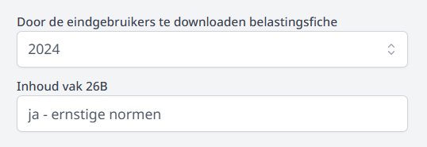
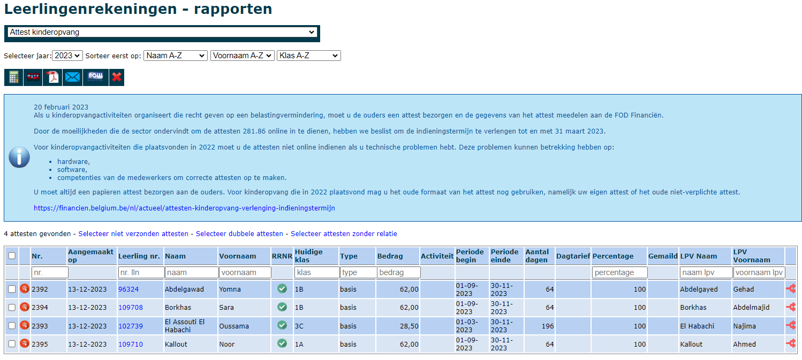
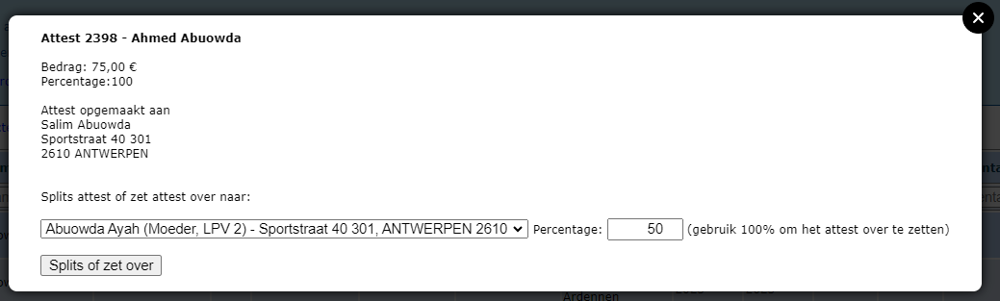

Ouders hebben recht op belastingvermindering voor de uitgaven die ze deden voor alle opvang- en vrijetijdsinitiatieven buiten de normale lesuren: tijdens schoolvakanties, in het weekend, op vrije dagen en woensdagnamiddagen, voor- en nabewaking en opvang tijdens de middagpauzes. Scholen dienen daarom voor de **betaalde** kinderopvang een fiscaal attest op te maken en dit voor alle leerlingen tot de leeftijd van 14 jaar. 

## 1. Artikels die recht geven op een fiscaal attest kinderopvang

### 1.1 Voor- en nabewaking, woensdagnamiddagopvang, opvang tijdens middagpauzes

In de module Leerlingenrekeningen kan je via het menu [Artikels](/leerlingenrekeningen/Artikels%20en%20artikelgroepen/#artikels) voor elk artikel aangeven of het recht geeft op belastingsvermindering. Voor voor- en nabewaking, woensdagnamiddagopvang en opvang tijdens de middagpauzes volstaat het dat dit vinkje is aangezet. Alle aanrekeningen waarin het artikel wordt gebruikt, zullen toegevoegd worden aan het attest kinderopvang. 

:::caution OPGELET
Dit werkt niet met terugwerkende kracht! Heb je in het verleden reeds artikels aangerekend die recht geven op belastingsvermindering, maar waarvoor het vinkje niet was aangezet, dan zullen deze artikels niet mee in rekening worden gebracht op het attest kinderopvang. Contacteer in dat geval het Toolbox-team. 
:::

### 1.2 Uitstappen tijdens het weekend en schoolvakanties
Indien de school ook uitstappen of reizen organiseert die tijdens het weekend of tijdens een schoolvakantie plaatsvinden, moet ook hiervoor een fiscaal attest voor kinderopvang worden afgeleverd. Om voor dergelijke activiteiten een correct fiscaal attest te kunnen genereren vanuit Toolbox, moet de aanrekening gekoppeld zijn aan een activiteit uit de [Activiteitenmodule](/activiteiten). Hier zijn 2 werkwijzes mogelijk:
1. De Activiteitenmodule is in gebruik op de school en de activiteit werd hierin aangemaakt. Vervolgens werd ze geïmporteerd in de module Leerlingenrekeningen om aan te rekenen via de schoolrekening. De werkwijze hiervoor vind je terug in de handleiding van de [Activiteitenmodule](/activiteiten). Toolbox heeft met deze werkwijze voldoende info om correcte fiscale attesten kinderopvang te kunnen afleveren voor deze activiteit. 

2. De Activiteitenmodule wordt NIET gebruikt door de school. Toolbox heeft op basis van alleen de aanrekening in de module Leerlingenrekeningen NIET voldoende info om correcte fiscale attesten kinderopvang te kunnen afleveren. De aanrekening moet hiervoor nog gekoppeld worden aan een activiteit uit de Activiteitenmodule. 
     - STAP 1: Maak de activiteit aan in de Activiteitenmodule. Lees [hier](/activiteiten) hoe je te werk gaat. Het is mogelijk om een activiteit in het verleden aan te maken. 

     - STAP 2: Koppel de activiteit uit de Activiteitenmodule aan de corresponderende aanrekening in de module Leerlingenrekeningen. Dit kan zowel bij Aanrekenen als bij Aanrekenen Artikel. Het is ook mogelijk om die koppeling nog te leggen nadat de activiteit reeds gefactureerd werd. 

     - STAP 3: Klik bij het gebruikte artikel op het icoon <LegacyAction img="busGrijs.png"/> in de kolom Acitviteit.

     

     - STAP 4: Selecteer de actitiveit die je wenst te koppelen en wijzig dit voor alle leerlingen in de aanrekening. 

     

    - STAP 5: Klik op 'Koppel activiteit'.

     Wanneer de activiteit correct gekoppeld is zal het grijze icoon van de bus rood geworden zijn <LegacyAction img="busred.png"/>. 
     Indien je voor eenzelfde activiteit meerdere facturen hebt gemaakt (bv. voorschotfacturen voor een meerdaagse reis), dien je alle deelfacturen te koppelen aan de activiteit. Op basis daarvan heeft Toolbox voldoende info om correcte fiscale attesten kinderopvang op te maken. 
     

## 2. Voorbereiding 

### 2.1 In de module Instellingen

Om correcte fiches te genereren, moeten er eerst een aantal zaken worden ingesteld in de module Instellingen van Toolbox.

De gegevens van de school/werkgever die op de fiscale fiches komen zijn dezelfde voor personeelsleden als voor de attesten kinderopvang voor ouders en moeten worden ingesteld in de Instellingen => Woon-werkverkeer. 

Vul alle gevraagde gegevens in, zowel van de schuldenaar als van de afzender. In de praktijk zullen deze twee meestal dezelfde zijn. Let op dat je hier de gegevens van de VZW invult en niet van de school. De VZW is namelijk de werkgever. 

Selecteer onderaan ook het inkomstenjaar (2023) waarvoor de personeelsleden via de module **Openbaar vervoer** of de module **Fietsvergoeding** de fiscale fiche kunnen downloaden. 

<Thumbnails img={[
    require('./opvang1.PNG').default, 
    require('./opvang2.PNG').default, 
]} />

### 2.2. In de module Leerlingenrekeningen

Ook in de module Leerlingenrekeningen bij het menu 'Scholen' moeten nog een aantal zaken ingesteld worden alvorens men fiscale attesten kan genereren. Klik op het potloodje vóór de school en ga naar het tabblad 'Attest kinderopvang'. 

- Vink aan dat de school attesten voor kinderopvang maakt. 
- Vul verder de naam en hoedanigheid van de ondertekenaar in. 
- Onderaan kan ook de handtekening van de ondertekenaar geselecteerd worden (indien die werd ingescand en doorgegeven aan het Toolbox-team via toolbox@kobavzw.be). 
- Wanneer de attesten kinderopvang via mail verstuurd worden, kan je hier de tekst voor het e-mailbericht instellen. Daarvoor kan je gebruik maken van enkele dynamische variabelen die bij het versturen van het bericht opgevuld zullen worden met de corresponderende leerlingengegevens.
- Als alles correct is ingesteld, klik je op 'School bijwerken'.  

## 3. Attesten kinderopvang genereren

Je kan attesten kinderopvang aanmaken in de module **Leerlingenrekeningen => Rapporten => Attest kinderopvang**. Selecteer daar het inkomstenjaar (bv. 2023 voor de aangifte in het jaar 2024).

Als je nog geen attesten hebt aangemaakt, krijg je hiervoor een melding. Er wordt kort samengevat wat je eerst moet doen alvorens de attesten aan te maken:

- Laat de synchronisatie met Informat/Wisa nog een keer lopen op vandaag, maar ook op minimaal 2 momenten in vorig schooljaar, zodat je zeker over alle gegevens van de leerlingen en hun relaties (ouders) beschikt. Dat doe je in de modules Synchronisatie leerlingen (secundair) en in de module Synchronisatie leerlingen basis (basisschool). Daar voer je de eerste twee stappen uit (Informat/Wisa uitlezen + Synchroniseer leerlingen). Hoe je moet synchroniseren in vorig schooljaar lees je [hier](/leerlingenrekeningen/FAQ/#3-attesten-kinderopvang---voor-leerlingen-die-uitgeschreven-zijn-worden-geen-leerplichtverantwoordelijken-opgehaald). 
- Kijk goed na of alle aangemaakte (en verzonden) facturen zijn doorgeboekt naar Exact Online. Je kan dit makkelijk zien in het menu Zoek Facturen van de module Leerlingenrekeningen. Daar klik je in de menubalk op het icoontje van Exact.
- Zorg dat alle betaalde facturen in Exact zijn afgepunt. De fiscale attesten kunnen enkel uitgereikt worden voor bedragen die effectief betaald zijn. Als de facturen dus niet (correct) afgepunt zijn in Exact, worden deze bedragen niet meegenomen voor het fiscaal attest.
- Haal de openstaande facturen op uit Exact Online. Zo weet Toolbox welke facturen nog niet betaald zijn. Als het ophalen van de Openstaande facturen gebeurt vanuit een centrale Toolbox, kan je in de module Openstaande facturen steeds zien wanneer er voor het laatst gegevens werden opgehaald. 

Als je die stappen hebt doorlopen, dan klik je in het menu op de rekenmachine. Je krijgt nu de vraag of je de attesten voor 2023 wil laten berekenen. Klik op OK en er verschijnt nu een voortgangsindicator. Laat die even lopen.

 

Na het aanmaken van de attesten krijg je te zien hoeveel attesten er werden aangemaakt. Klik op de link 'Ga naar de aangemaakte attesten'.

Je krijgt nu de tabel te zien met de aangemaakte attesten. Vooraan zie je om welke leerling het gaat. In het midden zie je het bedrag en het percentage. Standaard wordt er één attest per leerling gemaakt aan 100%.

In de tweede kolom kan je op het vergrootglas <LegacyAction img="vergrootglasRood.png"/> klikken. Daarmee open je de detail van het fiscaal attest en zie je welke bedragen er werden meegerekend. Je kan van hieruit ook de facturen openen.

Je kan de attesten als pdf generen of rechtstreeks mailen naar de ouders. Selecteer de leerlingen waarvoor je het attest wil afdrukken/mailen en klik bovenaan op één van volgende iconen <LegacyAction img="pdf.png"/> <LegacyAction img="mailEnveloppe.png"/>.

## 4. Attest opsplitsen of overzetten naar andere leerplichtverantwoordelijke (LPV)

Wil je het attest splitsen, bijvoorbeeld voor gescheiden ouders, dan klik je op het achterste icoontje <LegacyAction img="splits.png"/>. In dit scherm kan je het attest vervolgens splitsen door een percentage lager dan 100% in te vullen en een andere relatie te kiezen. Er wordt een tweede attest aangemaakt op naam van deze geselecteerde relatie en het oorspronkelijke attest (percentage) wordt aangepast.

Je kan dit scherm ook gebruiken om het bestaande attest op een andere naam te zetten. Je kiest de juiste relatie uit de lijst en je vult bij percentage 100% in. Het bestaande attest wordt op die manier overgezet naar de nieuwe relatie.

## 5. XML-bestand aanmaken

Berichtgeving van FOD Financiën d.d. 20 februari 2023
 
Als u kinderopvangactiviteiten organiseert die recht geven op een belastingvermindering, moet u de ouders een attest bezorgen en de gegevens van het attest meedelen aan de FOD Financiën.
 
Door de moeilijkheden die de sector ondervindt om de attesten 281.86 online in te dienen, hebben we beslist om de indieningstermijn te verlengen tot en met 31 maart 2023.
 
Voor kinderopvangactiviteiten die plaatsvonden in 2022 moet u de attesten niet online indienen als u technische problemen hebt. Deze problemen kunnen betrekking hebben op:
hardware,
software,
competenties van de medewerkers om correcte attesten op te maken.
U moet altijd een papieren attest bezorgen aan de ouders. Voor kinderopvang die in 2022 plaatsvond mag u het oude formaat van het attest nog gebruiken, namelijk uw eigen attest of het oude niet-verplichte attest.
 
https://financien.belgium.be/nl/actueel/attesten-kinderopvang-verlenging-indieningstermijn

Toolbox is wel reeds klaar om de nodige XML documenten aan te maken via de knop <LegacyAction img="belcotax.png" />bovenaan.

Het XML-bestand wordt nu gedownload. Je kan het terugvinden links onderaan je scherm of in de map 'downloads' op je computer.

Om het bestand te kunnen indienen bij Belcotax-on-web moet het XML-bestand nog worden omgezet naar een BOW-bestand. Hoe je dat doet, lees je [hier](https://tbvs.be/downloads/Xml_naar_bow.pdf) . Dit BOW-bestand moet worden opgeladen via de online toepassing van Belcotax-on-web. Indien je geen toegang hebt tot deze applicatie, neem je best contact op met je regioboekhouder. 