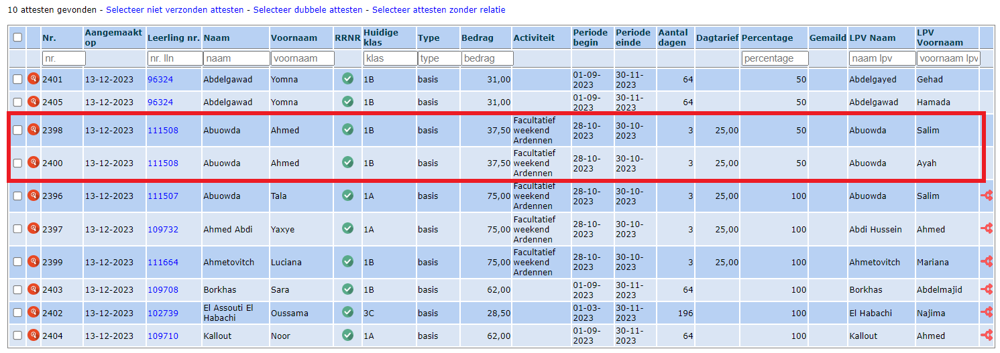

Ouders hebben recht op belastingvermindering voor de uitgaven die ze deden voor alle opvang- en vrijetijdsinitiatieven buiten de normale lesuren: tijdens schoolvakanties, in het weekend, op vrije dagen en woensdagnamiddagen, voor- en naschoolse opvang en opvang tijdens de middagpauzes. Scholen dienen daarom voor de **betaalde** kinderopvang een fiscaal attest op te maken en dit voor alle leerlingen tot de leeftijd van 14 jaar. 

## 1. Artikels die recht geven op een fiscaal attest kinderopvang

### 1.1 Voor- en naschoolse opvang en opvang tijdens middagpauzes

In de module Leerlingenrekeningen kan je via het menu [Artikels](/leerlingenrekeningen/Artikels%20en%20artikelgroepen/#artikels) voor elk artikel aangeven of het recht geeft op belastingsvermindering. Voor voor- en naschoolse opvang en opvang tijdens de middagpauzes volstaat het dat dit vinkje is aangezet. Alle aanrekeningen waarin het artikel wordt gebruikt, zullen toegevoegd worden aan het attest kinderopvang. 

:::caution OPGELET
Dit werkt niet met terugwerkende kracht! Heb je in het verleden reeds artikels aangerekend die recht geven op belastingsvermindering, maar waarvoor het vinkje niet was aangezet, dan zullen deze artikels niet mee in rekening worden gebracht op het attest kinderopvang. Contacteer in dat geval het Toolbox-team. 
:::

### 1.2 Uitstappen tijdens het weekend en schoolvakanties
Indien de school ook uitstappen of reizen organiseert die tijdens het weekend of tijdens een schoolvakantie plaatsvinden, moet er ook hiervoor een fiscaal attest voor kinderopvang worden afgeleverd. Om voor dergelijke activiteiten een correct fiscaal attest te kunnen genereren vanuit Toolbox, moet de aanrekening gekoppeld zijn aan een activiteit uit de [Activiteitenmodule](/activiteiten). Hier zijn 2 werkwijzes mogelijk:
1. De Activiteitenmodule is in gebruik op de school en de activiteit werd hierin aangemaakt. Vervolgens werd ze geïmporteerd in de module Leerlingenrekeningen om aan te rekenen via de schoolrekening. De werkwijze hiervoor vind je terug in de handleiding van de [Activiteitenmodule](/activiteiten). Toolbox heeft met deze werkwijze voldoende info om correcte fiscale attesten kinderopvang te kunnen afleveren voor deze activiteit. 

2. De Activiteitenmodule wordt NIET gebruikt door de school. Toolbox heeft op basis van alleen de aanrekening in de module Leerlingenrekeningen NIET voldoende info om correcte fiscale attesten voor kinderopvang te kunnen afleveren. De aanrekening moet hiervoor nog gekoppeld worden aan een activiteit uit de Activiteitenmodule. Het is ook mogelijk om die koppeling nog te leggen nadat de activiteit reeds gefactureerd werd.
     - STAP 1: Maak de activiteit aan in de Activiteitenmodule. Lees [hier](/activiteiten) hoe je te werk gaat. Het is mogelijk om een activiteit in het verleden aan te maken. 

     - STAP 2: Open de module Leerlingenrekeningen en selecteer de notagroep waarin de activiteit werd aangerekend. 

     - STAP 3: Ga naar 'Aanrekenen' of 'Aanrekenen artikel' en open de aanrekening van de activiteit.
     
     - STAP 4: Klik bij het gebruikte artikel (helemaal bovenaan) op het icoon <LegacyAction img="busGrijs.png"/> in de kolom Acitviteit.

     

     - STAP 4: Selecteer de actitiveit die je wenst te koppelen en wijzig dit voor alle leerlingen in de aanrekening. 

     

    - STAP 5: Klik op 'Koppel activiteit'.

     Wanneer de activiteit correct gekoppeld is zal het grijze icoon van de bus rood geworden zijn <LegacyAction img="busred.png"/>. 
     Indien je voor eenzelfde activiteit meerdere facturen hebt gemaakt (bv. voorschotfacturen voor een meerdaagse reis), dien je alle deelfacturen te koppelen aan de activiteit. Op basis daarvan heeft Toolbox voldoende info om correcte fiscale attesten kinderopvang op te maken. 
     

## 2. Voorbereiding 

### 2.1 In de module Instellingen

Om correcte fiches te genereren, moeten er eerst een aantal zaken worden ingesteld in de module Instellingen van Toolbox.

De gegevens van de school/werkgever die op de fiscale fiches komen zijn dezelfde voor personeelsleden als voor de attesten kinderopvang voor ouders en moeten worden ingesteld in de Instellingen => Woon-werkverkeer. 

Vul alle gevraagde gegevens in, zowel van de schuldenaar als van de afzender. In de praktijk zullen deze twee meestal dezelfde zijn. Let op dat je hier de gegevens van de VZW invult en niet van de school. De VZW is namelijk de werkgever. 

Selecteer onderaan ook het inkomstenjaar (2023) waarvoor de personeelsleden via de module **Openbaar vervoer** of de module **Fietsvergoeding** de fiscale fiche kunnen downloaden. 

<Thumbnails img={[
    require('./opvang1.PNG').default, 
    require('./opvang2.PNG').default, 
]} />

### 2.2. In de module Leerlingenrekeningen

Ook in de module Leerlingenrekeningen bij het menu 'Scholen' moeten nog een aantal zaken ingesteld worden alvorens men fiscale attesten kan genereren. Klik op het potloodje vóór de school en ga naar het tabblad 'Attest kinderopvang'. 

- Vink aan dat de school attesten voor kinderopvang maakt. 
- Vul verder de naam en hoedanigheid van de ondertekenaar in. 
- Onderaan kan ook de handtekening van de ondertekenaar geselecteerd worden (indien die werd ingescand en doorgegeven aan het Toolbox-team via toolbox@kobavzw.be). 
- Wanneer de attesten kinderopvang via mail verstuurd worden, kan je hier de tekst voor het e-mailbericht instellen. Daarvoor kan je gebruik maken van enkele dynamische variabelen die bij het versturen van het bericht opgevuld zullen worden met de corresponderende leerlingengegevens.
- Als alles correct is ingesteld, klik je op 'School bijwerken'.  

## 3. Attesten kinderopvang genereren

Je kan attesten kinderopvang aanmaken in de module **Leerlingenrekeningen => Rapporten => Attest kinderopvang**. Selecteer daar het inkomstenjaar (bv. 2023 voor de aangifte in het jaar 2024).

Als je nog geen attesten hebt aangemaakt, krijg je hiervoor een melding. Er wordt kort samengevat wat je eerst moet doen alvorens de attesten aan te maken:

- Laat de synchronisatie met Informat/Wisa nog een keer lopen. Dat doe je in de module **Synchronisatie leerlingen** voor leerlingen van het secundair onderwijs en in de module **Synchronisatie leerlingen basis** voor leerlingen van de basisschool. Daar voer je de eerste twee stappen uit (Informat/Wisa uitlezen + Synchroniseer leerlingen). 
- Kijk goed na of alle aangemaakte (en verzonden) facturen zijn doorgeboekt naar Exact Online. Je kan dit makkelijk zien in het menu **Zoek Facturen** van de module **Leerlingenrekeningen**. Daar klik je in de menubalk op het icoontje van Exact <LegacyAction img="exact.png"/>.

- Zorg dat alle betaalde facturen in Exact zijn afgepunt. De fiscale attesten kunnen enkel uitgereikt worden voor bedragen die effectief betaald zijn. Als de facturen dus niet (correct) afgepunt zijn in Exact, worden deze bedragen niet meegenomen voor het fiscaal attest.
- Haal de openstaande facturen op uit Exact Online. Zo weet Toolbox welke facturen nog niet betaald zijn. Als het ophalen van de openstaande facturen gebeurt vanuit een centrale Toolbox, kan je in de module **Openstaande facturen** steeds zien wanneer er voor het laatst gegevens werden opgehaald. 

Bij het opmaken van de fiscale attesten maken we een onderscheid tussen:
- Fiscale attesten voor voor-en naschoolse opvang => Alle opvang wordt samengebracht op 1 attest.
- Fiscale attesten voor uitstappen of reizen die plaatsvonden tijdens het weekend of een schoolvakantie => Er moet een apart attest/bijkomend attest opgemaakt worden per activiteit.

### 3.1 Fiscaal attest voor voor- en naschoolse opvang en opvang tijdens middagpauzes

Als je hogervermelde stappen hebt doorlopen, dan klik je bovenaan links op de rekenmachine <LegacyAction img="calculator.png"/>. Je krijgt nu de vraag of je de attesten voor 2023 wil laten berekenen. Klik op OK en er verschijnt een voortgangsindicator. Laat die even lopen.

 

Na het aanmaken van de attesten krijg je te zien hoeveel attesten er werden aangemaakt. Klik op de link 'Ga naar de aangemaakte attesten'.

Je krijgt nu de tabel te zien met de aangemaakte attesten. Standaard wordt er één attest per leerling gemaakt aan 100% voor de voor- en naschoolse opvang. Indien er andere activiteiten werden aangerekend die plaatsvonden tijdens het weekend of een schoolvakantie, moet er per activiteit nog een bijkomend attest aangemaakt, eveneens voor 100%. Voor meer info over het genereren van deze bijkomende fiscale attesten, zie punt 3.2 of klik [hier](/fiscale_attesten_kinderopvang#32-fiscaal-attest-voor-uitstappen-tijdens-het-weekend-en-schoolvakanties). 

Je kan de attesten als pdf generen of rechtstreeks mailen naar de ouders. Selecteer de leerlingen waarvoor je het attest wil afdrukken/mailen en klik bovenaan op één van volgende iconen <LegacyAction img="pdf.png"/> <LegacyAction img="mailEnveloppe.png"/>.

Verder kan je attesten ook volledig verwijderen door ze te selecteren en bovenaan te klikken op <LegacyAction img="remove.png"/>. Nadat een attest verwijderd is, kan je het opnieuw genereren door terug op de rekenmachine <LegacyAction img="calculator.png"/> te klikken. 

### 3.2 Fiscaal attest voor uitstappen tijdens het weekend en schoolvakanties

Klik bovenaan op de rode bus <LegacyAction img="busred.png"/> om fiscale attesten aan te maken voor uitstappen die tijdens het weekend of een schoolvakantie hebben plaatsgevonden.

 

In een dropdownlijst zie je alle activiteiten uit de activiteitenmodule waarvoor er facturen werden gemaakt. Selecteer uit deze lijst de activiteit waarvoor je fiscale attesten wil maken.  

:::caution belangrijk
Indien er voor een activiteit meerdere (voorschot)facturen werden gemaakt, moeten alle deelfacturen aan deze activiteit gekoppeld zijn om het correcte bedrag op het fiscaal attest te kunnen weergeven. Klik [hier](/fiscale_attesten_kinderopvang#12-uitstappen-tijdens-het-weekend-en-schoolvakanties) om te lezen hoe je activiteiten kan koppelen aan een aanrekening. 
:::

Enkel wanneer de factuur (of alle deelfacturen) voor een activiteit volledig is (zijn) betaald, zal je een attest kunnen genereren. 
Selecteer de leerlingen waarvoor je het attest wil opmaken. Achter de naam van de leerling kan je controleren hoe oud de leerling was bij aanvang en bij afloop van de activiteit. Wanneer een leerling tijdens de activiteit de leeftijd van 14 jaar bereikte, kan het attest in een latere fase manueel gecorrigeerd worden. 
Wanneer je de checkbox bovenaan gebruikt om alle leerlingen te selecteren, zullen enkel de leerlingen geselecteerd worden die bij aanvang van de activiteit nog niet de leeftijd van 14 jaar hadden bereikt en dus recht hebben op een fiscaal attest. 

Klik op 'Maak attest aan voor geselecteerde leerlingen'.

Je krijgt nu de tabel te zien met de aangemaakte attesten. Standaard wordt er één attest per leerling per activiteit aangemaakt aan 100%. Indien er nog andere activiteiten werden aangerekend die plaatsvonden tijdens het weekend of een schoolvakantie, moeten nog bijkomende attesten worden aangemaakt. Herhaal voor elke activiteit de bovenstaande stappen.

Je kan de attesten als pdf generen of rechtstreeks mailen naar de ouders. Selecteer de leerlingen waarvoor je het attest wil afdrukken/mailen en klik bovenaan op één van volgende iconen <LegacyAction img="pdf.png"/> <LegacyAction img="mailEnveloppe.png"/>.

Verder kan je attesten ook volledig verwijderen door ze te selecteren en bovenaan te klikken op <LegacyAction img="remove.png"/>. Nadat een attest verwijderd is, kan je het opnieuw genereren door terug op de rekenmachine <LegacyAction img="calculator.png"/> te klikken. 

## 4. Attest aanpassen

In het overzicht met alle attesten kan je in de tweede kolom op het vergrootglas <LegacyAction img="vergrootglasRood.png"/> klikken. Daarmee open je de detail van het fiscaal attest en zie je welke bedragen er werden meegerekend. 

Je kan van hieruit de facturen openen door te klikken op het blauwe factuurnummer.

Je kan ook bepaalde facturen van het fiscale attest verwijderen door op het rode kruisje <LegacyAction img="remove.png"/> achteraan te klikken. 

Verder kan je de details (bedrag, periode, aantal dagen, dagtarief) op het attest manueel aanpassen door te klikken op 'Wijzig dit attest'. Dit is nodig voor kinderen die tijdens een meerdaagse activiteit de leeftijd van 14 jaar hebben bereikt. Toolbox zal in dat geval niet automatisch het totaalbedrag en het aantal dagen herberekenen. Via deze weg kan het attest gecorrigeerd worden. Het dagbedrag moet in de meeste gevallen behouden blijven. Enkel het aantal dagen en het totaalbedrag (= dagbedrag x aantal dagen) moet manueel worden aangepast. 

Klik op 'Wijzig attest' om de aanpassingen te bewaren. 

:::caution nota
Wanneer het dagbedrag lager is dan het toegelaten maximumbedrag van 15,70 euro, moet dit niet worden ingevuld op het attest. 
:::

## 5. Attest opsplitsen of overzetten naar andere leerplichtverantwoordelijke (LPV)

Wil je het attest splitsen, bijvoorbeeld voor gescheiden ouders, dan klik je in het overzicht op het achterste icoontje <LegacyAction img="splits.png"/>. In dit scherm kan je het attest vervolgens splitsen door een percentage lager dan 100% in te vullen en een andere relatie te kiezen. Er wordt een tweede attest aangemaakt op naam van deze geselecteerde relatie en het oorspronkelijke attest (percentage) wordt aangepast. Deze herberekening gebeurt automatisch. Je kan dus nooit attesten uitreiken voor meer dan 100% van de betaalde kosten.  

Je kan dit scherm ook gebruiken om het bestaande attest op een andere naam te zetten. Je kiest de juiste relatie uit de lijst en je vult bij percentage 100% in. Het bestaande attest wordt op die manier volledig overgezet naar de nieuwe relatie.

## 6. XML-bestand aanmaken

In eerste instantie bezorgt de school een fiscaal attest aan de ouders. Daarnaast moeten de gegevens van het attest ook digitaal meegedeeld worden aan de FOD Financiën en dit uiterlijk op de laatste kalenderdag van de maand februari. 

Het nodige XML-bestand kan in Toolbox (Leerlingenrekeningen => Rapporten => Attest kinderopvang) gegenereerd worden via de knop <LegacyAction img="belcotax.png" />bovenaan.

Het XML-bestand wordt nu gedownload. Je kan het terugvinden links onderaan of rechts bovenaan je scherm bij downloads of in de map 'downloads' op je computer.

Om het bestand te kunnen indienen bij Belcotax-on-web moet het XML-bestand nog worden omgezet naar een BOW-bestand. Hoe je dat doet, lees je [hier](https://tbvs.be/downloads/Xml_naar_bow.pdf). Dit BOW-bestand moet worden opgeladen via de online toepassing van Belcotax-on-web. Indien je geen toegang hebt tot deze applicatie, neem je best contact op met je regioboekhouder. 

