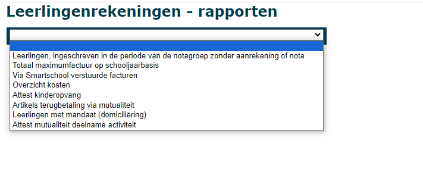
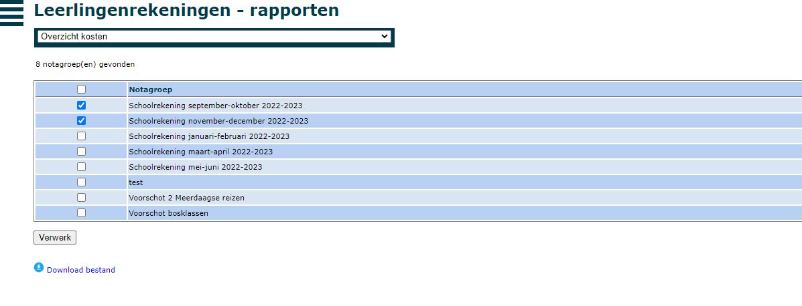
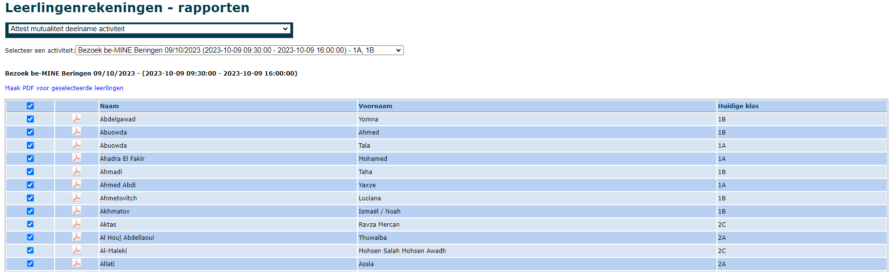

Via het menu Rapporten kan je onderstaande rapporten opvragen.

## Leerlingen zonder aanrekening of nota
Aan de hand van dit rapport kan je nagaan of je leerlingen over het hoofd hebt gezien bij het aanrekenen van kosten. Het rapport is gekoppeld aan een bepaalde notagroep en geeft weer welke leerlingen in die bepaalde facturatieperiode een inschrijving hadden in de school, maar waarvoor toch niets is aangerekend. Idealiter is dit rapport leeg. 

Mogelijk is een leerling in de loop van de facturatieperiode ingeschreven geweest, maar bij het opmaken van de facturen reeds uitgeschreven. Het zou dus kunnen dat men bij het aanrekenen van de kosten deze leerling over het hoofd heeft gezien. Aan de hand van dit rapport is dat makkelijk na te gaan. De leerling kan eenvoudig toegevoegd worden aan de bestaande aanrekeningen. 

Lees [hier](/leerlingenrekeningen/FAQ/#3-kan-ik-nog-een-factuur-opmaken-voor-een-leerling-die-reeds-is-uitgeschreven) hoe je een factuur kan maken voor een leerling die reeds is uitgeschreven. 

## Totaal maximumfactuur op schooljaarbasis

In dit rapport kan je het totaalbedrag per leerling raadplegen dat gedurende het geselecteerde schooljaar reeds is aangerekend in het kader van de maximumfactuur. De resultatenlijst is gesorteerd op bedrag van laag naar hoog.

Om een artikel te laten meetellen voor de maximumfactuur zet je in de algemene artikelenlijst (menu > Artikels) het vinkje aan bij het betreffende artikel. Geef bij Scholen (tabblad facturen) ook zeker op dat de school gebruik maakt van de maximumfactuur.

:::caution OPGELET
Toolbox houdt enkel rekening met de **scherpe maximumfactuur**. Bij artikelen die in aanmerking komen voor de minder scherpe maximumfactuur kan je het vinkje best **niet** aanzetten. Momenteel bestaat er in Toolbox nog geen mogelijkheid om de minder scherpe maximumfactuur op te volgen.
:::

## Via Smartschool verstuurde facturen
Hier tref je een overzicht van alle facturen in de geselecteerde notagroep die via Smartschool zijn verstuurd. Achteraan zie je hoe vaak de leerling en/of de ouders het bericht hebben geopend. 

## Overzicht kosten

Door middel van het rapport 'Overzicht kosten' kan je één of meerdere notagroepen selecteren om vervolgens alle aangerekende kosten per leerling voor die notagroepen te exporteren naar Excel. Dit document bevat ook alle boekhoudkundige parameters per aangerekend artikel. Door via het menu 'Start' het schooljaar (éénmalig) te wijzigen, kunnen ook kosten van notagroepen uit voorgaande schooljaren worden opgevraagd.

## Attest kinderopvang

Toolbox kan automatisch fiscale attesten voor de kinderopvang aanmaken. Klik [hier](/leerlingenrekeningen/Rapporten/attesten_kinderopvang/) voor de volledige procedure.

Om een artikel te laten meetellen voor het attest kinderopvang zet je in de algemene artikelenlijst (menu > Artikels) het vinkje aan bij het betreffende artikel.

## Artikels terugbetaling via mutualiteit
Voor sommige activiteiten voorziet de mutualiteit een financiële tegemoetkoming. Hiervoor moet er per activiteit een formulier worden ingevuld. In de meeste scholen gebeurt dit op initiatief van de leerling (ouders). Wanneer een leerling een formulier binnenbrengt, kan je via dit rapport snel nagaan welke kosten (die in aanmerking komen voor een terugbetaling via de mutualiteit) er voor de betreffende leerling zijn gemaakt. OPGELET! Dit rapport houdt geen rekening met betalingen. Je controleert best via de module Openstaande facturen of de activiteiten effectief zijn betaald. 

Om een artikel te laten meetellen voor de terugbetaling via de mutualiteit zet je in de algemene artikelenlijst (menu > Artikels) het vinkje aan bij het betreffende artikel.

## Leerlingen met mandaat (domiciliëring)
Hier vind je een volledig overzicht van alle leerlingen waarvoor een domiciliëringsopdracht is. Je vindt er ook de referentie van het mandaat en de omschrijving terug. 

## Attest mutualiteit deelname activiteit
Wanneer een activiteit werd aangevraagd via de [activiteitenmodule](/activiteiten), wordt er automatisch een attest aangemaakt voor elke deelnemer. 
- Selecteer uit de lijst de activiteit waarvoor je attesten wil afdrukken.  
- Via het pdf-icoon vooraan kan je het attest downloaden en afdrukken.

:::caution let op
Er wordt geen rekening mee gehouden of een activiteit al dan niet werd betaald. Dit is nog na te kijken via de module Openstaande facturen.  
:::