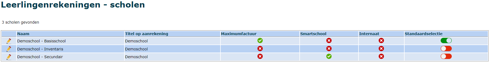
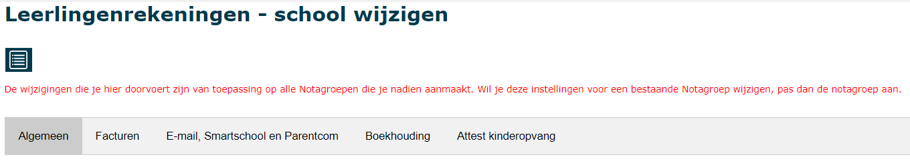
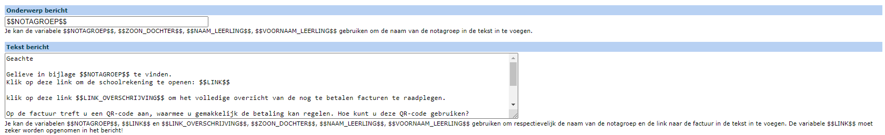
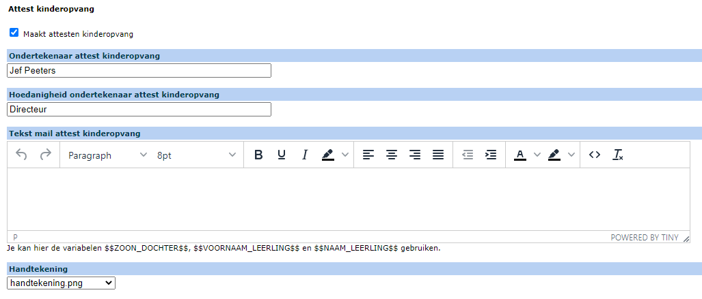

De eerste stap is het aanmaken van de school of scholen. Een 'school' in de module
leerlingenrekeningen bestaat altijd uit één of meerdere instellingsnummers. Binnen de module kunnen
er meerdere scholen aangemaakt worden in verschillende combinaties van instellingsnummers. Dit kan
niet door de gebruiker zelf gebeuren. Deze instellingen moeten door de helpdesk van de Toolbox
worden ingesteld. Eens de school is aangemaakt, kunnen de parameters en een sjabloon voor de
facturen worden ingesteld.

:::tip info
Klik steeds op <LegacyAction img="school_bijwerken.png"/> onderaan elk tabblad om de wijzigingen te bewaren.  
Klik op <LegacyAction img="listWit.png"/> om terug te keren naar het beginmenu.
:::
 

Klik op <LegacyAction img='menu.JPG'/> om het menu te openen en ga **Scholen**. 

Aan de hand van de groene vinkjes of rode kruisjes kan je in één oogopslag zien of de school gebruik maakt van de maximumfactuur, of er een smartschoolplatform is ingesteld.

**Standaardselectie:** Dit geeft aan welke school als standaard staat opgegeven. Alle gebruikers zullen standaard in deze school werken, tenzij zij in het startscherm (eenmalig of permanent) een andere school selecteren. 

Klik op <LegacyAction img='potlood2.png'/> om de parameters aan te passen, zoals hieronder weergegeven in 5 tabbladen. De inhoud van elk tabblad wordt hieronder uitvoerig toegelicht. 

## 1. Algemeen

Dit tabblad bevat de algemene gegevens van de school zoals naam en adres. 
- **Naam**: Is de naam van de school die in het programma zal worden gebruikt. Dit is **niet** de naam die op de facturen wordt weergegeven. Die stel je in bij het tabblad 'Facturen'.
- **Schoolnummer gestructureerde mededeling**: Dit nummer is voor elke school in eenzelfde boekhouddossier uniek en wordt gebruikt in de gestructureerde mededeling van de leerlingenfacturen. Het wordt vooraf ingesteld door Toolbox.
- **Sortering notagroep**: De recentste notagroep kan standaard onderaan of bovenaan getoond worden.  
- **Klas of klascode**: Op de facturen kan de volledige benaming van de klas of de (kortere) klascode gebruikt worden. De benamingen worden opgehaald uit het administratief pakket (Informat of Wisa).

## 2. Facturen

In dit tabblad kan onder andere het sjabloon voor de factuur worden aangepast.

- **Naam**: Dit is de naam van de school zoals die op de facturen zal worden weergegeven.
- **Tekst onderaan de factuur**:  Dit is de tekst die onder de aanrekening komt. Deze tekst kan meerdere dynamische variabelen bevatten. Door die variabelen in de tekst op te nemen, wordt de factuur dynamisch per individuele leerling opgemaakt.   
    - $$TOTAALBEDRAG$$: het factuurbedrag
    - $$OGM$$: de gestructureerde mededeling. Door de gestructureerde mededeling te gebruiken, worden betalingen automatisch afgepunt in Exact Online. Het gebruik van deze variabele is sterk aan te raden. 
    - $$REKENINGNUMMER$$: indien onderaan ingevuld 
    - $$VERVALDATUM$$
    - $$ZOON_DOCHTER$$ 
    - $$PAGINAEINDEMETHOOFDING$$
    - $$PAGINAEINDE$$ 
- **Tekst onderaan de factuur indien factuur bedrag negatief**: Er kan een aparte tekst worden opgemaakt voor creditbedragen. Het systeem zal automatisch de correcte tekst gebruiken afhankelijk van het factuurbedrag (positief of negatief). 
- **Tekst indien domiciliëring**: Er kan er ook een aparte tekst worden opgemaakt voor facturen die met domiciliëring worden betaald. Ook dan zal het systeem automatisch de juiste tekst gebruiken. 

:::tip Belangrijk
Er kunnen in één notagroep dus zowel 'gewone' aanrekeningen, creditnota's als aanrekeningen met domiciliëring gemaakt worden. Het systeem zal automatisch de juiste tekst gebruiken.
:::

- **Voetnoot op factuur**: Tekstveld voor een eventuele voetnoot. Bijvoorbeeld om de algemene gegevens van de school op te nemen, zoals maatschappelijke zetel, ondernemingsnummer, ... 
- **Logo**: Het geselecteerde logo wordt op de factuur weergegeven. Dat kan zowel bovenaan als onderaan (**Logo footer**) op de pagina. De grootte kan ingesteld worden via **Hoogte logo (in px)**.
- **Positie adres op factuur**: Keuze tussen links of rechts afhankelijk van huisstijl en venstenveloppe. Vervolgens kunnen ook de marges rond het adresveld worden ingesteld worden via **Marges in mm**.
- **Overschrijvingsformulier sjabloon**: Je kan facturen afdrukken met een overschrijvingsformulier. OPGELET! Op deze facturen staan ook alle openstaande facturen van de leerling vermeld. Hoe deze openstaande facturen moeten worden getoond (met detail of zonder) kan worden ingesteld bij ‘Toon detail openstaande facturen op overschrijving’. Bij de optie ‘met detail’ worden alle openstaande facturen afzonderlijk getoond. Indien je ‘zonder detail’ kiest, wordt enkel het totaal openstaand saldo weergegeven. 
- **Maximumfactuur**: Aanvinken als het regime van de maximumfactuur van toepassing is (basisscholen).
- **Factuur aan leerling (in plaats van aan de ouders)**: Vink dit aan als de factuur aan de leerling zelf gericht moet worden. 
- **Rekeningnummer**: Invullen om de dynamische variabele $$REKENINGNUMMER$$ te kunnen gebruiken en om een QR code te genereren op de facturen. 
- **Voeg EPC of POM QR code toe**: Vink één van de twee mogelijkheden aan indien je een QR code wil toevoegen aan de facturen. De EPC QR code zet een overschrijving klaar in de eigen bankapp en is gratis. POM biedt meer functionaliteiten aan, zoals betalen met Payconiq of via een betaallink. POM is echter wel betalend. Tarieven raadplegen en activeren kan via https://app.pom.be/nl/connect/koba-toolbox/tarieven. POM zal pas functioneel zijn als het contract is geactiveerd. Lees [hier](/leerlingenrekeningen/FAQ/#5-ouders-melden-dat-de-qr-code-op-de-factuur-niet-werkt) meer over de QR codes. 
- **Klas ‘UIT’ verbergen**: Indien aangevinkt, wordt op een factuur voor een leerling die is uitgeschreven, geen klas vermeld. Als uitgevinkt, verschijnt in de plaats van de klas of klascode het woord ‘UIT’ op de factuur.  
- **Klas ook naast adres tonen**: De klas wordt ook getoond in het adresveld. Dit is een handige optie bij het gebruik van vensterenveloppes. 

## 3. E-mail, Smartschool, Parentcom en Questi
- **Smartschool**: De facturen kunnen dankzij de synchronisatie met Smartschool rechtstreeks naar de co-accounts worden verzonden. Kies bij **Verzenden via Smartschool** het juiste Smartschoolplatform (vooraf in te stellen in de module Instellingen van Toolbox). Geef ook de **Afzender Smartschool** op. Afhankelijk van de instellingen van de webservices in Smartschool, is dit het intern nummer of de gebruikersnaam van de gebruiker in Smartschool die de berichten verstuurt. 
- **E-mail**: Indien er bij **Verzenden via Smartschool** geen smartschoolplatform wordt geselecteerd, kan er gebruik gemaakt worden van e-mail. Geef dan zeker op wie de afzender is (**Naam afzender mail** en **Mailadres afzender mail**). Optioneel kunnen alle mails naar een e-mailadres in CC gestuurd worden. Om te kunnen mailen, moeten de velden hieronder ook worden ingevuld. Hiervoor kan je steeds beroep doen op het Toolbox-team. 

 <Thumbnails img={[
    require('./scholen3.PNG').default, 
 ]} />

- **Parentcom/Questi**: Maak je reeds gebruik van het communicatieplatform Parentcom of Questi, dan kunnen de Toolboxfacturen ook via die weg verstuurd worden. De koppeling met Toolbox kan aangevraagd worden bij voorkeur via de helpdesk. Die vind je terug in Toolbox bij het vraagteken rechtsboven. Heb je geen toegang tot Toolbox, dan kan je mailen naar toolbox@kobavzw.be. 

- **Berichten**: Het onderwerp en de berichttekst worden zowel voor Smartschool, E-mail als Parentcom gebruikt. In het **Onderwerp** van het bericht kan de dynamische variabele **$$NOTAGROEP$$** worden gebruikt om de naam van de notagroep in de tekst toe te voegen.  Ook volgende dynamische variabelen kunnen eventueel worden toegevoegd aan het onderwerp:  $$ZOON_DOCHTER$$, $$NAAM_LEERLING$$, $$VOORNAAM_LEERLING$$.

  Voorts moet er altijd een tekst voor het bericht worden aangemaakt. Schrijf de tekst in het veld bij **Tekst bericht**. Daar zijn volgende dynamische variabelen beschikbaar: 
  - $$NOTAGROEP$$: Naam van de notagroep (factuur)
  - $$LINK$$: De link naar de factuur. Deze variabele moet ALTIJD opgenomen worden in het bericht. De factuur is immers enkel beschikbaar via een link naar de server waar de factuur als dynamische pdf staat opgeslagen.
  - $$LINK_OVERSCHRIJVING$$: link naar een overzicht van alle openstaande facturen van de leerling. In het tabblad Facturen kan je instellen of je enkel het totaal openstaand saldo wil tonen (toon detail = uitgevinkt) of elke openstaande factuur als een aparte lijn (toon detail = aangevinkt). 
  - $$ZOON_DOCHTER$$
  - $$NAAM_LEERLING$$
  - $$VOORNAAM_LEERLING$$
  

- **Tekst Smartschoolbericht naar leerlingen**: Dit biedt de mogelijkheid om ook naar de leerlingen een bericht te sturen wanneer de facturen naar de co-accounts worden verzonden. In dit bericht kan er geen link gemaakt worden naar de factuur. Het is louter ter info. Vul je geen tekst in, dan wordt er geen bericht naar leerlingen gestuurd.

- **Mails met opmaak verzenden**: E-mailberichten kunnen in HTML-formaat verstuurd worden. Hierdoor krijgen ze een mooiere lay-out waarin ook het schoollogo kan worden opgenomen. De link naar de factuur is korter en allerlei kleuren kunnen naar eigen keuze worden ingesteld (bv. op basis van de huisstijl). Door te klikken op de kleur, kan een andere kleur gekozen worden en kan je de RGB-waarden invullen. Door te klikken op <LegacyAction img="kleur.png"/> kan je op je scherm een specifieke kleur selecteren en vervolgens gebruiken in de mailinstellingen. 

## 4.	Boekhouding 
Stel hier in welk dagboek en welke betalingsvoorwaarden gebruikt moeten worden voor de leerlingenrekeingen. Die zijn nodig om de facturen over te zetten naar Exact Online. Deze instellingen kunnen geselecteerd worden uit de lijst op voorwaarde dat ze op voorhand geïmporteerd zijn via de importmodule van de leerlingenrekeningen via het menu <LegacyAction img="menu.JPG"/> > Importeer > Grootboekrekeningen, kostenplaatsen/kostendragers en betalingsvoorwaarden uit Exact Online. Zie ook ‘Importeren’. 

- **Dagboek Exact Online**: In de regel moet hier het verkoopdagboek leerlingen worden geselecteerd dat specifiek van toepassing is voor het boekhouddossier in Exact Online. 
- **Betalingsvoorwaarde Exact Online**: Selecteer binnen welke termijn de factuur betaald moet worden. 
- **Betalingsvoorwaarde domiciliëring Exact Online**: Kies voor DO (domiciliëring) indien het mogelijk is om te betalen via domiciliëring. 
- **SEPA schuldeisersidentificatie**: Dit nummer moet enkel worden ingevuld wanneer de school de mogelijkheid biedt om te betalen via domiciliëring en moet worden opgevraagd bij de boekhouding. 

## 5.	Attest kinderopvang
Verder kan je nog aanduiden of de school attesten voor de kinderopvang maakt. Je stelt ook in wie die attesten ondertekent. De coördinaten van de school die op het attest moeten komen, moeten worden ingesteld in de module Instellingen van Toolbox. 

De attesten kunnen ook via e-mail, Smartschool of Parentcom verstuurd worden. Het tekstbericht kan hier worden ingesteld. Ook hier kunnen weer een aantal dynamische variabelen worden gebruikt. 

Tot slot kan je de handtekening van de directeur toevoegen aan de attesten, zodat die niet elk afzonderlijk attest moet ondertekenen. Indien er geen handtekening beschikbaar is of de beschikbare handtekening is niet correct, bezorg dan de correcte handtekening aan het Toolbox-team. Er wordt best voldoende groot gehandtekend op een wit papier. De scan is bij voorkeur in PNG- of JPG-formaat.

Lees hier [hier](/fiscale_attesten_kinderopvang) meer over het aanmaken van de attesten kinderopvang. 

