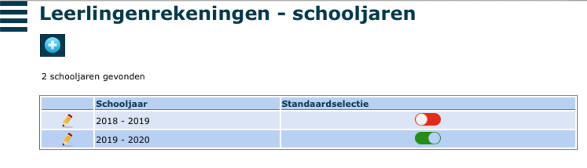

In het menu ‘Schooljaren’ kan je zelf nieuwe schooljaren aanmaken. Je kan hier ook instellen wat het standaardschooljaar is. Om een nieuw schooljaar aan te maken, klik je op <LegacyAction img="pluscircleblue.png" />.

 

