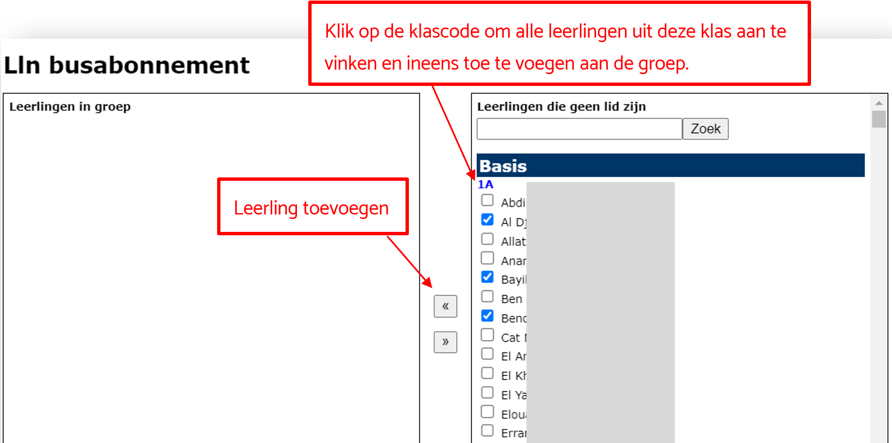

Meestal worden artikelen aangerekend aan individuele leerlingen of aan klas- of subgroepen. Deze leerlingen en groepen worden geïmporteerd vanuit het pakket leerlingenadministratie (Informat of Wisa) via de synchronisatiemodules. Soms kan het echter zinvol zijn om nog andere groepen te definiëren. Bv. een groep leerlingen met een busabonnement dat voor het zwemmen enkel het inkomticket moet betalen en niet voor het busvervoer. Hiervoor kan je rechtstreeks in de leerlingenrekeningen een eigen groep aanmaken. Die groep kan je later selecteren bij het aanrekenen van artikelen en/of in de module Registratie Basisschool. 

## 1. Groep toevoegen

Door te klikken op de blauwe tekst, voeg je een eigen groep toe die je kan samenstellen na het invoeren van een groepsnaam.
<Thumbnails img={[
    require('./groepen1.PNG').default, 
    require('./groepen2.PNG').default,
]} />

## 2. Leerlingen toevoegen 

Via <LegacyAction img="person.png"/> kan je de groepen samenstellen. Alle leerlingen kunnen toegevoegd worden aan of verwijderd worden uit de groep door te klikken op de dubbele pijltjes in het midden. De leerlingen die zijn toegevoegd aan de groep, worden in de linkerkolom weergegeven. Zij kunnen te allen tijde weer worden verwijderd uit de groep.

LET OP dat je leerlingen pas uit de groep verwijdert nadat alle kosten zijn aangerekend. 

## 3. Overige acties

<LegacyAction img="delen.png"/> Selecteer (rood) om de groep te delen met andere gebruikers. Zij kunnen de groep niet wijzigen, maar wel gebruiken om artikelen aan te rekenen aan de groep of voor de Registratie Basisschool (indien actief gezet). 
 
<LegacyAction img="registratieBasisschool.png"/>Selecteer (Geel) om de groep te kunnen gebruiken in Registratie Basisschool.  
 
<LegacyAction img="edit.png"/>Selecteer om de groepsnaam te wijzigen. 
 
<LegacyAction img="remove.png"/>Selecteer om de volledige groep te verwijderen. 

