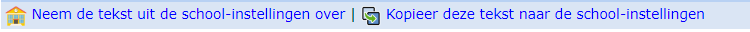
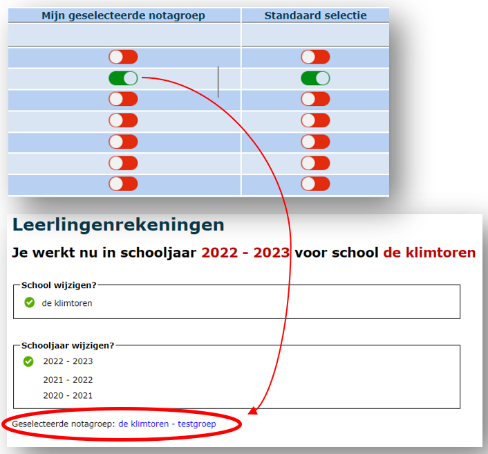

Een notagroep is een facturatieperiode. Op het einde van zo'n periode volgt er logischerwijs een factuur. Dit is een verzamelfactuur van alle aangerekende kosten per individuele leerling in de betreffende periode, bv. een trimester. In dat geval moet er per trimester een nieuwe notagroep worden aangemaakt. Binnen een notagroep kunnen kosten in de vorm van artikels worden aangerekend.

Klik op <LegacyAction img="pluscircleblue.png"/> om een nieuwe notagroep aan te maken. Een nieuwe notagroep neemt standaard de instellingen van de school over (zie [Scholen](/leerlingenrekeningen/Scholen/)). Het is echter mogelijk om de instellingen specifiek voor een welbepaalde notagroep te overschrijven. 

<Thumbnails img={[
    require('./notagroepen1.PNG').default, 
]} />

- **Facturatiedatum**: Dit is de datum van de factuur. Deze datum zal ook getoond worden op de factuur. Op basis van de facturatiedatum in combinatie met de 'Betalingsvoorwaarde Exact Online' in het tabblad Boekhouding zal de vervaldatum van de factuur berekend worden. De facturatiedatum kan na het aanmaken van een notagroep of zelfs na het aanrekenen van artikels nog aangepast worden. -  
- **Naam notagroep**: Kies hiervoor een logische naam voor de facturatieperiode. Bijvoorbeeld: eerste trimester schooljaar 2022-2023. Deze tekst zal ook worden hernomen op de factuur.
- **Omschrijving notagroep**: Hier kunnen aanvullende gegevens betreffende de notagroep worden opgenomen. Deze tekst komt niet mee op de factuur.
- **Begin- en einddatum periode**: Het effectieve tijdvak waarover er wordt gefactureerd. M.a.w. de periode waarin de kosten zijn gemaakt. Dit is vooral van belang voor de eigen administratie om gemakkelijk na te gaan welke periode vervat zit in de aanrekening.

De overige instellingen onder de tabbladen **Facturen, E-mail, Smartschool en Parentcom en Boekhouding** worden overgenomen van de instellingen bij het menu [Scholen](/leerlingenrekeningen/Scholen/). Ze kunnen op deze plek en enkel voor deze specifieke notagroep worden aangepast. Indien de instellingen moeten worden aangepast voor elke toekomstige notagroep, doe je dit in het hoofdmenu bij ‘Scholen’ of je kopieert de tekst die je hier aanmaakte rechtstreeks naar het menu Scholen door te klikken op 'kopieer deze tekst naar de School-instellingen'. Indien je bij schoolinstellingen nog wijzigingen aanbracht aan de teksten en je wil die wijzigingen overnemen in de reeds aangemaakte notagroepen, gebruik je de knop 'Neem de tekst uit de School-instellingen over'.

Wanneer er meerdere notagroepen in een schooljaar zijn aangemaakt, kan je de notagroep waarin je wenst te werken, selecteren door te klikken (groen) in ‘Mijn geselecteerde notagroep’. De volgende keer dat je inlogt bij Toolbox, zal deze notagroep automatisch geselecteerd zijn. Wanneer je ook ‘Standaard selectie’ aanduidt, zal deze notagroep voor alle andere Toolbox-gebruikers in de school geselecteerd zijn bij aanmelden. 

