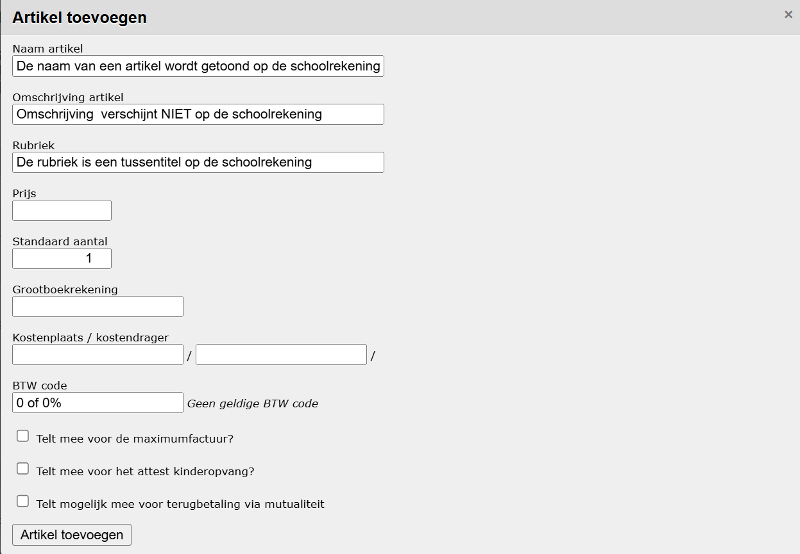

Hetgeen aan de leerlingen zal worden aangerekend, wordt gedefinieerd als artikels. Artikels kunnen als op zich zelf staande items worden aangerekend, maar kunnen ook worden gebundeld in artikelgroepen. Het voordeel van zo’n artikelgroep is dat er verschillende soorten kosten kunnen worden gebundeld. Alle artikels kunnen dan eenvoudig samen worden aangerekend. Ook bestaat de mogelijkheid om de groep onder één noemer aan te rekenen en op de factuur te tonen. Zo kan een uitstap als uitstap worden aangerekend, terwijl de busreis, het museumbezoek en het drankje als verschillende artikels zijn gedefinieerd en in de boekhouding op verschillende kostendragers kunnen worden geboekt. 

Elk artikel dient een grootboekrekening, kostenplaats en kostendrager te bevatten. Deze gegevens komen uit Exact Online en worden in de Toolbox geïmporteerd. Normaal zal dit bij de opstartconfiguratie altijd worden uitgevoerd. Moest het nodig zijn om een update door te voeren dan kunnen deze opnieuw worden geïmporteerd door onder “Importeer” te klikken op “Grootboekrekeningen, … uit Exact Online”, zoals hieronder weergegeven.

Als de juiste grootboekrekening, kostenplaats of kostendrager er onverhoopt niet tussen staat dan moet deze in Exact Online worden toegevoegd door de (regio)boekhouder en vervolgens worden geïmporteerd op dezelfde werkwijze als hierboven omschreven.    

## Artikels

Onder “Artikels” worden alle mogelijke aan te rekenen kosten opgenomen. De artikels kunnen bij het aanrekenen nog aangepast worden, waardoor het aantal te beheren artikels beperkt kan worden tot unieke combinaties van grootboekrekening, kostenplaats en kostendrager. Artikels zijn op deze manier eerder een beperkt aantal standaardsjablonen. De instellingen die aan het sjabloonartikel zijn gekoppeld, worden bij het effectief aanrekenen van het artikel mee overgenomen. Op deze wijze kunnen de verschillende artikels eenvoudig beheerd worden. 

### Nieuw artikel aanmaken
Klik op <LegacyAction img="pluscircleblue.png"/> om een nieuw artikel aan te maken. Een nieuw scherm verschijnt waar de gegevens over het artikel kunnen worden ingevoerd.

- **Naam artikel**:  De naam van het artikel wordt getoond op de factuur (tenzij je die naam bij het aanrekenen overschrijft).
- **Omschrijving artikel**: Bijkomende informatie waarop je kan zoeken maar die niet zichtbaar is op de factuur. Dit is later handig om als zoekterm te gebruiken. 
- **Rubriek**:  De categorie waaronder het artikel op de factuur zal terechtkomen. Dit kan bv. 'uitstappen' zijn. Je kan hier zelf tekst invullen of kiezen uit reeds eerder gebruikte rubrieken. De rubriek kan later bij het aanrekenen ook nog gewijzigd worden. 
- **Prijs**: De standaardprijs. Deze kan bij het aanrekenen nog gewijzigd worden.
- **Standaard aantal**: Aantal keer dat het artikel standaard opgenomen moet worden. In de meeste gevallen is dat 1, tenzij het artikel steeds per 2 of meer wordt verkocht.
- **Grootboekrekening**: De grootboekrekening waarop geboekt moet worden. Dit is een lijst van waaruit geselecteerd kan worden. De informatie in de lijst is geïmporteerd uit Exact Online. 
- **Kostenplaats en kostendrager**: Codes voor analytische opvolging in Exact Online. Dit komt ook uit een lijst die is geïmporteerd uit Exact Online. De benaming van de kostendrager wordt achteraan steeds voluit getoond ter controle.  

:::caution OPGELET
Indien je niet zeker weet welke grootboekrekening, kostenplaats of kostendrager je moet gebruiken voor een bepaald artikel, vraag je dit best na bij de boekhouding. 
Foutieve boekhoudkundige parameters worden in het overzicht met artikelen als volgt weergegeven. Aanpassing van het artikel is dan noodzakelijk.

<Thumbnails img={[
    require('./artikels3.PNG').default, 
]} />
:::

- **Maximumfactuur**: Aanvinken als het artikel meetelt voor de maximumfactuur (Basisschool).
- **Attest kinderopvang**: Aanvinken als het artikel opgenomen moet worden voor het attest kinderopvang (bv. voor een artikel 'naschoolse opvang'). Attesten kinderopvang kan je genereren via het menu > [Rapporten](/leerlingenrekeningen/Rapporten/)
- **Terugbetaling mutualiteit**: Aanvinken als het artikel in aanmerking komt voor terugbetaling via de mutualiteit. Een overzicht van aangerekende artikels per leerling die in aanmerking komen voor een terugbetaling van de mutualiteit is eveneens te vinden bij [Rapporten](/leerlingenrekeningen/Rapporten/)

### Artikels wijzigen
Door vooraan een artikel op het potlood te klikken, kan je het artikel wijzigen. Klik steeds op 'Artikel bijwerken' om de wijzigingen te bewaren. 

### Artikels dupliceren
Door op <LegacyAction img="copy.png"/> te klikken, kan je een artikel dupliceren om zo een nieuw artikel aan te maken op basis van de instellingen van het gedupliceerde artikel.

### Actieve en niet-actieve artikels
Wanneer je een artikel niet meer gebruikt, kan je het op non-actief zetten door helemaal achteraan te klikken op het <LegacyAction img="SwitchGreen.png"/> icoon zodat dit rood wordt. Vervolgens kan je bovenaan kiezen om enkel de actieve of niet-actieve artikelen te tonen. Een niet actief artikel kan je op dezelfde manier als hierboven terug actief zetten. 

## Artikelgroepen

Je kan artikels bundelen in een groep zodat ze als één geheel kunnen worden aangerekend.
Dit kan voor alle artikels, ook als ze verschillende boekhoudkundige parameters hebben als grootboekrekening, kostenplaats en kostendrager. Bv. voor een schoolreis moet een inkomticket, het busvervoer en een drankje worden aangerekend. Alle artikels van deze schoolreis kan je bundelen in één artikelgroep. 
Klik op <LegacyAction img="pluscircleblue.png"/> om een nieuwe artikelgroep aan te maken. Een nieuw scherm verschijnt waar de gegevens over de artikelgroep kunnen worden ingevoerd.

<Thumbnails img={[
    require('./artikels5.PNG').default, 
]} />

Per artikelgroep kan je instellen of de details worden weergegeven op de factuur of enkel de artikelgroep verschijnt als één lijn. Een artikelgroep kan je dus op 2 manieren tonen op de factuur:
- Met detail: je hebt 3 artikels die je aan leerlingen wil aanrekenen. Je maakt hiervoor een artikelgroep aan, voegt er de 3 bestaande artikels aan toe. Gebruik je nu de artikelgroep in een aanrekening (met detail), dan verschijnen op de factuur 3 aparte lijnen. Er wordt gebruik gemaakt van de rubriek van elk individueel artikel.
- Zonder detail: je hebt opnieuw 3 bestaande artikels die je aan een artikelgroep hebt toegevoegd. Voeg je die artikelgroep toe aan de aanrekening, dan verschijnt er één regel op de factuur met het totaal van de 3 artikels. Er wordt gebruik gemaakt van de rubriek van de artikelgroep. In de boekhouding worden de aangerekende details uiteraard nog wel opgesplitst.

Vervolgens verschijnt er een nieuwe artikelgroep. Klik op <LegacyAction img="artikels.png"/> om artikels toe te voegen. 

- Klik op <LegacyAction img="PijlLinks.png"/> om het desbetreffende artikel om het toe te voegen aan de artikelgroep. 

- Klik op <LegacyAction img="remove3.png"/> om een artikel weer te verwijderen uit de artikelgroep.

- Filter: Via de filter boven de te selecteren artikels kan er op een kenmerk van het artikel worden gefilterd. Bijvoorbeeld een deel van de naam of de rubriek waar het aan toebehoort. De filter wordt uitgevoerd van zodra er op de entertoets wordt geklikt. Voor het verwijderen van de filter, maak deze weer leeg en klik wederom op de entertoets. 

In dit stadium wordt de artikelgroep enkel gevuld met artikels. De effectieve aanrekening gebeurt naderhand bij het **Aanrekenen** van kosten. Ook dan is het nog mogelijk om wijzigingen aan te brengen bij de artikels.
