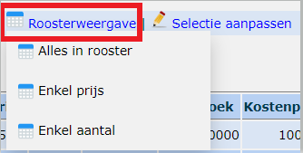

Er zijn twee manieren om manueel kosten door te rekenen aan de leerlingen, nl. via **Aanrekenen** en **Aanrekenen artikel**.  

Bij ["Aanrekenen"](/leerlingenrekeningen/Aanrekenen/#aanrekenen)kunnen er verschillende artikels ineens worden geselecteerd die vervolgens gezamenlijk worden aangerekend aan een groep leerlingen. Dit is de makkelijkste werkwijze wanneer er meerdere artikels zijn die aan eenzelfde groep leerlingen moet worden aangerekend. Aanrekenen kan enkel gebruikt worden indien de prijs en het aantal van een artikel voor elke leerling hetzelfde is.

Bij  ["Aanrekenen artikel"](/leerlingenrekeningen/Aanrekenen/#aanrekenen-artikel) daarentegen kan je slechts één artikel selecteren en wordt dit artikel vervolgens aangerekend aan een groep leerlingen. Dit wordt gebruikt wanneer de prijs of het aantal van een artikel per leerling verschillend is. In de praktijk is “Aanrekenen artikel” de meest gebruikte manier om kosten aan te rekenen aan leerlingen.

In eenzelfde notagroep kan je zowel "Aanrekenen" als "Aanrekenen artikel" gebruiken. Je kan ook meerdere aanrekeningen (arikel) toevoegen. 

Daarnaast kunnen er nog allerlei gegevens uit andere programma's worden geïmporteerd en aangerekend via de Leerlingenrekeningen. Zie ook het onderdeel [Importeren](/leerlingenrekeningen/Importeren/) voor meer info.

## Aanrekenen

Via Aanrekenen kan je artikels of artikelgroepen aan één of meerdere leerlingen aanrekenen. Hier zijn de artikels, de prijs, het aantal, ... voor alle leerlingen hetzelfde.

Je begint door een nieuwe aanrekening aan te maken in de actieve notagroep door op <LegacyAction img="pluscircleblue.png"/> te klikken of de daarbij behorende tekst in het blauw. Het is ook mogelijk om verder te werken aan een bestaande aanrekening door op het potloodicoon vóór de aanrekening te klikken of te verwijderen door op de prullenbak te klikken. Per notagroep kunnen er verschillende aanrekeningen worden opgemaakt, die samen één factuur zullen vormen.

### 1. Titel definiëren 
Eerst en vooral kan er via de taakbalk bovenaan een titel worden toegevoegd aan een nieuwe aanrekening of een bestaande titel worden gewijzigd. De titel wordt automatisch opgeslagen. Op die manier kan later snel de juiste aanrekening teruggevonden worden. Deze titel wordt **niet** getoond op de factuur. 

In de titelkolom kan je in het zoekveld bovenaan zoeken op de titel. Op die manier kan je snel een aanrekening terugvinden. 

Via deze iconen <LegacyAction img="aanrekenen.PNG"/> in de taakbalk links bovenaan navigeer je terug naar het overzicht met aanrekeningen (linkse icoon) of maak je meteen een nieuwe aanrekening (rechtse icoon). 

### 2. Artikels zoeken
Via het vak “Artikels toevoegen” kunnen er artikels of artikelgroepen worden gezocht om te voegen aan de aanrekening. Hier vind je de artikels uit de lijst met sjabloonartikels die zijn ingesteld bij het onderdeel [Artikels](/leerlingenrekeningen/Artikels%20en%20artikelgroepen/). Dit vak werkt als een filter. Als er enkele karakters worden opgegeven die voorkomen in de naam van het artikel, dan zal er een lijst verschijnen met alle artikels die deze volgorde van karakters in hun benaming dragen. Het is ook mogelijk om wildcards (dit is het procentteken-%) te gebruiken. Als %%% wordt opgegeven dan zal de lijst met alle actieve artikels worden getoond. Door op <LegacyAction img="clear.png"/> te klikken, wordt de zoekbalk weer leeg gemaakt.

### 3. Artikels toevoegen
Aan de hand van de gekozen zoekterm worden de overeenkomstige artikels eronder getoond. 
Klik op <LegacyAction img="PijlOnder.png"/> om het artikel toe te voegen aan de lijst met aan te rekenen items. Na het toevoegen is er nog steeds de mogelijkheid om het artikel aan te passen, zonder dat het sjabloon in het menu ‘artikelen’ wordt gewijzigd.

Er zijn nog 2 bijkomende mogelijkheden om een artikel toe te voegen tijdens het aanrekenen. Deze mogelijkheden moeten met de nodige voorzichtigheid worden gebruikt, omdat deze manier van werken meteen ook een nieuw artikel genereert in de lijst met artikelsjablonen (in het menu ‘Artikels’). Dit is zinvol als bv. een bepaalde activiteit jaarlijks of meermaals per jaar voorkomt. Als het gaat om een eenmalig iets, is de werkwijze zoals hierboven omschreven de beste optie. 
1. Klik hierop <LegacyAction img="copy.png"/> om het artikel te dupliceren. Dit is het aanmaken van een nieuw artikel op basis van de gegevens van het geselecteerde artikel. Het nieuwe artikel wordt ineens mee opgenomen in de algemene lijst van artikels. 

2. Klik hier <LegacyAction img="pluscircleblue.png"/> om een volledig nieuw artikel aan te maken. Ook hier wordt het nieuwe artikel ineens mee opgenomen in de algemene lijst van artikels. 

:::caution OPGELET
Zorg dat je steeds de correcte boekhoudkundige parameters gebruikt! Bij twijfel, raadpleeg je (regio)boekhouder.
:::

### 4. Artikels in aanrekening wijzigen
Eens de artikels aan de aanrekening zijn toegevoegd, kunnen deze eenvoudig worden gewijzigd door op het potloodicoon vóór het artikel te klikken. Zowel “gewone” artikels als artikelgroepen alsook  de artikels in een artikelgroep kunnen worden gewijzigd. De artikels die onder een artikelgroep vallen, worden standaard ondergebracht in de rubriek van de artikelgroep, derhalve wordt in het vervolg geen rekening gehouden met de rubriek van dit type van artikels. 

:::caution OPGELET
Enkel het artikel in **deze aanrekening** wordt aangepast, niet het 'sjabloonartikel' in het artikelbestand! 
:::

### 5. Leerlingen toevoegen 
Via de taakbalk bovenaan het scherm kunnen er leerlingen worden toegevoegd of verwijderd.

- Klik op <LegacyAction img="pluscircleblue.png"/> om (bestaande groepen) leerlingen toe te voegen of te verwijderen. Voor verdere instructies: lees verder onder deze opsomming. 

- Klik op <LegacyAction img="leerlingen.png"/> om een eigen groep leerlingen toe te voegen. Meer info over eigen groepen aanmaken vind je bij het onderdeel [Mijn groepen](/leerlingenrekeningen/Mijn%20groepen/).

- Klik op <LegacyAction img="vergrootglasRood.png"/> om leerlingen toe te voegen over de schooljaren heen (Bv. In september een factuur maken voor een leerling die dit schooljaar niet meer in de school is ingeschreven) of als je één bepaalde leerling wilt opzoeken.  

- Klik op <LegacyAction img="remove3.png"/> om (enkele) leerlingen te verwijderen in het overzicht. 

- Klik op <LegacyAction img="syncGreen.png"/> om de aanrekening opnieuw in te laden nadat er wijzigingen zijn doorgevoerd in prijs of aantal. De totalen worden nu herberekend.   

Je kan steeds leerlingen opzoeken op naam, klas of groep en vervolgens toevoegen aan de aanrekening via het groene plusteken. Als je meerdere leerlingen wil toevoegen binnen eenzelfde klas of groep, kan je er meerdere selecteren met behulp van de vinkjes vooraan. Je kan ook ineens iedereen selecteren met behulp van de bovenste checkbox naast 'Naam'.

Door op het groene plusteken <LegacyAction img="plusGreen.PNG"/> te klikken, voeg je de geselecteerde leerlingen toe en ga je terug naar de aanrekening. Als je op het dubbele plusteken <LegacyAction img="plus2Green.PNG"/> klikt, worden de leerlingen toegevoegd aan de aanrekening, maar blijf je in dit scherm en kan je meteen nog andere leerlingen toevoegen. Op die manier kan je bijvoorbeeld zoeken naar de leerlingen van klas 1A op een bepaalde datum, die leerlingen toevoegen en meteen zoeken naar de leerlingen van 1B op diezelfde datum. Dat versnelt het werken. Je kan ook klasgroepen combineren door in het zoekveld bij Groepen de verschillende klassen in te typen, gescheiden door een komma (ZONDER SPATIES). Bv. 1A,1B,2A,2B.

Indien je nog leerlingen (van dit schooljaar) wil toevoegen die ondertussen uitgeschreven zijn, maak je bovenaan het datumveld leeg of typ je een datum in waarop de betreffende leerling nog was ingeschreven (bv. de datum van een bepaalde activiteit). Indien gekoppeld aan Smartschool, kan je ook meteen kijken of een leerling aanwezig was op de dag van de activiteit, zodat de activiteit al dan niet wordt aangerekend o.b.v. de aanwezigheid van de leerling.

Om leerlingen uit een vorig schooljaar toe te voegen, klik je in het overzichtsscherm van de aanrekening op dit icoon <LegacyAction img="vergrootglasRood.png"/>. 

### 6. Leerlingen verwijderen uit een aanrekening
Leerlingen of een groep van leerlingen verwijderen uit de afrekening kan je doen in het overzichtsscherm van de aanrekening door op de vuilnisbak <LegacyAction img="remove3.png"/> te klikken achter de naam van de leerling, ofwel door meerdere leerlingen te selecteren en op de rode vuilnisbak bovenaan te klikken. Je kan de leerlingen ook opzoeken in het toevoegscherm <LegacyAction img="pluscircleblue.png"/>, ze daar selecteren en vervolgens verwijderen door middel van het rode minteken. 

- Klik <LegacyAction img="min.PNG"/> om de geselecteerde leerlingen te verwijderen en terugkeren naar het overzichtsscherm van de aanrekening. 

- Klik <LegacyAction img="min2.PNG"/> om de geselecteerde leerlingen verwijderen en in het toevoegscherm te blijven om meteen een volgende reeks leerlingen te verwijderen. 

### 7. Aanrekening omzetten naar een nota

Als de aanrekening helemaal klaar is, moet die nog worden omgezet naar een nota voor verdere verwerking. Eens de aanrekening is omgezet naar een nota, is deze opgenomen in de lijst met nota’s per leerling. De nota kan in deze context het best omschreven worden als een voorbereidende verzamelstaat van de aangerekende kosten per leerling. 

Omzetten naar een nota kan op twee manieren. De eerste is in de aanrekening zelf in de taakbalk bovenaan.
Klik op <LegacyAction img="calculator.png"/> om de aanrekening om te zetten naar een nota. 
Als de aanrekening is omgezet naar een nota, kan je niets meer wijzigen in de aanrekening. Je merkt dit ook aan de oranje pijl bovenaan (waar voorheen het icoon van de rekenmachine stond). Zolang je dit icoon ziet staan, kan je de omzetting naar een nota nog ongedaan maken en terug wijzigingen aanbregen in de aanrekening. Als de nota echter al omgezet is naar een factuur, zal je merken dat het ongedaan maken van de aanrekening, niet meer mogelijk is.

Als je vergeet een aanrekening om te zetten naar een nota, zal je zien dat de aanrekening in het overzicht van aanrekeningen de status 'Niet overgezet naar een nota' krijgt. Vanuit dit menu kan je ook meerdere aanrekeningen tegelijk omzetten naar een nota. Selecteer één, enkele of alle nota’s en klik op <LegacyAction img="calculator.png" text="Zet geselecteerde aanrekeningen over naar Nota"/>.

Aan de rechterkant zie je per aanrekening aan hoeveel leerlingen er is aangerekend, hoeveel verschillende artikels er zijn aangerekend en wat het totaalbedrag van deze aanrekening is. 

## Aanrekenen artikel

Vaak wil je een bepaald artikel aanrekenen aan een reeks leerlingen, maar is het aantal of de prijs per leerling verschillend. Daarvoor kan je de optie ‘Aanrekenen artikel’ gebruiken. Binnen deze optie kan je namelijk voor elke leerling de prijs, het aantal, de naam, ... wijzigen.

:::info Ter info
Belangrijk verschil bij deze manier van aanrekenen: je moet de aanrekening niet meer omzetten naar een nota, dat gebeurt automatisch.
:::

De werkwijze van 'Aanrekenen artikel' is in grote lijnen dezelfde als die van 'Aanrekenen'. Je doorloopt dezelfde stappen als hierboven omschreven bij [Aanrekenen](/leerlingenrekeningen/Aanrekenen/#aanrekenen). Via 'Aanrekenen artikel' kan je echter geen artikelgroep toevoegen. Dat kan enkel via 'Aanrekenen'. Je kan ook slechts 1 artikel per aanrekening toevoegen. 

### 1. Artikel wijzigen (per leerling)

Er zijn verschillende manieren om het artikel nog aan te passen:

1. In het overzicht kunnen de **prijs en/of het aantal** op leerlingniveau worden aangepast. 

     Klik bij 'Roosterweergave' op één van onderstaande iconen om alle prijs-velden, aantal-velden of beide om te zetten naar tekstvelden. Deze manier van werken laat toe om heel snel met behulp van de tab-toets op het toetsenbord door die velden te gaan en wijzigingen aan te brengen. 

     

     

     Dubbelklikken in de kolom “Prijs” of “Aantal” bij de desbetreffende leerling is ook een mogelijkheid. Wijzig het gegeven en druk op de entertoets voor het doorvoeren van de wijziging.
  
2. Je kan ook wijzigingen doorvoeren voor een bepaalde selectie leerlingen . Selecteer de gewenste (of alle) leerlingen door ze vooraan aan te vinken en klik op <LegacyAction img="potlood2.png" text="Selectie aanpassen"/>. Kies vervolgens welke parameter je wenst aan te passen en voer de wijziging door. Volgende parameters zijn via deze weg aan te passen:

     

3. Klik op het potlood icoon <LegacyAction img="potlood2.png"/> vooraan de desbetreffende leerling. Alles van het artikel kan nu worden aangepast voor enkel deze leerling. 

4. Klik op het potloodicoon voor het ‘artikel in aanrekening’ (bovenaan) om een wijziging door te voeren **voor alle leerlingen** in de aanrekening. 
     - Er kan nog worden geopteerd om **enkel de naam van het artikel** te wijzigen voor de reeds toegevoegde leerlingen in de aanrekening. Vink hiervoor de voorlaatste optie aan alvorens op te slaan. 
     - Je kan **alles wijzigen** voor de reeds toegevoegde leerlingen in de aanrekening. Vink hiervoor de laatste optie aan alvorens op te slaan. 
     - Als er geen van deze twee opties worden geselecteerd: het aangepaste artikel wordt enkel aangerekend aan de leerlingen die na de aanpassing worden toegevoegd aan de aanrekening.  Deze methode laat toe om leerlingen in blok toe te voegen. Bv. de leerlingen van 1A moeten 10 euro betalen, de leerlingen van 1B moeten 15 euro betalen. 

     Werkwijze: voeg het artikel toe aan ‘aanrekening artikel’ met als prijs 10 euro. Voeg nu de leerlingen van 1A toe. Wijzig het ‘artikel in aanrekening’ (bovenaan) en pas de prijs aan naar 15 euro zonder de onderste 2 vinkjes aan te vinken. Voeg nu de leerlingen van 1B toe.

     

