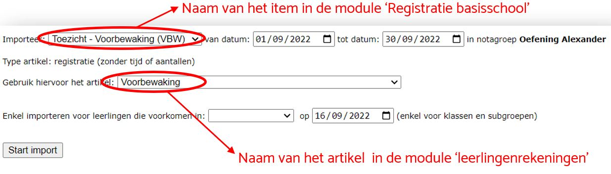
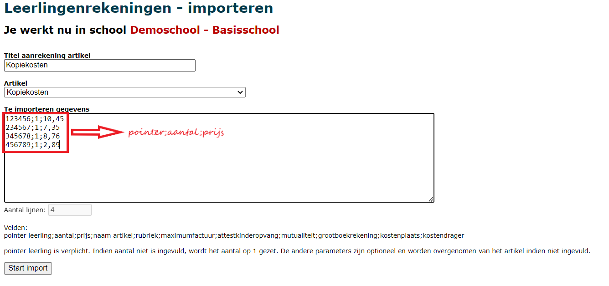

Toolbox heeft de mogelijkheid om gegevens uit externe software op te halen en meteen om te zetten naar een aanrekening (artikel). Hierdoor wordt tijd bespaard aangezien er niet meer overgetypt moet worden. Bijkomend voordeel is dat er geen fouten meer kunnen sluipen in het overtypen.

Volgende imports zijn momenteel beschikbaar:

## 1. Exact Online
- **Grootboekrekeningen, kostenplaatsen/kostendragers en betalingsvoorwaarden**: in de module leerlingenrekeningen moet je bij artikels en aanrekeningen de grootboekrekeningen en de analytische informatie invullen. Deze importmodule haalt die informatie op uit Exact Online en zorgt er voor dat je ze maar aan te klikken hebt. Enkel iemand met toegang tot Exact Online kan deze actie uitvoeren.
 
- **Mandaten domiciliëringen uit Exact Online**: Meer info over domiciliëring is te vinden onder [Inschrijvingen](/leerlingenrekeningen/Inschrijvingen/#domiciliëring). Wanneer het mandaat is opgeladen in Exact Online kan het via deze weg geïmporteerd worden in de leerlingenrekeningen. Vanaf dan kan de factuur voor de betreffende leerlingen betaald worden via domiciliëring. Het sjabloon voor de factuur met domiciliëring moet aangemaakt zijn bij [Scholen > tabblad Facturen](/leerlingenrekeningen/Scholen/#2-facturen). 

 <Thumbnails img={[
    require('./import3.PNG').default, 
 ]} />

 Zie ook [Scholen > Boekhouding](/leerlingenrekeningen/Scholen/#4boekhouding) om na te gaan waar de SEPA schuldeisersidentificatie moet worden ingevuld.

## 2. Toolbox

- **Registratie basisschool**: deze module in Toolbox laat toe om het verbruik van bepaalde items per leerling te registreren. Voorbeelden zijn: voor- en nabewaking, drankje tijdens de middagpauze, ... Alle zaken die via die module werden geregistreerd, kunnen langs hier worden geïmporteerd. Om correct te kunnen importeren moet er in de leerlingenrekeningen een artikel bestaan (bv. voorbewaking) dat aan de importgegevens gekoppeld kan worden. Dit maak je eenmalig aan bij 'artikelen'. Als je nu gaat importeren, kan je aangeven welke geregistreerde items je wil importeren en welk artikel je wil gebruiken om aan te rekenen. Verder kan je ook de registratieperiode en de klas of groep selecteren waarvoor gegevens geïmporteerd moeten worden.
Wanneer de gegevens geïmporteerd zijn, zijn ze terug te vinden bij 'aanrekenen artikel'. Door op het potloodje vooraan te klikken, kan je allerlei aanpassingen doen in de aanrekening. Meer info hierover vind je bij [Aanrekenen artikel > Artikels in aanrekening wijzigen](/leerlingenrekeningen/Aanrekenen/#1-artikel-wijzigen-per-leerling).

 
- **Schoolfoto's**: De module [Schoolfoto's](/schoolfotos) laat toe om pakketten met foto's die de fotograaf aflevert uit te delen aan leerlingen en te registreren wie welke foto's (delen van het pakket) terug inlevert. Op die manier kan Toolbox berekenen wat de totale waarde van het pakket is en voor welke waarde de leerling terug inlevert. Het verschil wordt dan aangerekend. Deze module kan ook bijbestellingen registreren.

- **Aanrekeningen via de kassa**: Ook aanrekeningen via de [kassa](/kassa) van Toolbox kunnen geïmporteerd worden om de aankopen via de leerlingenrekeningen door te rekenen.

- **Orderflow**: Orders uit Orderflow die **niet aangekocht zijn via de webshop** van Orderflow, kunnen via deze weg geïmporteerd worden om aan te rekenen via de leerlingenrekeningen. Orders die via de webshop besteld en betaald zijn, komen terecht in een aparte school 'Import webshop Orderflow' in de leerlingenrekeningen. Deze orders zijn onmiddellijk betaald bij de aankoop en kunnen via deze aparte school verder verwerkt worden naar Exact Online. 

- **Terugbetaling waarborg inventaris**: Wanneer een contract in de module Inventaris wordt stopgezet, wordt er automatisch een creditnota gegenereerd voor de terugbetaling van de waarborg (indien van toepassing). Deze creditnota houdt ook meteen rekening met een vergoeding voor eventuele schade aan het toestel. De creditnota's kunnen rechstreeks vanuit de module Inventaris worden overgezet naar de leerlingenrekeningen. Ze komen dan terecht in de school Inventaris en vormen een afzonderlijke creditnota. 

  Via het menu Importeer, kunnen ze ook ingelezen worden in de eigen school om zo te verrekenen op de periodieke schoolrekening (bv. op het einde van het schooljaar). Indien het factuurbedrag hoger of gelijk is aan het waarborgbedrag, moet er zodoende geen terugbetaling gebeuren, waardoor er een hele hoop werk wordt bespaard. Indien deze laatste werkwijze de voorkeur uitdraagt, mogen de creditnota's **niet worden overgezet** vanuit de module Inventaris! Je kan meteen de functie 'Importeer' in de module Leerlingenrekeningen gebruiken. Selecteer hiervoor eerst de notagroep waarin geïmporteerd moet worden. Na het importeren zullen de creditnota's in de module Inventaris de status 'verwerkt' krijgen. De ingelezen terugbetaling zijn in de Leerlingenrekeningen terug te vinden in het menu 'Aanrekenen'. 
 
- **Leerlingen met een inventariscontract**: Naast een waarborg is het ook mogelijk om periodiek een bedrag aan te rekenen voor items uit de module Inventaris zoals bv. een trimestriële gebruiksvergoeding. Lees [hier](/inventaris/toestel_toewijzen/#d-periodieke-gebruiksvergoedinghuur-aanrekenen) hoe deze importfunctie werkt. 

- **Activiteitenmodule**: Activiteiten die ingegeven werden via de activiteitenmodule kunnen rechtstreeks in de module Leerlingenrekeningen worden geïmporteerd. Lees [hier](/verwerking_leerlingenrekeningen) hoe dat concreet in z'n werk gaat. 

## 3. Canon Uniflow

Toolbox is in staat om de geregistreerde kopieën (gemaakt door leraren of door leerlingen zelf) te importeren en aan te rekenen. Hierdoor wordt het verwerken van die zaken een werkje van slechts enkele seconden.

## 4. Externe gegevens

Het is tevens mogelijk om gegevens te importeren die niet werden geregistreerd in Toolbox of via één van de gekoppelde programma's zoals Orderflow of Canon Uniflow. Selecteer hiervoor eerst de notagroep waarin geïmporteerd moet worden. 

- **Titel**: Deze titel wordt getoond in het overzicht van alle aanrekeningen en maakt het zoeken makkelijker. Hij wordt NIET getoond op de factuur zelf.
- **Artikel**: Het gewenste artikel uit de leerlingenrekeningen moet vooraf aangemaakt worden in de module Leerlingenrekeningen via het menu Artikels.
- **Te importeren gegevens**: Hier moeten minimaal volgende gegevens worden opgegeven, gescheiden door puntkomma:
   - Pointer: Dit is het uniek nummer van de leerling. Dit wordt zowel in het administratief pakket (Informat of Wisa), in Toolbox als in het boekhoudpakket (Exact Online) gebruikt. 
   - Aantal: Het aantal keer dat je het artikel wil aanrekenen aan deze leerling.
   - Prijs: De (eenheids)prijs van het artikel. Indien in het artikel zelf reeds een prijs werd opgegeven, is die hier niet verplicht in te vullen. Als de prijs hier wel wordt ingevuld, overschrijft die de prijs van het geselecteerde artikel (enkel in deze aanrekening). 

Na het importeren zijn de aanrekeningen terug te vinden via het menu 'Aanrekenen artikel'. Daar kunnen eventueel nog wijzigingen aangebracht worden aan het artikel zelf, maar ook aan het aantal, de prijs, de boekhoudkundige parameters, ...