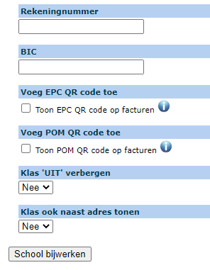

<ImageTitle img="leerlingenrekeningen.png">FAQ</ImageTitle>

## 1. Kan ik nog een wijziging aanbrengen aan een factuur nadat ik gefactureerd heb?

Zolang de facturen nog niet zijn overgezet naar Exact Online, kan je op leerlingniveau alles nog wijzigen.  Dat doe je als volgt:

- Ga naar nota's.
- Klik op het potloodje vóór de leerling waarvoor je nog iets wil wijzigen.
- Je ziet nu een overzicht van alle artikelen die voor die leerling gefactureerd zijn.
- Klik achteraan op het vuilnisbakje om een artikel volledig te verwijderen.
- Klik op het potloodje vooraan om aantallen, prijzen of boekhoudkundige gegevens te wijzigen.
- Klik op de blauwe plus bovenaan om een volledig nieuw artikel toe te voegen.

Indien de facturen digitaal verstuurd zijn, kunnen de ouders via de link in het originele bericht meteen de aangepaste factuur terugvinden.

## 2. Hoe maak ik een creditnota?

- Zolang er nog **geen factuur** is gemaakt van de nota, kan je nog wijzigingen aanbrengen in de aanrekeningen of rechtstreeks in de nota van de leerling. 
- Als de factuur nog **niet is overgezet naar Exact Online**, kan je enkel nog wijzigingen doorvoeren in de nota. Wijzigingen zijn vanaf dat moment dus enkel nog mogelijk op niveau van de individuele leerling. Lees ook de vraag hierboven voor meer info. 
- Wanneer de factuur is overgezet naar Exact, moet je werken met een creditnota. Dat kan in dezelfde notagroep. Je hoeft dus geen aparte notagroep voor creditnota's aan te maken. Een creditnota is in principe een negatieve aanrekening. Die maak je op dezelfde manier als een gewone aanrekening (via ['Aanrekenen' of 'Aanrekenen artikel'](/leerlingenrekeningen/Aanrekenen/)). Je wijzigt in de aanrekening het artikel naar een negatief aantal of een negatieve prijs (beide opties zijn mogelijk). Vervolgens wordt er voor de leerling een nieuwe (tweede) nota aangemaakt die je ook kan omzetten naar een factuur.  

## 3. Kan ik nog een factuur opmaken voor een leerling die reeds is uitgeschreven?
 
Dat kan zeker! Je rekent een artikel aan zoals je dat gewoon bent (via aanrekenen of aanrekenen artikel).

**1e manier - enkel voor leerlingen die in het huidig schooljaar op de school waren ingeschreven**

Je voegt leerlingen toe via  . Standaard staat de datum van vandaag ingevuld. Nu worden enkel de leerlingen getoond die vandaag zijn ingeschreven in de school. Door dit datumveld leeg te maken, krijg je alle leerlingen te zien die dit schooljaar ingeschreven zijn (geweest), dus ook de leerlingen die ondertussen terug uitgeschreven zijn. Je kan zoeken op de naam van de leerlingen door die in te typen in het eerste zoekveld.  De leerling toevoegen doe je met één van de groene plustekens. 

**2e manier - ook mogelijk om leerlingen over de schooljaren heen toe te voegen**

Via deze knop  kan je alle leerlingen zoeken die ooit ingeschreven zijn geweest in de school, dus ook leerlingen die zijn uitgeschreven tijdens één van de vorige schooljaren. Hier kan je enkel zoeken op de naam van de leerlingen. Het volstaat om een deeltje van de naam in te geven en op enter te drukken. De leerling toevoegen doe je opnieuw met één van de groene plustekens. 

## 4. Hoeveel is er al aangerekend in het kader van de maximumfactuur?

In de module leerlingenrekeningen kan je bij Rapporten het totaalbedrag per leerling raadplegen dat gedurende het geselecteerde schooljaar al is aangerekend in het kader van de maximumfactuur. De resultatenlijst is gesorteerd op bedrag van laag naar hoog. 

Om een artikel te laten meetellen voor de maximumfactuur zet je in de algemene artikelenlijst (menu > Artikels) het vinkje aan bij het betreffende artikel. Geef bij School (tabblad facturen) ook zeker op dat de school gebruik maakt van de maximumfactuur.  

:::caution OPGELET
Toolbox houdt enkel rekening met de **scherpe maximumfactuur**. Bij artikelen die in aanmerking komen voor de minder scherpe maximumfactuur kan je het vinkje best **niet** aanzetten. Momenteel bestaat er in Toolbox nog geen mogelijkheid om de minder scherpe maximumfactuur op te volgen.
:::

## 5. Ouders melden dat de QR code op de factuur niet werkt. 

Waarschijnlijk maakt de school gebruik van de ECP QR code en proberen de ouders de code te scannen via Payconiq. De EPC QR code scannen kan echter enkel in de mobiele app van de eigen bank en **nooit** in de app van Payconiq. Hieronder vind je meer info over de verschillende soorten QR codes:

In Toolbox kan je gebruik maken van 2 soorten QR-codes. Dit kan je instellen bij Leerlingenrekeningen > Scholen > tabblad Facturen. Om gebruik te kunnen maken van een QR code moet ook het bankrekeningennummer en de BIC code van de school worden ingevuld. 

- De **EPC QR** code is gratis en kan door de ouders gescand worden in hun eigen bankapp op voorwaarde dat de bankinstelling deze scanfunctie aanbiedt in zijn app. Deze QR code zet simpelweg een overschrijving klaar die de school (na betaling door de ouders) in het boekhoudprogramma Exact Online binnenkrijgt en kan afpunten. 

:::caution belangrijk
Deze QR code kan je **niet** scannen met de Payconiq (by Bancontact) app, enkel in de mobiele app van de eigen bank.
Indien ouders de factuur openen op een mobiel toestel, zal men de QR code moeten scannen met een ander mobiel toestel. Je kan dus niet op de QR code klikken om te betalen. 
::: 
 
- De **POM QR code** biedt meer functionaliteiten aan, maar is wel betalend. Het voordeel van deze QR code is dat die werkt in alle bankapps, maar ook met de Payconiq app. De QR code kan gescand worden, maar is eveneens een betaallink waarop je kan klikken om de factuur te betalen. Ouders kunnen de factuur dus openen en betalen vanop hetzelfde toestel. Bovendien krijg je als school meteen de bevestiging dat deze factuur betaald werd. Van zodra een ouder betaalt, wordt er namelijk vanuit de betaalprovider POM onmiddellijk een melding gegeven aan Toolbox dat die factuur betaald werd. Nadien komt dat geld op de rekening van de school en wordt de factuur automatisch afgepunt, omdat POM de juiste gestructureerde mededeling mee doorstuurt naar de boekhouding.

 Tarieven raadplegen en POM activeren kan via https://app.pom.be/nl/connect/koba-toolbox/tarieven. POM zal pas functioneel zijn als het contract is geactiveerd. 

