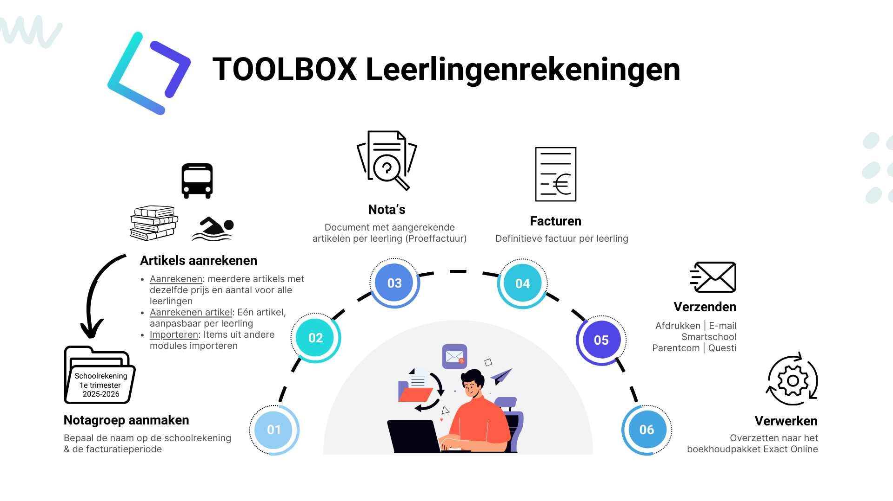

<ImageTitle img="leerlingenrekeningen.png">Leerlingenrekeningen</ImageTitle>

De module Leerlingenrekeningen stelt de gebruiker in staat om efficiënt en snel facturen op te maken
ten aanzien van de leerlingen. De module is volledig geïntegreerd in de Toolbox, waardoor er een
perfecte samenwerking is met de leerlingenadministratie in Informat of WISA (afhankelijk van het
pakket dat door de school wordt gebruikt) en de boekhouding in Exact Online (EOL).

In de module Leerlingenrekeningen kan per item of artikel steeds de kostenplaats, grootboekrekening
en kostendrager worden gedefinieerd. Op deze manier kan na het afronden van het facturatieproces
de boeking in EOL geheel geautomatiseerd worden doorgevoerd. De medewerker hoeft hiervoor niets
te doen in EOL.

De module is flexibel ingericht, zodat de gebruiker steeds volledige controle heeft over het
facturatieproces. Kosten kunnen aan de hand van een zelf gekozen periodiciteit worden overgebracht
naar een notagroep. Zowel vanaf het niveau van de klas, een subgroep als op het niveau van de
individuele leerling kunnen er kosten worden aangerekend. Elke factuurregel blijft individueel
aanpasbaar, ook nadat de verzamelnota per individuele leerling is opgemaakt, tot het moment dat de
factuur is overgezet naar EOL. Daarna is de factuur geboekt en kan deze niet meer worden aangepast.

Aan de hand van de eerder opgegeven instellingen (slechts éénmaal op te geven) zal de Toolbox
dynamisch een pdf document genereren voor elke individuele factuur die gekoppeld en inzichtelijk is
per individuele leerling. Dit document kan worden afgeprint, opgeslagen of verzonden per e-mail. Met
1 druk op de knop kunnen de facturen ook worden verstuurd via de co-accounts in Smartschool of Parentcom. 

<DocCardList /> 