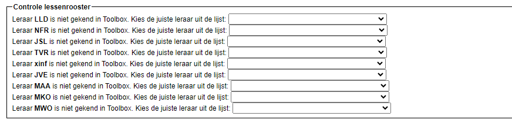
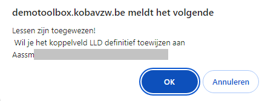
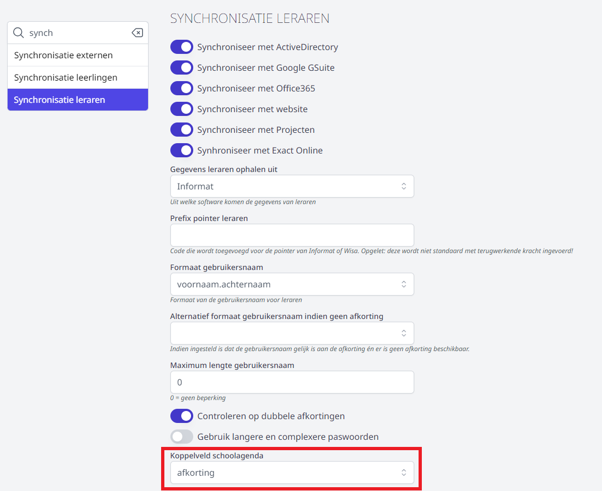

<LegacyAction img="calendar.png" text="Beheer de huidige rooster"/> hier definieer je het uurrooster voor je school.

## Actief lessenrooster
Bovenaan deze pagina krijg je een lijst te zien met alle lessenroosters die opgeladen zijn in Toolbox.
Het rooster dat je hier selecteert, wordt het actief lessenrooster in Toolbox dat bijvoorbeeld gebruikt wordt in de module [Vervanglijsten](/vervangingslijsten). Indien je het gewenste uurrooster niet terugvindt in de lijst, zal je het nog moeten uploaden. Dat kan bij het onderdeel [Nieuw roosterbestand uploaden](/lessenrooster/rooster_uploaden/).

## Controle lessenrooster
Voor het geselecteerde roosterbestand worden hier de (namen van de) roosters getoond die niet automatisch gekoppeld kunnen worden aan een leraar. Dit kan voorkomen wanneer in het roosterprogramma bv. een andere afkorting voor de leraar gebruikt wordt dan in Toolbox. De getoonde roosters kunnen manueel gekoppeld worden door de betreffende leraar te selecteren via het dropdownmenu achteraan. 
Idealiter is dit vak leeg. 

Bij het koppelen verschijnt er een pop-up waarin gevraagd wordt of je het rooster zeker wil koppelen aan de geselecteerde leraar. Van zodra je dit hebt bevestigd, verschijnt er een tweede pop-up. Hierin wordt gevraad of je het koppelveld met die bepaalde afkorting definitief wil toewijzen aan de geselecteerde leraar. 

Op die manier worden de afkortingen van leraren die niet meteen gematched kunnen worden in Toolbox vanuit deze module gekoppeld én bewaard worden in het koppelveld lessenrooster. Hiermee kan je heel wat tijd besparen als de afkortingen niet (correct) doorkomen uit je administratieve software.

Krijg je bij 'Controle lessenrooster' wel een heel lange resultatenlijst? Kijk dan eerst eens in de module **Instellingen => Synchronisatie leraren** of het 'koppelveld schoolagenda' is ingesteld op 'Afkorting'. Indien je dit hebt aangepast moet je de leraren eerst even opnieuw synchroniseren (Informat uitlezen + Synchroniseer leraren). Daarna kan je het lessenrooster opnieuw opladen en zou de controlelijst leeg of althans een stuk korter moeten zijn. 

## Opbouw lessenrooster
De duur van een lesuur wordt hier getoond en kan worden ingesteld in de module Instellingen > Lessenrooster. In dit gedeelte specifieer je verder hoe de lesblokken in het uurrooster eruit zien: 
- afkorting en omschrijving voor de lesblokken
- begin- en einduur van de lesblokken
- is het lesblok in de voor- of namiddag

