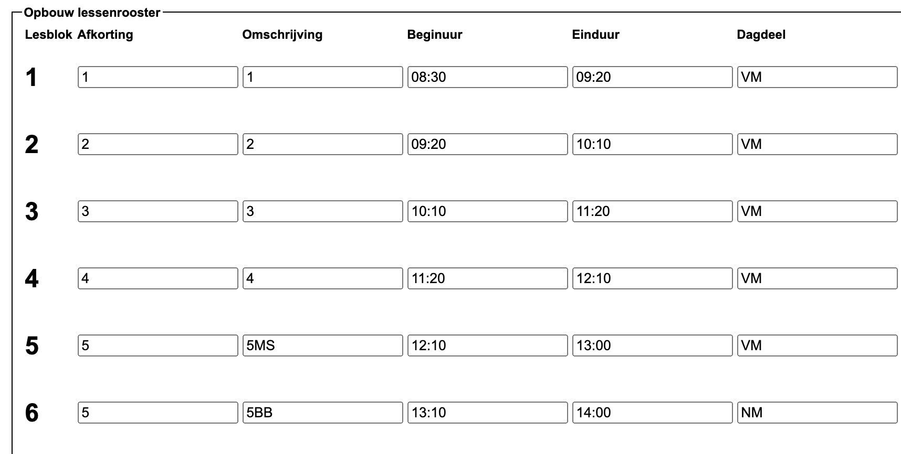

<LegacyAction img="calendar.png" text="Beheer de huidige rooster"/> hier definieer je het uurrooster voor je school.

## Actief lessenrooster
Bovenaan deze pagina krijg je een lijst te zien met alle lessenroosters die opgeladen zijn in Toolbox.
Het rooster dat je hier selecteert, wordt het actief lessenrooster in Toolbox dat bijvoorbeeld gebruikt wordt in de vervanglijsten.

## Opbouw lessenrooster
In dit gedeelte specifieer je hoe het uurrooster eruit ziet:
- afkorting en omschrijving voor de lesblokken
- begin- en einduur van de lesblokken
- is het lesblok in de voor- of namiddag

