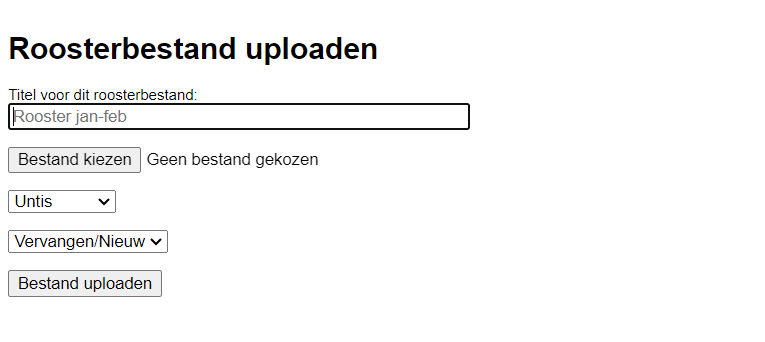

Via de knop <LegacyAction img="pluscircle.png" text="Nieuw roosterbestand uploaden"/> kan je een roosterbestand opladen om zo een nieuw lessenrooster te importeren in de Toolbox.

- Stap 1: Kies een naam voor het nieuwe rooster, bijvoorbeeld "Rooster Jan-Juni".

- Stap 2: Selecteer het bestand vanop je computer.

- Stap 3: Selecteer het roosterprogramma waarin het lessenrooster is opgemaakt. 

- Stap 4: Kies voor 'Vervangen/Nieuw' of 'Toevoegen'.
    - **Vervangen**/Nieuw: Kies voor deze optie als je een eerder opgeladen bestand wil vervangen door dit bestand. Dat kan nodig zijn wanneer je in het roosterprogramma nog wijzigingen hebt aangebracht. In dat geval is het belangrijk dat je bij het opladen exact dezelfde naam gebruikt voor het rooster. Het bestaande rooster met diezelfde naam wordt bij het uploaden overschreven. 
    - Vervangen/**Nieuw**: Je kan het bestand ook toevoegen aan de reeks van reeds opgeladen lessenroosters. In dat geval geef je dit roosterbestand een naam die nog niet in gebruik is. 
    - **Toevoegen**: Sommige scholen hebben meerdere roostermakers die elk voor hun eigen afdeling de lessenrooster opstellen. Om in Toolbox de module Afwezigheden of Vervangingslijsten te kunnen gebruiken, kan het nodig zijn dat de roosters van die verschillende afdelingen tegelijkertijd actief zijn. Met behulp van de optie 'Toevoegen' kan je meerdere roosters **met dezelfde naam** samenvoegen tot één actief rooster in Toolbox.
    
- Stap 5: Druk op 'Bestand uploaden' om het nieuwe rooster te importeren.

- Stap 6: Nadat het lessenrooster is opgeladen kan je het controleren op fouten via <LegacyAction img="calendar.png"/> [Beheer de huidige rooster](../uurrooster_beheren/).

