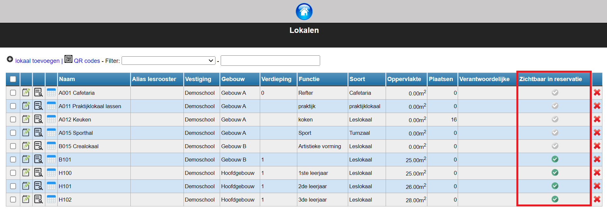
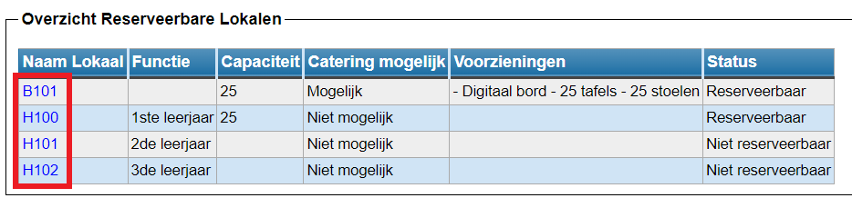
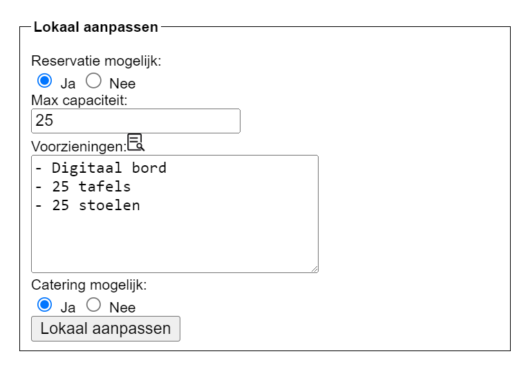
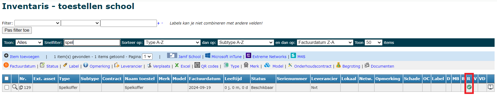
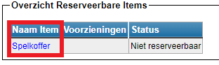
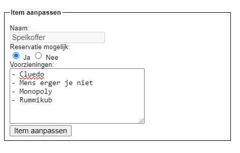
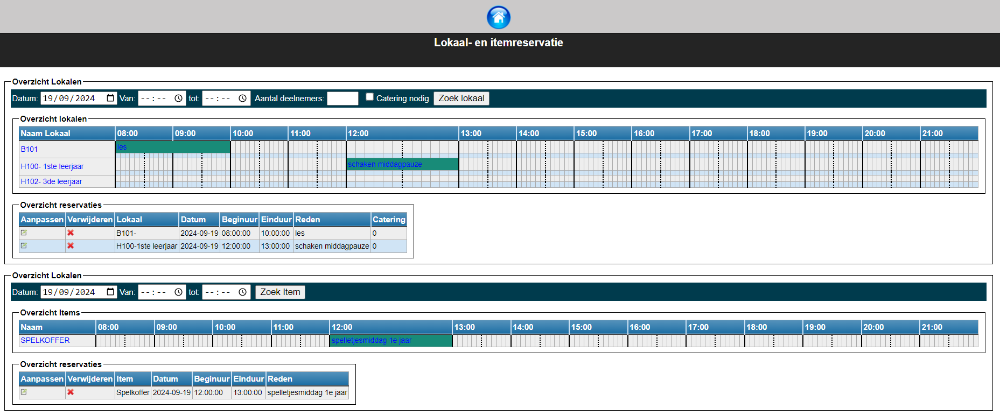
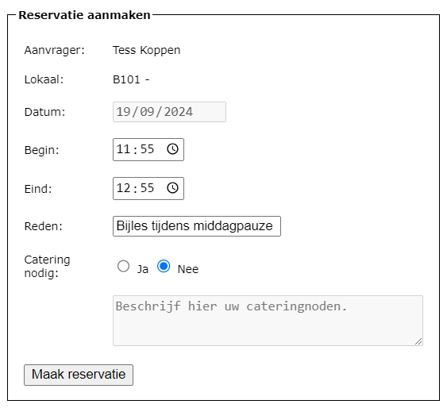
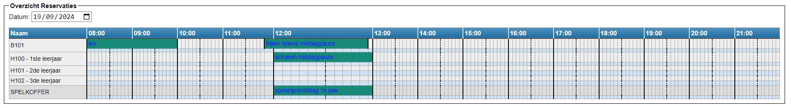
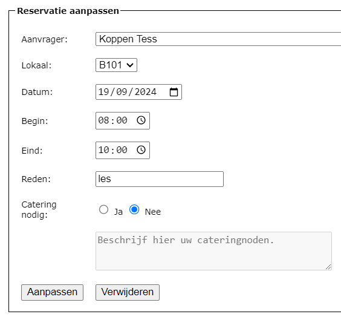

<ImageTitle img="lokaalreservatie.png">Lokalen en items reserveren</ImageTitle>

Deze module biedt de mogelijkheid om lokalen of andere items op school te reserveren, bv. tablets, laptops, spelkoffers, ...  De module kan enkel intern gebruikt worden. Dat wil zeggen dat enkel personeelsleden een reservatie kunnen doen. Het systeem is dus niet geschikt om ruimtes te verhuren aan derden. Hiervoor kan de module [Verhuurcontracten](/Verhuurcontracten) gebruikt worden.

## Module activeren / Gebruikersrechten toekennen

Om een module in Toolbox te kunnen gebruiken, moet ze eerst en vooral geactiveerd worden. Ga hiervoor naar de module **Instellingen => Modules** en zet de module 'Lokaalreservaties' actief. 

Om in de module te kunnen werken, moeten er gebruikersrechten worden toegekend aan de juiste personeelsleden. Ga hiervoor naar de module [Gebruikersbeheer](/gebruikersbeheer) en gebruik één van de bovenste twee opties. Voor deze module is het gebruikersbeheer opgedeeld in 2 verschillende rechten:
- **Lokaalreservatie**: Ken dit gebruikersrecht toe aan alle personeelsleden die lokalen of items moeten kunnen reserveren. 
- **Lokaalreservatie_beheer**: Ken dit gebruikersrecht toe aan personeelsleden die de module moeten kunnen beheren. Deze persoon kan aangeven welke lokalen en/of items gereserveerd kunnen worden. Verder kan die ook de voorzieningen per lokaal instellen en aangeven of er catering mogelijk is. Bovendien heeft deze persoon een overzicht van alle geplaatste reserveringen. Die reservaties kunnen door een beheerder nog aangepast worden. Mogelijk heeft een beheerder in deze module ook gebruikersrechten nodig voor de modules **Lokalen en gebouwen** en/of **Inventaris**. 

:::caution opgelet
Alle acties die in deze paragraaf worden vermeld, kunnen enkel uitgevoerd worden door een beheerder in Toolbox. Kom te weten wie jouw beheerder is door in Toolbox te klikken op het vraagteken rechtsboven. 
:::

## Lokalen instellen

### In de module 'Gebouwen en lokalen'

Om een lokaal te kunnen reserveren via de module 'Lokalen reserveren' moet het lokaal eerst en vooral zijn toegevoegd aan de module [Gebouwen en lokalen](/gebouwen_lokalen). In die module kan je in het menu 'Lokalen' helemaal achteraan aanvinken welke lokalen zichtbaar moeten zijn in de reservatiemodule. Hiermee worden die lokalen nog niet meteen beschikbaar voor reservatie. Een beheerder in de module 'Lokalen reserveren' zal in die module nog moeten aangeven welk lokaal effectief gereserveerd kan worden.  

### In de module 'Lokalen reserveren'

Een beheerder in deze module ziet bij het openen van de module onderaan het tandwiel 'Beheer'. Via deze weg kan de beheerder instellen welke lokalen er effectief beschikbaar zijn voor reservatie. Klik op de naam van het lokaal (blauwe link) om de specificaties verder aan te vullen. 

Van zodra je aangeeft dat er een reservatie mogelijk is voor dit lokaal, zal het lokaal zichtbaar zijn in de reservatiemodule. Verder kan je aangeven wat de maximumcapaciteit is en wat de voorzieningen in het lokaal zijn. Indien er in de module [Inventaris](/inventaris) items zijn gekoppeld aan dit lokaal (bv. pc, printer, digitaal bord,...), kan je die eenvoudig ophalen door te klikken op volgend icoontje <LegacyAction img="detail.png"/>. Tot slot moet er nog aangeduid worden of catering mogelijk is in dit lokaal. Indien ja, wordt er bij reservatie een tekstveld getoond waarin men kan aangeven wat men verwacht van de catering. 

## Items instellen

### In de module 'Inventaris'

Om een item te kunnen reserveren via de module 'Lokalen reserveren' moet het item eerst en vooral zijn toegevoegd aan de module [Inventaris](/inventaris). In die module kan je in het menu 'Items school' helemaal achteraan in de kolom R (van reservatie) aanvinken welke items zichtbaar moeten zijn in de reservatiemodule. Hiermee worden die items nog niet meteen beschikbaar voor reservatie. Een beheerder in de module 'Lokalen reserveren' zal in die module nog moeten aangeven welk item effectief gereserveerd kan worden.  

### In de module 'Lokalen reserveren'

Een beheerder in deze module ziet bij het openen van de module onderaan het tandwiel 'Beheer'. Via deze weg kan de beheerder instellen welke items er effectief beschikbaar zijn voor reservatie. Klik op de naam van het item (blauwe link) om de specificaties verder aan te vullen. 

Van zodra je aangeeft dat er een reservatie mogelijk is voor dit item, zal het item zichtbaar zijn in de reservatiemodule. Verder kan je nog aangeven wat de voorzieningen zijn, bv. de inhoud van een spelkoffer.  

## Lokaal/item reserveren

Wanneer een gebruiker de module opent, ziet die meteen welke lokalen (bovenaan) en welke items (onderaan) gereserveerd kunnen worden. Daarnaast is het ook meteen duidelijk of er al reservaties zijn en wanneer. De eigen reservaties worden ook nog eens apart in een tabel getoond. Daar kan men via het potloodje <LegacyAction img="edit.png"/> de reservatie nog wijzigen of volledig verwijderen via het rode kruisje <LegacyAction img="remove.png"/>. 

Om een geschikt lokaal te vinden, kan men een aantal parameters instellen om de zoekopdracht te verfijnen, zoals datum, tijd, aantal deelnemers, of er catering nodig is. Op basis van deze parameters toont Toolbox de beschikbare lokalen. 

Om een lokaal of item te reserveren klik je in een vrij tijdvak. In de pop-up die vervolgens verschijnt, kan je de aanvraag verder specifiëren.

## Extra functies voor beheerder
Naast het reserveerbaar maken van [lokalen](#in-de-module-lokalen-reserveren) en [items](#in-de-module-lokalen-reserveren-1) kan een beheerder in deze module ook de details van alle reservaties raadplegen door op het groene gereserveerde tijdvak te klikken. Op die manier kan de beheerder zien wie de aanvrager is en wat de verdere specificaties zijn (bv. noden bij catering). De beheerder kan de reservatie via deze weg ook aanpassen of verwijderen. 

