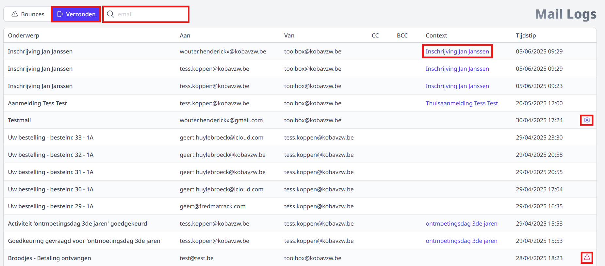
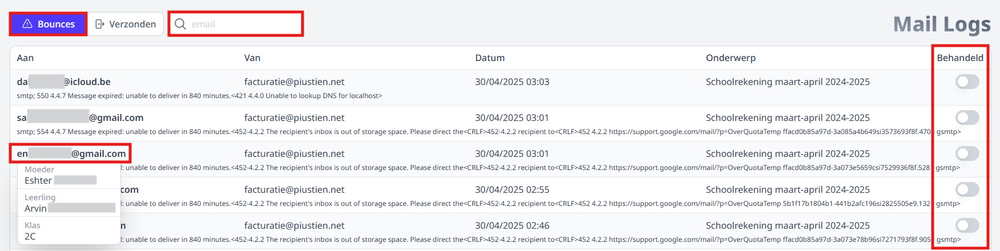

<ImageTitle img="toolboxmail.png">Mail logs</ImageTitle>

In deze module kan je 2 zaken controleren. Enerzijds vind je er een overzicht terug van alle e-mailberichten die **verzonden** zijn vanuit Toolbox-modules, bv. vanuit de module Leerlingenrekeningen, Openstaande facturen, Inventaris, … 
Anderszijds geeft de module een overzicht van alle **foutmeldingen** (bounces) die er zijn na het versturen van die e-mails vanuit Toolbox.  Op basis van deze foutmeldingen kan je achterhalen waarom bepaalde mails niet kunnen worden afgeleverd. De foutmeldingen zijn soms complex en worden steeds in het Engels weergegeven. Heb je hulp nodig om de foutmeldingen te interpreteren, raadpleeg dan de ICT-dienst van je school. 

:::caution Ter info
De **bounces** worden enkel weergegeven voor mails die verstuurd zijn via Toolboxmail. Of je gebruik maakt van Toolboxmail kan je terugvinden in de module 'Instellingen > E-mail'. De lijst met verzonden mails is wel van toepassing voor alle e-mailsettings.   
:::

## Overzicht verzonden mails
Om het overzicht van alle verzonden mails te raadplegen, klik je bovenaan op de knop 'Verzonden'. Ben je op zoek naar één specifiek e-mailadres, dan kan je het zoekveld bovenaan gebruiken. Naar gelang vanuit welke module er verzonden is, zijn er nog bepaalde koppelingen beschikbaar. Zo kan je via de kolom 'Context' de rechtstreekse link terugvinden naar een bepaalde inschrijving, activiteit of onkost. Voor bepaalde mailings is er achteraan een oogje <LegacyAction img="eye.PNG"/> beschikbaar. Hiermee open je de inhoud van de verzonden mail. Zie je bij bepaalde lijnen volgend icoontje achteraan <LegacyAction img="alert2.png"/> dan is er een foutmelding teruggekomen bij de poging tot het versturen van de e-mail. Klik op het icoontje om de foutmelding te raadplegen. Het overzicht van alle foutmelding vind je terug bij het onderdeel 'Bounces'. 

:::caution Ter info
De **bounces** worden enkel weergegeven voor mails die verstuurd zijn via Toolboxmail.  
:::

*Klik op de afbeelding om te vergroten.*

## Overzicht bounces

Om alle foutmeldingen te raadplegen voor mails die verzonden zijn via Toolboxmail, klik je bovenaan op de knop 'Bounces'. Via het zoekveld ernaast kan je zoeken op e-mailadres.

Door het e-mailadres aan te klikken wordt er meer info getoond. Zo kan je op een eenvoudige manier achterhalen aan welke leerling dit e-mailadres gekoppeld is (bv. vader van Pietje Puk uit 1A3). Deze functie werkt enkel voor e-mailadressen die gekend zijn in Informat. Heb je het probleem met het e-mailadres opgelost (bv. gecorrigeerd in Informat), dan kan je de log achteraan aanduiden als 'Behandeld'.

Een foutmelding die je vaak zal tegenkomen is: *'Amazon SES did not send the message to this address because it is on the suppression list for your account.'* Dat wil zeggen dat er eerder al een foutmelding is geweest voor dit e-mailadres. In dit geval gebruik je best de zoekfunctie om te zoeken op e-mailadres. Ga vervolgens terug naar de allereerste foutmelding voor dit e-maildres en doe het nodige om de fout te verhelpen. 

*Klik op de afbeelding om te vergroten.*

 

