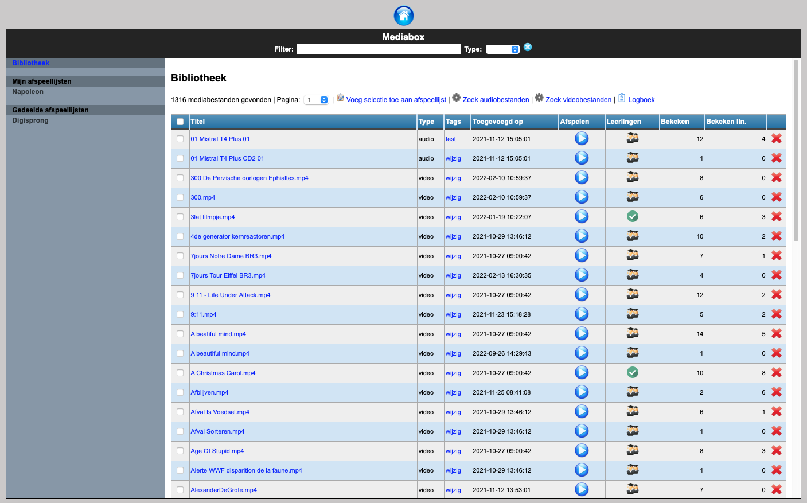

<ImageTitle img="mediabox.png">Mediabox</ImageTitle>

De module Mediabox laat toe om op een heel gebruiksvriendelijke manier audio- en videobestanden aan leraren ter beschikking te stellen. Via de filter kan je heel snel zoeken in het volledige archief en je kan ook afspeellijsten aanmaken om snel mediabestanden terug te vinden. Leraren kunnen ook tags toevoegen zodat het zoeken nog makkelijker wordt.

Mediabox laat ook toe om de bestanden aan leerlingen ter beschikking te stellen. Je hebt hierbij de keuze om alle bestanden ter beschikking te stellen of een selectie aan bestanden. Via de instellingen - Mediabox - Leerlingen kan je deze instelling wijzigen. Kies je voor toegelaten bestanden, dan kunnen leraren zelf selecteren welke bestanden beschikbaar zijn en hoe lang ze beschikbaar zijn. Dat gebeurt via het leerlingen-icoontje: daarmee zet je het fragment een week of een maand open. Staat het fragment open? Dan zie je een groen vinkje staan.

 

## Toolbox Gateway voor Mediabox

De mediabestanden (.mp3 voor audio en .mp4 voor video) staan op een (web)server binnen de school zelf. Dat kan een virtuele server (met bv. Linux of Windows) zijn of een NAS (bv. Synology). Door middel van Toolbox Gateway kan je vanuit Toolbox opvragen welke bestanden er beschikbaar zijn. Toolbox voegt deze items dan toe aan de databank zodat ze doorzoekbaar zijn. 

Om dit te laten draaien moet je op deze server ook een Webserver en PHP installeren. 

De audio- en videobestanden moeten in de map 'media' in de mappen 'audio' en 'video' staan. Binnen deze mappen mogen er eventueel submappen voorzien worden om de mediabestanden te ordenen. 

Je kan binnen de school met één of twee MediaBox servers werken. Dit kan handig zijn indien je meerdere vestigingen hebt. Zo kunnen de mediabestanden in de juiste vestiging worden geladen en moeten ze niet over het internet gaan.

In de map config pas je nu het bestand config.php aan. In de variabele $key zet je een zelfgekozen sleutel. Die bestaat uit een willekeurige reeks letters en cijfers. In de variabele $allowed_ips zet je het publieke IP-adres van de school én het IP-adres van je Toolbox.

## Instellingen in Toolbox

In de instellingen van Toolbox - Mediabox moet je enkele zaken instellen.

- Sleutel: hier vul je de unieke zelfgekozen sleutel in die je ook in de configuratie van Toolbox Gateway hebt gezet.
- Mediaserver 1
    - De externe URL: hier vul je in op welk adres de mediaserver buiten de school bereikbaar is. Bv. https://mediabox.mijnschool.be:8001
    - Het interne adres van de media server: op welk adres is de mediaserver binnen de schoolbereikbaar. Bv. https://mediaboxintern.mijnschool.be
    - Gebruiken vanuit publiek ip: hierin vul je het publieke ip-adres van de school in. Je kan hier ook meerdere ip's invullen door ze met komma's te scheiden.
    - Toegankelijk buiten het publiek IP:hier kan je aanduiden of de fragmenten ook buiten de school (dus vanop andere dan de publieke IP-adressen die je hierboven invulde) geladen kunnen worden.
 
Heb je meerdere servers die van thuis uit beschikbaar moeten zijn, stel dan één server in om toegankelijk te zijn buiten het publieke IP. Kies hiervoor best de server met de snelste internetlijn. 

 