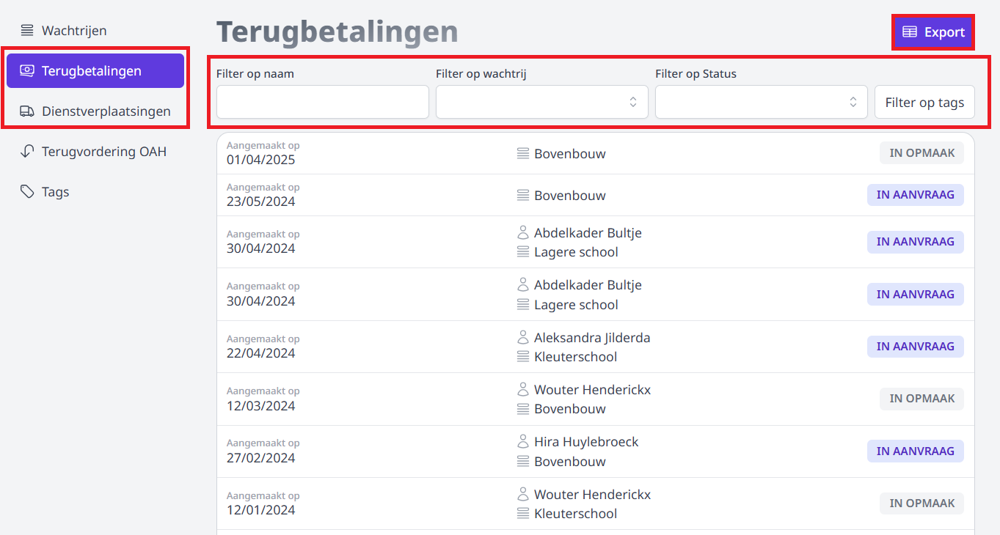
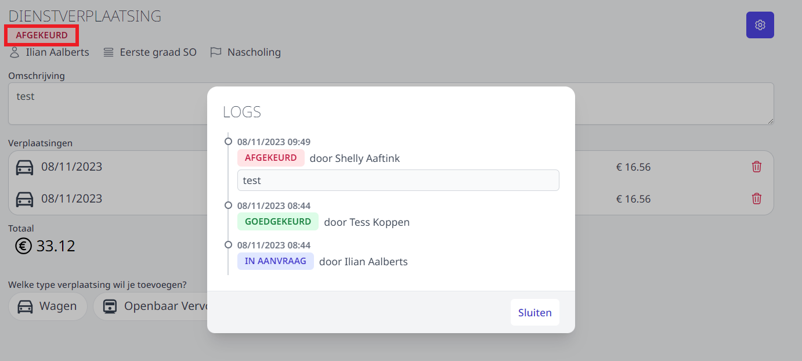

## Gebruikersbeheer

Om in de module Onkosten een terugbetaling aan te vragen, een aanvraag goed te keuren (als goedkeurder) of te verwerken (als verwerker) zijn er **geen bijkomende gebruikersrechten nodig**. Elk personeelslid met toegang tot Toolbox zal deze module kunnen gebruiken op voorwaarde dat ze geactiveerd is. Dat doe je via de module Instellingen => modules.

Om wachtrijen aan te maken en te beheren, om goedkeurders en verwerkers toe te wijzen en om een overzicht van alle aanvragen te raadplegen, is het gebruikersrecht **onkosten_beheer** noodzakelijk. Gebruikersrechten kan je toekennen via de module [Gebruikersbeheer](/gebruikersbeheer).

## Algemene Instellingen 

Vooraleer je aan de slag kan met de module Onkosten, moeten er nog een aantal zaken worden ingesteld in de module Instellingen => Onkosten. Deze module is enkel toegankelijk voor een beheerder. Via het vraagteken rechtsboven in Toolbox bij 'contact' kan je nagaan wie beheerder is voor jouw Toolbox.

Om de onkosten te kunnen verwerken naar Exact Online moet de **betalingsvoorwaarde** worden ingevuld. In de meeste gevallen is dit 00, maar soms wordt hiervoor in EOL ook 0 gebruikt. Kijk dit zeker na in je boekhoudpakket bij Stamgegevens > Relaties > Betalingsvoorwaarden. 

Vul vervolgens het **percentage** in voor de terugbetaling van dienstverplaatsingen met een eigen vervoermiddel (auto, motor, motorfiets). Toolbox maakt gebruik van de wettelijke bedragen die jaarlijks worden vastgelegd door de Vlaamse regering. Het schoolbestuur kan het bedrag van de kilometervergoeding met maximum 10% verminderen als ze een omniumverzekering voor dienstverplaatsingen heeft afgesloten. Vul in dat geval 90% in. 

Indien de school in het geval van dienstverplaatsing ook een terugbetaling voorziet voor een verplaatsing met de fiets of parkeerkosten, kan dat hier worden geactiveerd. Indien gedeactiveerd, zal het personeelslid voor de onkost in kwestie geen terugbetaling kunnen aanvragen. Het icoontje op de aanvraagpagina zal in dat geval onzichtbaar zijn. 

## Wachtrij aanmaken

Vooraleer personeelsleden een terugbetaling kunnen aanvragen, moet er in de module Onkosten minimaal één wachtrij worden aangemaakt. Aan zo'n wachtrij moet minstens één goedkeurder (bv. een directeur) en één verwerker (bv. een boekhoudkundig medewerker) worden gekoppeld. Deze personen kunnen optioneel van elke nieuwe aanvraag op de hoogte gebracht worden via e-mail of Smartschool. 

Verder is de wachtrij steeds gekoppeld aan een bepaalde kostenplaats en een dagboek uit Exact Online. 

- Ga in de module Onkosten naar **Beheer**.  

- Klik op **Wachtrij** en vervolgens op **Wachtrij aanmaken**. Indien er reeds een wachtrij bestaat, kan je die bekijken en/of aanpassen via het pijltje achteraan <LegacyAction img="PijlOnder.png"/>.

    

- Geef de wachtrij een naam (bv. eerste graad, bovenbouw, kleuterschool, ...) en klik op **Aanmaken**.

    

- Klap de wachtrij open door achteraan op <LegacyAction img="PijlOnder.png"/> te klikken. Je kan een wachtrij volledig verwijderen door op het vuilnisbakje <LegacyAction img="remove4.PNG"/>te klikken.

    

- Vul het gewenste type communicatie in om een automatisch bericht te versturen bij elke nieuwe aanvraag in de wachtrij. 
    - Indien je berichten wil versturen via **Smartschool**, selecteer je achteraan het gewenste Smartschoolplatform. Dit platform moet ingesteld zijn in de module **Instellingen** => Smartschool. 
    - Om te kunnen versturen via **e-mail**, moeten de e-mailinstellingen ingevuld zijn in de module **Instellingen** => [E-mail](/e-mail/). Ook de afzenders kan je in die module aanmaken. De mail wordt verstuurd naar het e-mailadres dat voor het personeelslid is opgegeven in het administratief pakket (Infomat/Wisa). In eerste instantie wordt dat van het type 'school' genomen. Als dat ontbreekt, zal het privé of domicilie e-mailadres gebruikt worden. Klik [hier](/e-mail/) om te lezen hoe je de mail kan configureren.

  

- Selecteer uit de lijst de gewenste **kostenplaats** en het **dagboek** waarop de aangevraagde onkosten standaard moeten worden geboekt. Bij het effectief doorboeken van de kosten naar Exact Online, kunnen de boekhoudkundige parameters op niveau van de verrichting nog worden aangepast. Indien je meerdere standaard kostenplaatsen of dagboeken gebruikt (bv. één voor de kleuterschool en één voor de lagere school) is het efficiënter om meerdere wachtrijen aan te maken. Dat maakt de boekhoudkundige verwerking eenvoudiger.

     

- Voeg tot slot minstens één **goedkeurder** en één **verwerker** toe door minimaal 3 karakters in het tekstveld te typen. Vervolgens wordt er een lijst getoond met personeelsleden met deze karakters in hun naam. Uit die lijst kan je de gewenste persoon selecteren. Opslaan is niet nodig, dat gebeurt automatisch. Goedkeurders en verwerkers hoeven niet noodzakelijk beheerder te zijn. Omwille van het vierogenprincipe kan eenzelfde persoon kan nooit zowel goedkeurder als verwerker zijn. 
    
    - Lees [hier](/aanvraag_behandelen) hoe een goedkeurder een aanvraag kan behandelen (goedkeuren/afkeuren). 
    - Lees [hier](/aanvraag_verwerken) hoe een verwerker de aanvraag kan overzetten naar Exact Online. 

     

## Overzicht van alle aanvragen raadplegen

Als beheerder kan je alle goedgekeurde, afgekeurde en verwerkte aanvragen alsook de aanvragen in opmaak raadplegen. Ga hiervoor in de onkostenmodule naar <LegacyAction img="beheer1.PNG"/> **=> Terugbetalingen / Dienstverplaatsingen**. De aanvragen zijn chronologisch (op datum van aanvragen) gerangschikt. 

Klik op de aanvraag om ze te openen en de details te raadplegen. 

Klik in de geopende aanvraag op de status om de historiek van de goedkeuringsflow te raadplegen. Bij (voorlopig) afgekeurde activiteiten kan je via deze weg de motivatie voor de weigering terugvinden.

 

 

