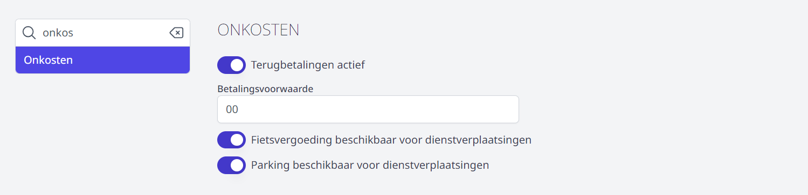

## Gebruikersbeheer

Om in de module Onkosten een terugbetaling aan te vragen, een aanvraag goed te keuren (als goedkeurder) of te verwerken (als verwerker) zijn er **geen bijkomende gebruikersrechten nodig**. Elk personeelslid met toegang tot Toolbox zal deze module kunnen gebruiken op voorwaarde dat ze geactiveerd is. Dat doe je via de module Instellingen => modules.

Om wachtrijen aan te maken en te beheren, om goedkeurders en verwerkers toe te wijzen en om een overzicht van alle aanvragen te raadplegen, is het gebruikersrecht **onkosten_beheer** noodzakelijk. Gebruikersrechten kan je toekennen via de module [Gebruikersbeheer](/gebruikersbeheer).

Directieleden en regiomedewerkers dienen hun onkosten aan te vragen via een aparte tegel **Onkosten directies & regiomedewerkers**. Deze tegel is in feite gewoon een link naar de module Onkosten in de overkoepelende Toolbox van de regio. Om foutieve aanvragen te voorkomen, is deze tegel niet standaard opengesteld voor alle personeelsleden. De tegel is wel standaard in alle Toolboxen actief, maar is pas zichtbaar voor een gebruiker nadat die het juiste gebruikersrecht heeft verkregen, nl. dat van **directie_stafmedewerker**.

## Algemene Instellingen 

Vooraleer je aan de slag kan met de module Onkosten, moeten er nog een aantal zaken worden ingesteld in de module Instellingen => Onkosten. Deze module is enkel toegankelijk voor een beheerder. Via het vraagteken rechtsboven in Toolbox bij 'contact' kan je nagaan wie beheerder is voor jouw Toolbox.

**Terugbetalingen actief** staat standaard aan. In dat geval kunnen personeelsleden via de module Onkosten zowel een onkostenvergoeding voor een dienstverplaatsing aanvragen alsook een terugbetaling van een eigen aankoop. Indien personeelsleden zelf géén aankopen mogen doen voor de school, kan deze optie uitgeschakeld worden. In dat geval is de laatste tegel niet zichtbaar voor de gebruikers.

- **VOORBEELD 1**: 'Terugbetalingen actief' is ingeschakeld:

- **VOORBEELD 2**: 'Terugbetalingen actief' is uitgeschakeld:

Om de onkosten te kunnen verwerken naar Exact Online moet de **betalingsvoorwaarde** worden ingevuld. In de meeste gevallen is dit 00, maar soms wordt hiervoor in EOL ook 0 gebruikt. Kijk dit zeker na in je boekhoudpakket bij Stamgegevens > Relaties > Betalingsvoorwaarden. 

Indien de school in het geval van dienstverplaatsing ook een terugbetaling voorziet voor een verplaatsing met de fiets of parkeerkosten, kan dat hier worden geactiveerd. Indien gedeactiveerd, zal het personeelslid voor de onkost in kwestie geen terugbetaling kunnen aanvragen. Het icoontje op de aanvraagpagina zal in dat geval onzichtbaar zijn. 

## Wachtrij aanmaken

Vooraleer personeelsleden een terugbetaling kunnen aanvragen, moet er in de module Onkosten minimaal één wachtrij worden aangemaakt. Aan zo'n wachtrij moet minstens één goedkeurder (bv. een directeur) en één verwerker (bv. een boekhoudkundig medewerker) worden gekoppeld. Deze personen kunnen optioneel van elke nieuwe aanvraag op de hoogte gebracht worden via e-mail of Smartschool. 

Verder is de wachtrij steeds gekoppeld aan een bepaalde kostenplaats en een dagboek uit Exact Online. 

- Ga in de module Onkosten naar **Beheer**.  

- Klik op **Wachtrij** en vervolgens op **Wachtrij aanmaken**. Indien er reeds een wachtrij bestaat, kan je die bekijken en/of aanpassen via het pijltje achteraan <LegacyAction img="PijlOnder.png"/>.

    

- Geef de wachtrij een naam (bv. eerste graad, bovenbouw, kleuterschool, ...) en klik op **Aanmaken**.

    

- Klap de wachtrij open door achteraan op <LegacyAction img="PijlOnder.png"/> te klikken. Je kan een wachtrij volledig verwijderen door op het vuilnisbakje <LegacyAction img="remove4.PNG"/>te klikken.

    

- Geef aan of je de wachtrij beschikbaar wil stellen voor zowel dienstverplaatsingen als terugbetalingen of voor slechts één van de twee. Standaard staan beide opties aan. 

    

- Vul het gewenste type communicatie in om een automatisch bericht te versturen bij elke nieuwe aanvraag in de wachtrij. 
    - Indien je berichten wil versturen via **Smartschool**, selecteer je achteraan het gewenste Smartschoolplatform. Dit platform moet ingesteld zijn in de module **Instellingen** => Smartschool. 
    - Om te kunnen versturen via **e-mail**, moeten de e-mailinstellingen ingevuld zijn in de module **Instellingen** => [E-mail](/e-mail/). Ook de afzenders kan je in die module aanmaken. De mail wordt verstuurd naar het e-mailadres dat voor het personeelslid is opgegeven in het administratief pakket (Infomat/Wisa). In eerste instantie wordt dat van het type 'school' genomen. Als dat ontbreekt, zal het privé of domicilie e-mailadres gebruikt worden. Klik [hier](/e-mail/) om te lezen hoe je de mail kan configureren.

  

- Selecteer uit de lijst de gewenste **kostenplaats** en het **dagboek** waarop de aangevraagde onkosten standaard moeten worden geboekt. Bij het effectief doorboeken van de kosten naar Exact Online, kunnen de boekhoudkundige parameters op niveau van de verrichting nog worden aangepast. Indien je meerdere standaard kostenplaatsen of dagboeken gebruikt (bv. één voor de kleuterschool en één voor de lagere school) is het efficiënter om meerdere wachtrijen aan te maken. Dat maakt de boekhoudkundige verwerking eenvoudiger.

     

- Voeg minstens één **goedkeurder** en één **verwerker** toe door minimaal 3 karakters in het tekstveld te typen. Vervolgens wordt er een lijst getoond met personeelsleden met deze karakters in hun naam. Uit die lijst kan je de gewenste persoon selecteren. Opslaan is niet nodig, dat gebeurt automatisch. Goedkeurders en verwerkers hoeven niet noodzakelijk beheerder te zijn. Omwille van het vierogenprincipe kan eenzelfde persoon kan nooit zowel goedkeurder als verwerker zijn. 
    
    - Lees [hier](/aanvraag_behandelen) hoe een goedkeurder een aanvraag kan behandelen (goedkeuren/afkeuren). 
    - Lees [hier](/aanvraag_verwerken) hoe een verwerker de aanvraag kan overzetten naar Exact Online. 

     

- Tot slot is het mogelijk om door de aanvrager - naast de verplichte bewijzen voor parkeren en openbaar vervoer - bijkomende documenten te laten toevoegen aan een aanvraag voor een onkostenvergoeding voor dienstverplaatsing. Dat kan bv. een nascholingsbewijs zijn. Deze mogelijkheid activeer je met behulp van de schuifbalk. 
Het toevoegen van bijkomende documenten is steeds optioneel voor de aanvrager. Die zal de aanvraag ook kunnen indienen zonder dat er een bijkomend document is opgeladen. 

     

## Overzicht van alle aanvragen raadplegen

Als beheerder kan je alle goedgekeurde, afgekeurde en verwerkte aanvragen alsook de aanvragen in opmaak raadplegen. Ga hiervoor in de onkostenmodule naar <LegacyAction img="beheer1.PNG"/> **=> Terugbetalingen / Dienstverplaatsingen**. De aanvragen zijn chronologisch (op datum van aanvragen) gerangschikt. 

Klik op de aanvraag om ze te openen en de details te raadplegen. 

Klik in de geopende aanvraag op de status om de historiek van de goedkeuringsflow te raadplegen. Bij (voorlopig) afgekeurde activiteiten kan je via deze weg de motivatie voor de weigering terugvinden.

 

 

## Tags

Het is mogelijk om eigen tags aan te maken. Die tags kunnen per wachtrij en volledig op maat van de school door een beheerder worden ingesteld. Aan elke tag kunnen specifieke personeelsleden gekoppeld worden die de tag mogen gebruiken. De tags kunnen doorheen de hele aanvraagprocedure worden toegevoegd of verwijderd. Dit maakt het mogelijk om bepaalde taken m.b.t. de aanvraag (bv. controle door nascholingsverantwoordelijke) eenvoudig op te volgen. In het overzicht van alle aanvragen kan er gefilterd worden op één of meerdere tags. 

- Om de tags aan te maken of te bewerken, ga je naar **Beheer => Tags** en klik op **Tag toevoegen**.

 

- Geef de tag een naam, kies een kleur en klik op **Toevoegen**. 

     

- Open de tag met het pijltje <LegacyAction img="PijlOnder.png"/> achteraan en koppel de wachtrij(en) waarin je deze tag beschikbaar wil stellen. 

- Selecteer daarvoor de gewenste wachtrij uit de lijst en voeg die toe met het plusteken achteraan. 

- Het is mogelijk om op deze manier meerdere wachtrijen te koppelen. De tag zal enkel in de gekoppelde wachtrij(en) gebruikt kunnen worden.

 

- Voeg per gekoppelde wachtrij de persoon of groep toe die de tag moet kunnen gebruiken. Je kan kiezen uit:
    - Iedereen
    - Wachtrij goedkeurders
    - Wachtrij verwerkers
    - Specifiek personeelslid
    
    Indien je kiest voor een specifiek personeelslid, moet je in een volgende stap het personeelslid selecteren uit een lijst. Je kan ook meerdere groepen en/of personeelsleden toevoegen. 

 
   

