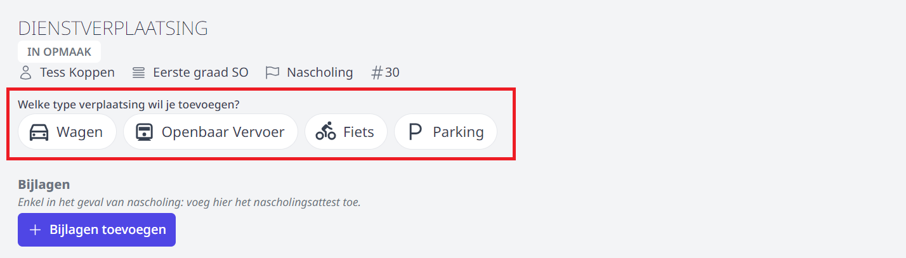
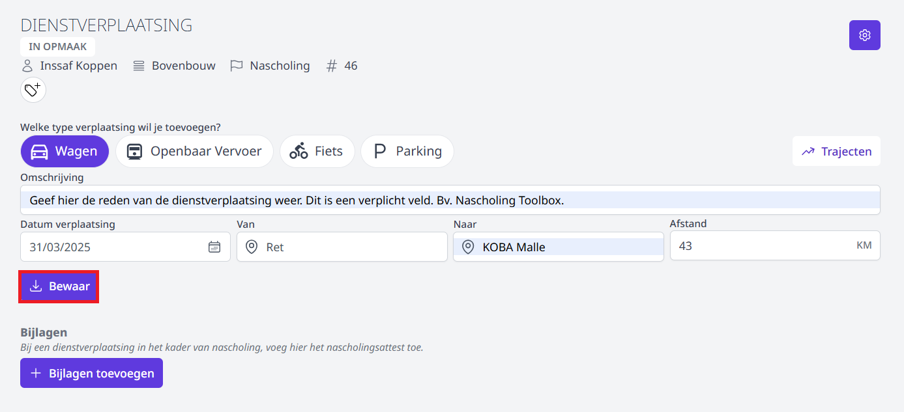
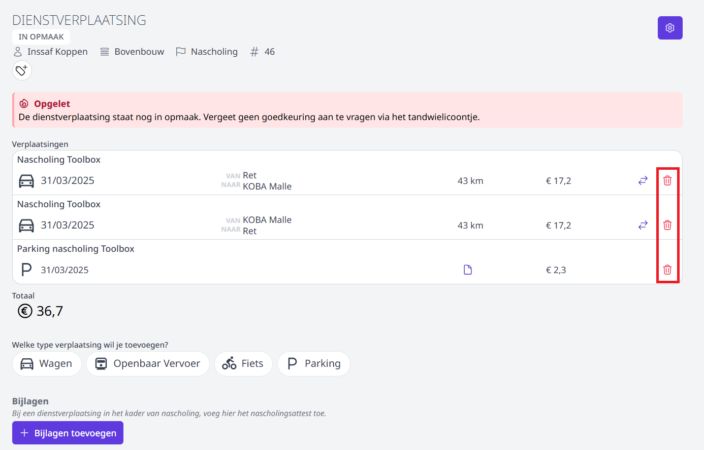
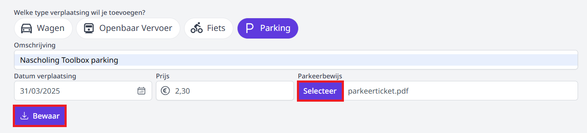

:::caution BELANGRIJK
De werkgever moet steeds **voorafgaand aan de dienstverplaatsing** toestemming hebben gegeven. Indien er geen uitdrukkelijke toestemming verkregen werd, kan een terugbetaling van de gemaakte onkosten geweigerd worden. Voor meer info over de aanvraagprocedure, raadpleeg uw directie. 
:::

Bekijk hier de instructievideo i.v.m. het aanvragen een onkostenvergoeding in Toolbox. Onder de video vind je meer tekst en uitleg.

<Youtube url="https://www.youtube.com/embed/cC_gFFHqKAk"/>

## Aanvraag invullen

- Klik op **Nieuwe dienstverplaating** om een terugbetaling van onkosten in het kader van een dienstverplaating aan te vragen.

- Selecteer een wachtrij. Indien er geen wachtrij beschikbaar is, kan er geen terugbetaling aangevraagd worden. Neem in dat geval contact op met de persoon die de terugbetalingen op school moet goedkeuren. 

- Geef op om welke reden je een dienstverplaatsing wil aanvragen. Je kan standaard kiezen uit:
    - Nascholing
    - Tijdelijk onderwijs aan huis (TOAH)
    - Andere
    
:::info Ter info
Indien je kiest voor TOAH zal je ook de naam van de leerling moeten selecteren waarvoor je TOAH hebt verstrekt. 
:::

- Klik op **Toevoegen**.

    <Thumbnails img={[
    require('./aanvraag2.PNG').default, 
    ]} />

- Vul optioneel de omschrijving in en duid aan welk type vervoer je gebruikte. Het bestuur is **NIET verplicht** om **parkeerkosten** terug te betalen of een onkostenvergoeding voor een dienstverplaatsing met de **fiets** te voorzien. Dit is een gunst van de werkgever. Indien de school dit niet aanbiedt, zullen de icoontjes <LegacyAction img="onkosten.PNG"/> niet zichtbaar zijn.

 

 - Naar gelang het geselecteerde vervoersmiddel zullen er andere invulvelden getoond worden. Vul de gevraagde gegevens in. 

 

 - Aan elke aanvraag kunnen meerdere lijnen worden toegevoegd. Zo kan je in één aanvraag bv. de heen- en terugrit ingeven alsook het parkeerticket indienen. Elke lijn kan terug verwijderd worden door achteraan op het vuilnisbakje te klikken. Je kan zelfs in één aanvraag alle dienstverplaatsingen van een bepaalde periode toevoegen. De lijnen kunnen ook tussentijds (bv. na elke dienstverplaatsing) ingegeven worden. Zolang de aanvraag niet ingediend is ter goedkeuring, kunnen er dienstverplaatsingen toegevoegd en verwijderd worden. 

 

## Document opladen (parking & openbaar vervoer)
- Bij een aanvraag tot terugbetaling van een onkost voor parking of openbaar vervoer moet er ook een aankoopbewijs worden opgeladen. Klik daarvoor op de knop 'Selecteer'. Je kan een opslagen aankoopbewijs (foto of scan) selecteren van op je computer of smartphone. Indien je de aanvraag indient via je smartphone kan je via de knop 'Selecteer' kiezen om de camera van je toestel te activeren en alsnog een foto te nemen. OPGELET! Zorg dat het aankoopbewijs goed leesbaar is.

## Aanvraag indienen ter goedkeuring

Wanneer de aanvraag volledig is ingevuld, kan ze ingediend worden ter goedkeuring. Dat kan door bovenaan te klikken op <LegacyAction img="beheer.PNG"/> en vervolgens op **Goedkeuring aanvragen**. De aanvraag wordt nu verstuurd naar de goedkeurder van de wachtrij. Van zodra deze de aanvraag heeft goedgekeurd of afgekeurd, zal de aanvrager een bericht van ontvangen.   

## Eigen aanvraag opvolgen
Bij het openen van de tegel **Dienstverplaatsing** zie je meteen een overzicht van alle eigen aanvragen. Ook de status van elke aanvraag is in één oogopslag duidelijk. 

Klik op een aanvraag om die te openen en eventueel te bewerken. Op deze manier kan je een activiteit met de status 'IN OPMAAK' indienen ter goedkeuring. Ook een (voorlopig) afgekeurde aanvraag kan achteraf nog gewijzigd worden op vraag van de goedkeurder of verwerker. Bv. wanneer de ingegeven prijs van de parkeerkost op de aanvraag niet overeenkomt met die op het parkeerticket. Na het wijzigen van de afgekeurde aanvraag, kan die opnieuw ingediend worden ter goedkeuring.

Door een aanvraag te openen en bovenaan op de status te klikken, wordt de historiek getoond. 

Er zijn verschillende statussen mogelijk:
- **In opmaak**: het personeelslid heeft de aanvraag gestart en is bezig met de opmaak ervan. De aanvraag is nog **niet** ingediend ter goedkeuring.
- **In aanvraag**: De aanvraag is ingediend ter goedkeuring. De goedkeurder werd hiervan op de hoogte gebracht via e-mail of Smartschool (indien ingesteld in de wachtrij). 
- **Goedgekeurd**: De activiteit is goedgekeurd. 
- **Afgekeurd**: Klik op de status om te lezen waarom de activiteit (voorlopig) werd afgekeurd. Open de afgekeurde activiteit om ze te wijzigen. Daarna kan de activiteit opnieuw ingediend worden ter goedkeuring. 