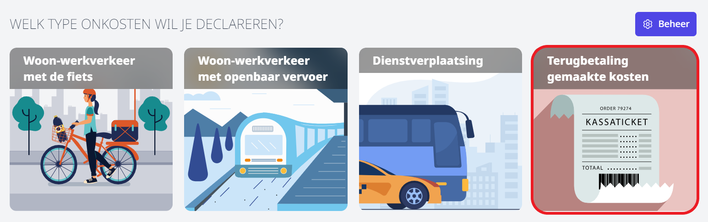
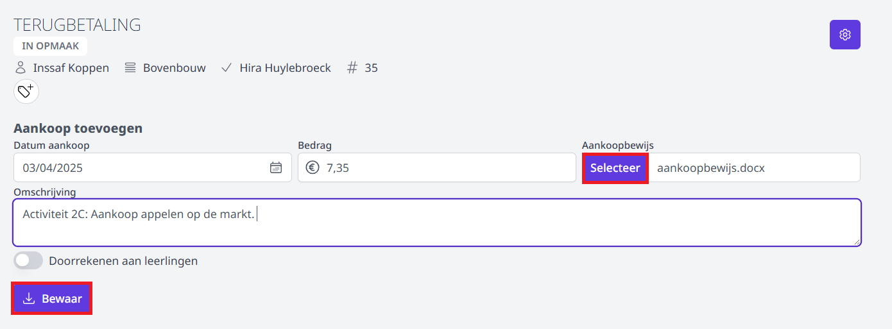
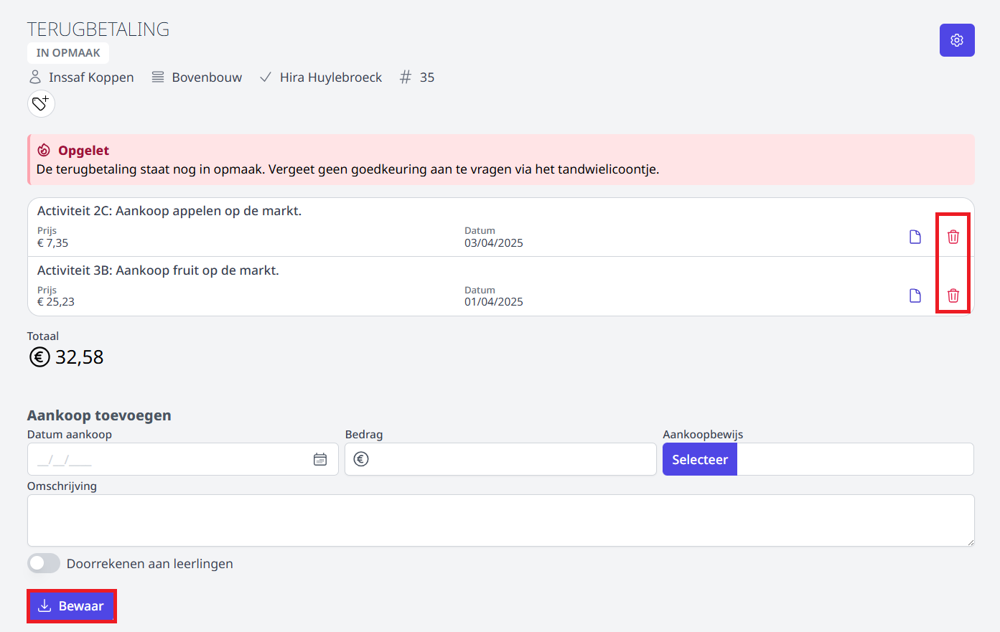
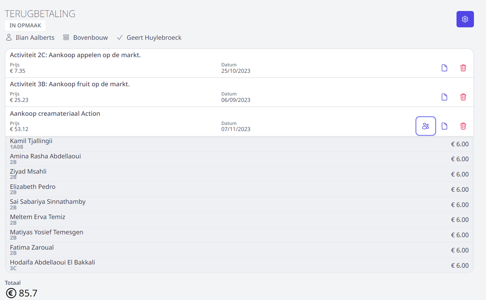
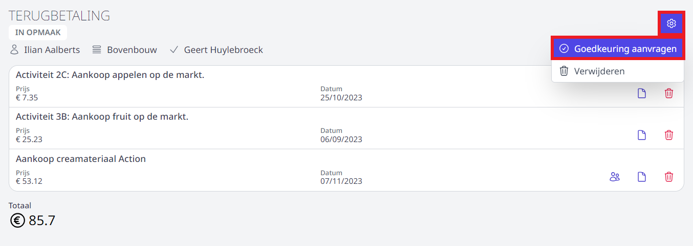
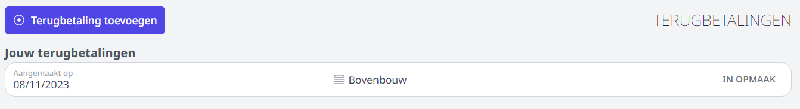
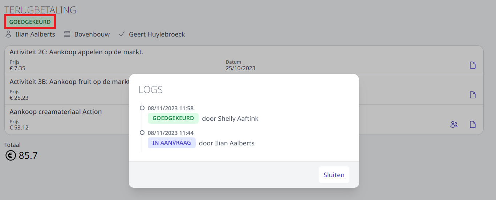

:::caution BELANGRIJK
De werkgever moet steeds **voorafgaand aan de aankoop** toestemming hebben gegeven. Indien er geen uitdrukkelijke toestemming verkregen werd, kan een terugbetaling van de gemaakte onkosten geweigerd worden. Het onderwijs is gebonden aan de wet op de overheidsopdrachten. Volg dus steeds de vastgelegde aankoopprocedure. Deze procedure verloopt (voorlopig) nog niet via Toolbox. Voor meer info, raadpleeg uw aankoper of directie. 

Elke terugbetaling van kosten eigen aan de werkgever wordt steeds vermeld op de fiscale fiche 281.10 van het personeelslid. 
:::

Bekijk hier de instructievideo i.v.m. het aanvragen een onkostenvergoeding in Toolbox. Onder de video vind je meer tekst en uitleg.

<Youtube url="https://www.youtube.com/embed/Fn_ga69jtRY"/>

## Aanvraag invullen

- Klik op **Terugbetaling toevoegen** om een terugbetaling van eigen aankopen in opdracht van de school (bv. didactisch materiaal) aan te vragen.

- Selecteer de **persoon** van wie je voorafgaand aan de aankoop uitdrukkelijk toestemming hebt gekregen (volgens de officieel geldende aankoopprocedure). Typ enkele karakters uit diens naam en een keuzelijst zal verschijnen. 

- Selecteer een **wachtrij**. Indien er geen wachtrij beschikbaar is, kan er geen terugbetaling aangevraagd worden. Neem in dat geval contact op met de persoon die de terugbetalingen op school moet goedkeuren. 

- Klik op **Toevoegen**.

    <Thumbnails img={[
        require('./kost1.PNG').default, 
    ]} />

- Vul de gevraagde gegevens in en laad het aankoopbewijs op door op de knop 'Selecteer' te klikken. Je kan een opslagen aankoopbewijs (foto of scan) selecteren van op je computer of smartphone. Indien je de aanvraag indient via je smartphone kan je via de knop 'Selecteer' kiezen om de camera van je toestel te activeren en alsnog een foto te nemen. OPGELET! Zorg dat het aankoopbewijs goed leesbaar is. 
- Klik op de knop 'Bewaar'.

    

 - Aan elke aanvraag kunnen meerdere lijnen (aankopen) worden toegevoegd. Zo kan je in één aanvraag bv. alle aankoopbonnetjes van een bepaalde activiteit of zelfs een bepaalde periode toevoegen. Elke lijn kan terug verwijderd worden door achteraan op het vuilnisbakje te klikken. De lijnen kunnen ook tussentijds (bv. na elke aankoop) ingegeven worden. Zolang de aanvraag niet ingediend is ter goedkeuring, kunnen er aankopen toegevoegd en verwijderd worden. 

    

## Kosten doorrekenen aan leerlingen

Bij het indienen van een eigen aankoop, is het mogelijk om de gemaakte kosten door te rekenen aan leerlingen. Bij het aanklikken van de schuifbalk verschijnt er een pop-up venster. Daar heb je de mogelijkheid om leerlingen op te zoeken en één voor één toe te voegen of om ineens een volledige klas toe te voegen. Je kan ook de combinatie van de 2 maken. 

<Thumbnails img={[
    require('./kost4.PNG').default, 
]} />

Toolbox zal automatisch bij het toevoegen van een leerling een herberekening maken van de verdeling van de kosten. Dit is steeds een gelijke verdeling van de effectieve kost. Het is mogelijk om deze kost manueel op niveau van de leerling aan te passen. Bovenaan zal een infobalk weergeven of het verdeelde bedrag overeenkomt met de werkelijke kost. Een exacte overeenkomst is NIET verplicht. Het is mogelijk om een iets hoger of lager bedrag door te rekenen aan de leerlingen. Een leerlingen verwijderen uit de lijst kan met het rode vuilnisbakje achteraan. 

<Thumbnails img={[
    require('./kost5.PNG').default, 
]} />

In het overzicht van aanvragen kan je via dit icoon <LegacyAction img="leerling.PNG"/> zien voor welke aanvragen er een verrekening moet gebeuren via de leerlingenrekeningen. Door op het icoon te klikken, zal het detailoverzicht van de leerlingen getoond worden. 

## Aanvraag indienen ter goedkeuring

Wanneer de aanvraag volledig is ingevuld, kan ze ingediend worden ter goedkeuring. Dat kan door bovenaan te klikken op <LegacyAction img="beheer.PNG"/> en vervolgens op **Goedkeuring aanvragen**. De aanvraag wordt nu verstuurd naar de goedkeurder van de wachtrij. Van zodra deze de activiteit heeft goedgekeurd of afgekeurd, zal de aanvrager hiervan een bericht ontvangen in Smartschool of via mail. Het is ook mogelijk om een notificatie te ontvangen in de browser of op de smartphone. Dit moet per gebruiker apart worden ingesteld door de gebruiker zelf. Lees er hier meer over: [notificaties](/onkosten/notificaties/).  

## Eigen aanvraag opvolgen
Bij het openen van de tegel **Terugbetaling gemaakte kosten** zie je meteen een overzicht van alle eigen aanvragen. Ook de status van elke aanvraag is in één oogopslag duidelijk. 

Klik op een aanvraag om die te openen en eventueel te bewerken. Op deze manier kan je een activiteit met de status 'IN OPMAAK' indienen ter goedkeuring. Ook een (voorlopig) afgekeurde aanvraag kan achteraf nog gewijzigd worden op vraag van de goedkeurder of verwerker. Bv. wanneer de ingegeven prijs van de aankoop op de aanvraag niet overeenkomt met die op het aankoopbewijs. Na het wijzigen van de afgekeurde aanvraag, kan die opnieuw ingediend worden ter goedkeuring.

Door een aanvraag te openen en bovenaan op de status te klikken, wordt de historiek getoond. 

Er zijn verschillende statussen mogelijk:
- **In opmaak**: het personeelslid heeft de aanvraag gestart en is bezig met de opmaak ervan. De aanvraag is nog **niet** ingediend ter goedkeuring.
- **In aanvraag**: De aanvraag is ingediend ter goedkeuring. De goedkeurder werd hiervan op de hoogte gebracht via e-mail of Smartschool (indien ingesteld in de wachtrij). 
- **Goedgekeurd**: De activiteit is goedgekeurd. 
- **Afgekeurd**: Klik op de status om te lezen waarom de activiteit (voorlopig) werd afgekeurd. Open de afgekeurde activiteit om ze te wijzigen. Daarna kan de activiteit opnieuw ingediend worden ter goedkeuring. 