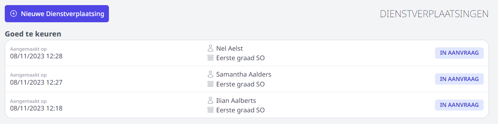
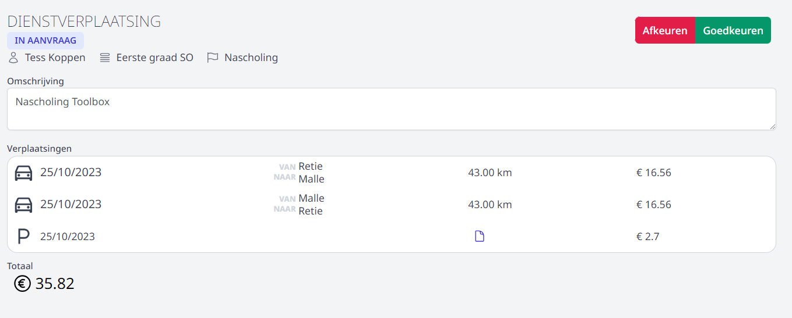
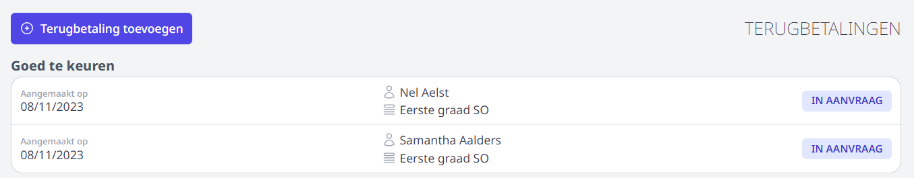
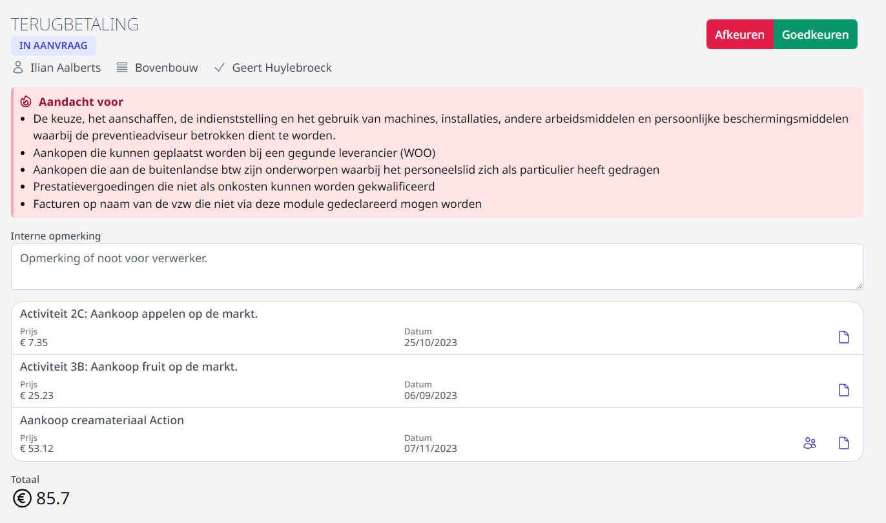

Wanneer een personeelslid een terugbetaling heeft aangevraagd, wordt de persoon die de aanvraag moet goedkeuren hiervan op de hoogte gebracht via een bericht in Smartschool of via e-mail (afhankelijk van hoe dit is ingesteld in de [wachtrij](/onkosten/voorbereiding_beheer/#wachtrij-aanmaken)). Het is ook mogelijk om een notificatie te ontvangen in de browser of op de smartphone. Dit moet per gebruiker apart worden ingesteld door de gebruiker zelf. Lees er hier meer over: [notificaties](/onkosten/notificaties/).

## Goedkeuren dienstverplaatsing

Bij het openen van de tegel **Dienstverplaatsing** in de module Onkosten ziet men meteen voor welke aanvragen men goedkeurder is en wat de status is van de aanvraag. 

- Klik op de aanvraag om de **details te bekijken** of om een aanvraag met de status 'IN AANVRAAG' goed- of af te keuren. 
- De icoontjes vooraan geven weer of het gaat om een verplaatsing met de wagen, het openbaar vervoer, de fiets of het indienen van een parkeerkost. Via het icoon <LegacyAction img="document.PNG"/> kan je het toegevoegde parkeer- of vervoerbewijs openen.
- Klik vervolgens rechts bovenaan op Goedkeuren of Afkeuren. 

    
- Wanneer je een activiteit afkeurt, heb je de mogelijkheid om meer info mee te geven. Zo kan het voorkomen dat het aankoopbewijs niet goed leesbaar is of dat er een foutief bedrag werd ingevuld. De aanvrager ontvangt vervolgens een bericht van deze beslissing. Daarna kan die de aanvraag wijzigen en opnieuw indienen ter goedkeuring. 

    <Thumbnails img={[
       require('./afkeuren1.PNG').default, 
    ]} />

## Goedkeuren terugbetaling aankoop

Bij het openen van de tegel **Terugbetaling gemaakte kosten** in de module Onkosten ziet men meteen voor welke aanvragen men goedkeurder is en wat de status is van de aanvraag. 

- Klik op de aanvraag om de **details te bekijken** of om een aanvraag met de status 'IN AANVRAAG' goed- of af te keuren. 

- Via het icoon <LegacyAction img="document.PNG"/> kan je het toegevoegde aankoopbewijs openen.
- Zie je het icoon <LegacyAction img="leerling.PNG"/> dan wordt de kost doorgerekend aan een (aantal) leerling(en). Door op het icoon te klikken worden de details de verdeling van de kosten weergegeven.
- Bekijk alvorens goed te keuren de aandachtspunten i.v.m. welke aankopen door personeel al dan niet geaccepteerd mogen worden.  
- Via een **Interne opmerking** kan je een boodschap meegeven voor de verwerker of een andere goedkeurder. Deze opmerking is niet zichtbaar voor de aanvrager. 
- Klik vervolgens rechts bovenaan op Goedkeuren of Afkeuren. 

 

- Wanneer je een aanvraag afkeurt, heb je de mogelijkheid om meer info mee te geven. Zo kan het voorkomen dat het aankoopbewijs niet goed leesbaar is of dat er een foutief bedrag werd ingevuld. De aanvrager ontvangt vervolgens een bericht van deze beslissing. Daarna kan die de aanvraag wijzigen en opnieuw indienen ter goedkeuring. 

    <Thumbnails img={[
       require('./afkeuren2.PNG').default, 
    ]} />
