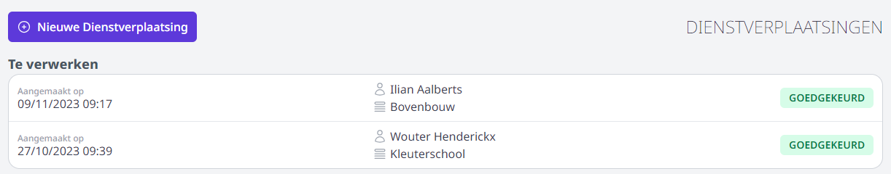
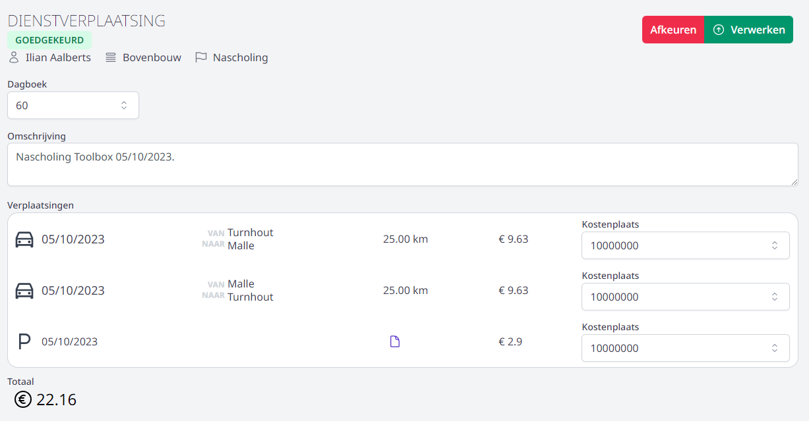
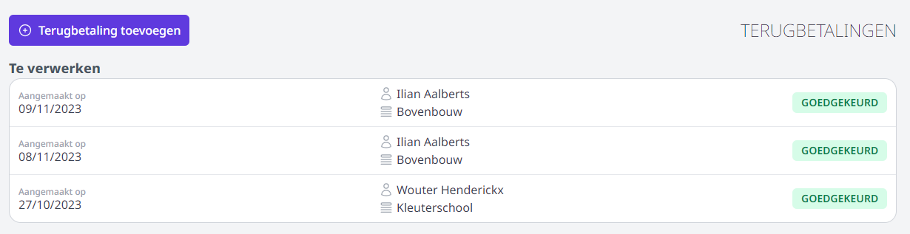
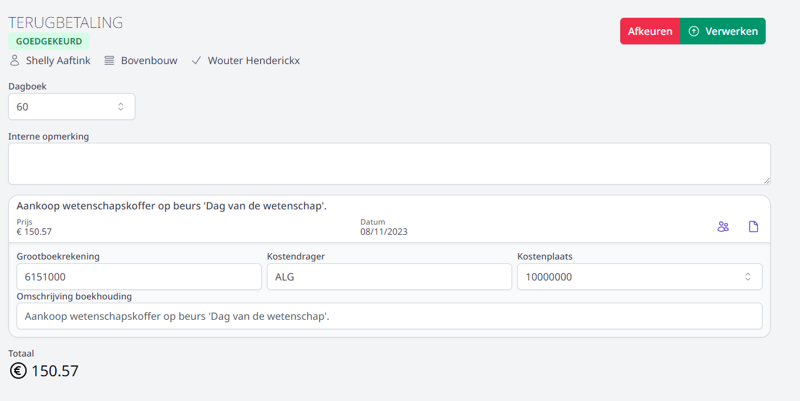

Wanneer een personeelslid een terugbetaling heeft aangevraagd én die werd geaccepteerd door een goedkeurder, kan de aanvraag boekhoudkundig verder verwerkt en uitbetaald worden. Dit is de taak van de verwerker. 

## Verwerken dienstverplaatsing

Bij het openen van de tegel **Dienstverplaatsing** in de module Onkosten ziet men meteen voor welke aanvragen men verwerker is. Enkel goedgekeurde aanvragen verschijnen in dit overzicht. 

Klik op de aanvraag om de **details te bekijken** en de aanvraag verder te verwerken. 

 

- Bovenaan in het detailscherm kan je nagaan wie de vraag heeft ingediend en over welke soort dienstverplaatsing het gaat (nascholing, TOAH of andere). Elke soort dienstverplaatsing is achterliggend (door Toolbox) gekoppeld aan de juiste kostendrager en grootboekrekening in Exact Online. 

- Bij de verplaatsingen geven de icoontjes vooraan weer of het gaat om een verplaatsing met de wagen, het openbaar vervoer, de fiets of het indienen van een parkeerkost. Via het icoon <LegacyAction img="document.PNG"/> kan je het toegevoegde parkeer- of vervoerbewijs openen.
- Het is mogelijk om via de pijltjes <LegacyAction img="pijltjes.PNG"/> een ander dagboek te selecteren. Per lijn kan men ook een andere kostenplaats instellen. Moet het dagboek of de kostenplaats standaard gewijzigd worden, pas dit dan aan in de [wachtrij](/onkosten/voorbereiding_beheer/#wachtrij-aanmaken).
- Klik vervolgens rechts bovenaan op Verwerken of Afkeuren. 
    - **Verwerken**: De verrichting wordt overgezet naar Exact Online. Dit kan enkel uitgevoerd worden door iemand met toegang tot Exact Online. Na het verwerken krijgt de aanvraag de status 'Verwerkt'.
    - **Afkeuren**: Een verwerker kan niet goedkeuren, maar wel afkeuren. Als de verwerker een anomalie in de aanvraag opmerkt, kan die beslissen om de aanvraag - hoewel reeds goedgekeurd - alsnog af te keuren. Wanneer je een activiteit afkeurt, heb je de mogelijkheid om meer info mee te geven. Zo kan het voorkomen dat het aankoopbewijs niet goed leesbaar is of dat er een foutief bedrag werd ingevuld. 
    
    De aanvrager zal hiervan op de hoogte worden gebracht via een e-mail- of smartschoolbericht (afhankelijk van de instelling in de wachtrij). Vervolgens zal die de aanvraag kunnen wijzigen en opnieuw indienen ter goedkeuring. De goedkeurder zal hiervan op zijn beurt een bericht ontvangen, waarna die de aanvraag opnieuw kan goedkeuren. De goedkeurder zal via de status steeds een historiek kunnen raadplegen en dus kunnen nagaan waarom de verwerker de aanvraag heeft afgekeurd. 

## Verwerken terugbetaling aankoop

Bij het openen van de tegel **Terugbetaling gemaakte kosten** in de module Onkosten ziet men meteen voor welke aanvragen men verwerker is. Enkel goedgekeurde aanvragen verschijnen in dit overzicht. 

Klik op de aanvraag om de **details te bekijken** en de aanvraag verder te verwerken. 

- Bovenaan in het detailscherm kan je nagaan wie de vraag heeft ingediend en wie er voorafgaandelijk toestemming heeft gegeven voor de aankoop.  

- Via het icoon <LegacyAction img="document.PNG"/> kan je het toegevoegde aankoopbewijs openen.

- Zie je het icoon <LegacyAction img="leerling.PNG"/> dan wordt de kost doorgerekend aan een (aantal) leerling(en). Door op het icoon te klikken worden de details de verdeling van de kosten weergegeven.
- Bij de **Interne opmerking** kan je een eventuele boodschap van de goedkeurder raadplegen. Deze opmerking is niet zichtbaar voor de aanvrager. Dit veld kan dus ook ingevuld worden door de verwerker om meer info te verstrekken aan de goedkeurder wanneer de verwerker een aanvraag alsnog afkeurt. 

- Het is mogelijk om via de pijltjes <LegacyAction img="pijltjes.PNG"/> een ander dagboek te selecteren. Per lijn kan men ook een andere kostenplaats instellen. Moet het dagboek of de kostenplaats standaard gewijzigd worden, pas dit dan aan in de [wachtrij](/onkosten/voorbereiding_beheer/#wachtrij-aanmaken).
- Vul per lijn de grootboekrekening en kostendrager aan. Wanneer je in dit veld begint te typen, zal er een keuzelijst verschijnen.
- Klik vervolgens rechts bovenaan op Verwerken of Afkeuren. 
    - **Verwerken**: De verrichting wordt overgezet naar Exact Online. Dit kan enkel uitgevoerd worden door iemand met toegang tot Exact Online. Na het verwerken krijgt de aanvraag de status 'Verwerkt'.
    - **Afkeuren**: Een verwerker kan niet goedkeuren, maar wel afkeuren. Als de verwerker een anomalie in de aanvraag opmerkt, kan die beslissen om de aanvraag - hoewel reeds goedgekeurd - alsnog af te keuren. Wanneer je een activiteit afkeurt, heb je de mogelijkheid om meer info mee te geven. Zo kan het voorkomen dat het aankoopbewijs niet goed leesbaar is of dat er een foutief bedrag werd ingevuld. 
    
    De aanvrager zal hiervan op de hoogte worden gebracht via een e-mail- of smartschoolbericht (afhankelijk van de instelling in de wachtrij). Vervolgens zal die de aanvraag kunnen wijzigen en opnieuw indienen ter goedkeuring. De goedkeurder zal hiervan op zijn beurt een bericht ontvangen, waarna die de aanvraag opnieuw kan goedkeuren. De goedkeurder zal via de status steeds een historiek kunnen raadplegen en dus kunnen nagaan waarom de verwerker de aanvraag heeft afgekeurd. 

