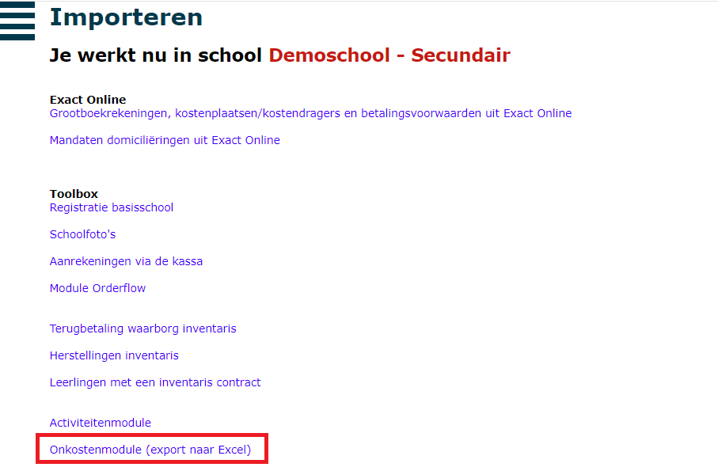

Dankzij de koppeling met de module Leerlingenrekeningen is het mogelijk om een overzicht op te vragen van alle onkosten die moeten worden doorgerekend aan leerlingen.

Klik [hier](/onkosten/aanvraag_kost/#kosten-doorrekenen-aan-leerlingen) voor meer info over het verdelen van een onkost over een groep leerlingen.

- Open de module Leerlingenrekeningen en selecteer de notagroep waarin je de activiteit wil importeren.
- Ga naar het menu **Importeer**. 
- Selecteer onder de rubriek Toolbox de 'Onkostenmodule.' 
- Op basis van het gegenereerde Excel-bestand heb je een overzicht van alle kosten die moeten worden aangerekend via de leerlingenrekeningen. Voor deze kosten kan je manueel aanrekeningen maken op de gebruikelijke manier. Je kan de kosten ook snel en eenvoudig importeren via het menu Importeer > Externe gegevens. Klik [hier](/leerlingenrekeningen/Importeren/#4-externe-gegevens) voor meer info.

