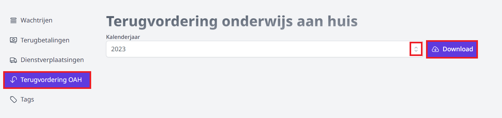

Alle dienstverplaatsingen die afgelegd zijn in het kader van onderwijs aan huis, kunnen per kalenderjaar teruggevorderd worden bij AGODI. In de opdrachtenmodule van Toolbox kan je hiervoor het volledig ingevulde terugvorderingsdocument genereren. 

:::caution belangrijk
Dit document kan slechts als volledig worden beschouwd als **ALLE dienstverplaatsingsen** in het kader van OAH op de correcte manier zijn aangevraagd via de onkostenmodule. Dat wil zeggen dat het personeelslid in de aanvraag reeds de juiste reden van dienstverplaatsing heeft geselecteerd, nl. onderwijs aan huis.
:::

Ga in de onkostenmodule naar het onderdeel **Beheer** en klik in het menu links op 'Terugvordering OAH'. Selecteer het gewenste kalenderjaar en klik op 'Download'. Bezorg het gegenereerde formulier vóór 28 februari van het volgende kalenderjaar aan de bevoegde instantie om de terugbetaling te bekomen. 

