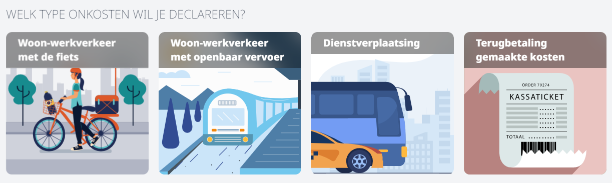

<ImageTitle img="onkosten2.png">Onkosten</ImageTitle>

Via de onkostenmodule kunnen leraren op een eenvoudige manier een terugbetaling van hun onkosten aanvragen. De module bundelt 4 categorieën van onkosten:
- Woon-werkverkeer: fietsvergoeding
- Woon-werkverkeer: openbaar vervoer
- Verplaatsingen in dienstopdracht
- Terugbetaling eigen aankopen 

De twee eerste tegels vormen een koppeling naar de reeds bestaande modules [Fietsvergoeding](/fietsvergoeding) en [Openbaar vervoer](/openbaar_vervoer). Die originele tegels blijven ook rechstreeks toegankelijk. 

Vergoedingen voor **dienstverplaatsingen** en **eigen aankopen** kunnen enkel via de **module Onkosten** worden aangevraagd. Deze aanvraag verloopt steeds via een goedkeuringsflow (wachtrij) waarbij de aanvraag moet worden bevestigd door één of meerdere goedkeurders, bv. de directie. Naast een goedkeurder is er ook minimaal één verwerker gekoppeld aan de wachtrij. Dit is bv. een boekhoudkundig medewerker die de aanvraag - na goedkeuring - verder mag verwerken naar Exact Online.  

Dankzij een rechtstreekse koppeling met het boekhoudpakket is het mogelijk om de aangevraagde terugbetalingen evenals de gekoppelde documenten met een eenvoudige druk op de knop over te zetten naar Exact Online. 

Het gebruik van deze module is een must-have om correcte fiscale attesten voor personeelsleden te kunnen afleveren.

Herbekijk hier de webinar van donderdag 30 november 2023.

<Youtube url="https://www.youtube.com/embed/8IpTae6CyTs"/>
 

<DocCardList /> 

