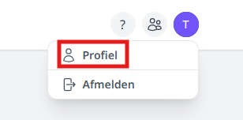
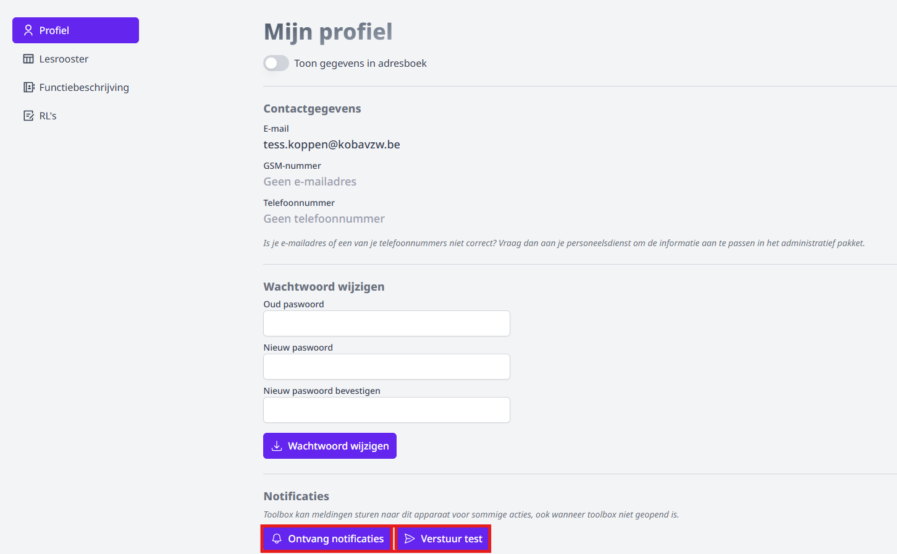

Zowel de **goedkeurder** als de **aanvrager** van een ontkost of dienstverplaatsing kan notificaties ontvangen in de browser of op de smartphone. Wanneer deze functionaliteit actief is, ontvangt de goedkeurder een melding bij een nieuwe aanvraag. De aanvrager ontvangt op zijn beurt een melding wanneer de onkost of dienstverplaatsing is goed- of afgekeurd. 

Het ontvangen van notificaties is **persoonsgebonden** en moet dan ook door de gebruiker zelf ingesteld worden op het gewenste apparaat. Het is dus perfect mogelijk dat de goedkeurder geen notificaties ontvangt, terwijl de aanvrager die wel ontvangt. Wil men op meerdere apparaten notificaties ontvangen (bv. op laptop én smartphone), dan moet dat op elk apparaat afzonderlijk ingesteld worden. Open hiervoor je persoonlijk profiel in Toolbox door te klikken op de eerste letter van je voornaam in de paarse bol rechts bovenaan. Helemaal onderaan kan je de notificaties voor dit apparaat activeren en ook een testnotificatie versturen. Deze functionaliteit werkt ook wanneer Toolbox niet geopend is.   

Specifiek voor Iphone: Voeg eerst Toolbox toe als pictogram aan je startscherm om de notificaties te kunnen ontvangen. Open hiervoor jouw Toolbox in Safari en klik onderaan op het deel-icoontje (vierkant met pijltje omhoog). Scroll vervolgens naar beneden en kies voor 'Zet op beginscherm'.   

<Thumbnails img={[
    require('./iphone1.png').default, 
    require('./iphone2.png').default, 
]} />
