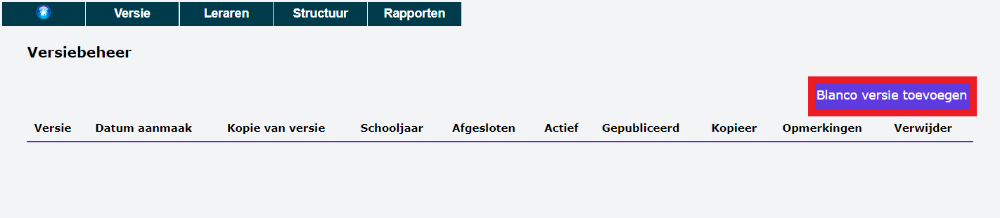
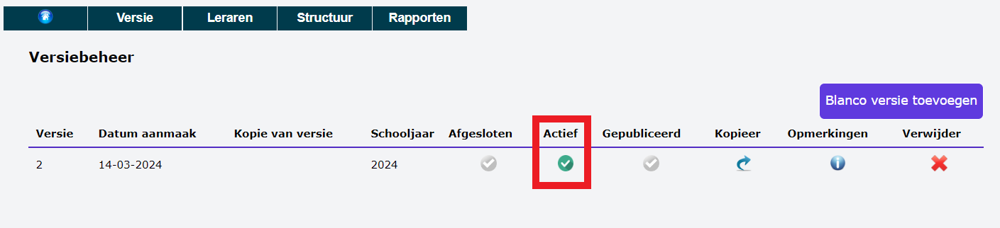

## 1. Gebruikersbeheer

Om de module Opdrachten te kunnen gebruiken, moet eerst en vooral het gebruikersrecht **Opdrachten** toegekend worden. Dat gebeurt door een beheerder via de module [Gebruikersbeheer](/gebruikersbeheer). 

## 2. Versie

Elke versie bevat een structuur (combinatie van (klas)groepen, vakken en aantal lesuren per vak) en de toegewezen opdrachten aan bepaalde leraren. Wanneer je de module voor het eerst gebruikt, vertrek je van een lege versie en moet die structuur nog volledig worden opgebouwd. Zodra dat is gebeurd, bestaat er de mogelijkheid om versies te kopiëren. 

Je kan werken met één versie per schooljaar, maar ook meerdere versies per schooljaar zijn mogelijk.  

### 2.1 Blanco versie aanmaken

Wanneer je de module voor de eerste keer gebruikt, is er nog geen enkele versie beschikbaar. Die maak je zelf aan door een blanco versie toe te voegen. 

Vul het kalenderjaar in waarin het schooljaar begint en klik op **Aanmaken**.

<Thumbnails img={[
    require('./versie_2.png').default, 
]} />

Je hebt nu een lege versie aangemaakt die nog **niet actief** is. Om in deze versie te kunnen werken, moet je ze activeren door op de bol te klikken in de kolom 'Actief'. Het activeren is geslaagd wanneer de bol groen is. In een lege versie maak je eerst de structuur van (klas)groepen, vakken en lesuren aan vooraleer je aan de slag kan met het toewijzen van opdrachten. 

Wanneer er meerdere versies beschikbaar zijn, kan er maar één tegelijk actief zijn. Je activeert dus steeds de versie waarin je wil werken of iets wil opzoeken. 

### 2.2 Bestaande versie kopiëren

In een eerste versie werd er reeds een structuur aangemaakt en werden er voor een bepaald schooljaar opdrachten toegekend aan bepaalde leraren. Vaak blijft die structuur voor het volgende schooljaar grotendeels ongewijzigd. De vakken per studierichtingen blijven over het algemeen dezelfde en ook het aantal lesuren per vak blijft constant. Daarom is het wenselijk om deze structuur en eventueel zelfs de volledige opdrachten van de leraren te kopiëren naar het volgende schooljaar. Nadat de versie is gekopieerd, kan je die nieuwe versie nog volledig aanpassen aan de situatie van het nieuwe schooljaar. 

Klik bij de versie die je wil dupliceren in de kolom 'Kopieer' op het <LegacyAction img="redo.png"/> icoon. Vervolgens kan je kiezen wat precies je wil kopiëren naar de nieuwe versie. 
- Enkel de structuur (vakken, (klas)groepen, lesuren) en de info over de leraren => klik op 'Kopieer naar nieuwe versie'
- De structuur, leraren én alle lesopdrachten => Vink 'Kopieer de opdrachten mee' aan en klik op 'Kopieer naar nieuwe versie'

<Thumbnails img={[
    require('./versie_4.png').default, 
]} />

