## 1. Structuur
De structuur omvat alle vakken, (klas)groepen en de koppeling tussen de twee, nl. welke vakken er in welke groep gegeven worden. Nadat de koppeling is gelegd, kan je aan elk vak het aantal in te richten uren toewijzen. Deze structuur moet volledig opgezet worden alvorens je uren kan toekennen aan leraren. 

### 1.1 Vakken
Voeg bij het onderdeel **Structuur => Vakken** alle vakken toe die op de school gegeven worden. Klik daarvoor op de knop 'Vak toevoegen'. 

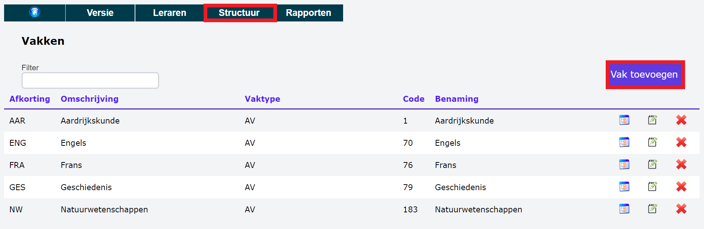

Je hebt nu de keuze om een vak te selecteren uit de officiële vakkenlijst of manueel een vak toe te voegen. 

### a. Officiële vakkenlijst

- Geef enkele karakters uit de naam van het vak in en een lijst met resultaten verschijnt. 

    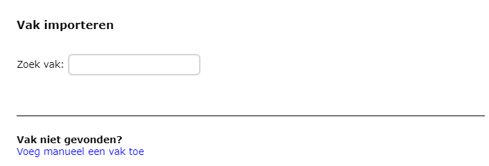

- Klik vooraan op het handje om het vak toe te voegen.

    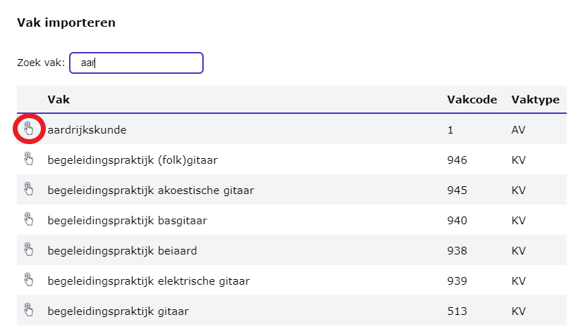

- Vul een afkorting in voor het vak en klik op OK. Enkel vakken met een afkorting zullen later gekoppeld kunnen worden aan een (klas)groep. 

    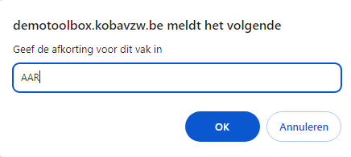

### b. Manueel toevoegen

Het kan gebeuren dat je een vak niet kan terugvinden in de officiële vakkenlijst, bv. keuzevakken, CLIL, co-teaching voor een bepaald vak ... Dergelijke vakken kan je manueel aanmaken. Naast effectieve lesvakken, kan je het onderdeel vakken ook gebruiken om specifieke schoolse taken te omschrijven waarvoor een personeelslid uren krijgt. Elke taak maak je dan aan als een apart vak dat je later kan koppelen aan een groep. Denk aan functies als:  

- opmaken lessenrooster
- stagecoördinator
- klasbegeleider
- administratie/opvoeder
- ICT-coördinator of -medewerker

Vul minimaal de verplichte velden in, aangeduid met een rood sterretje: 
- Zelfgekozen afkorting voor het vak
- Eigen omschrijving voor het vak

Verder kan je ook de optionele velden invullen:
- Vaktype (AV, PV, TV, KV, Admin.): Op basis van de combinatie vaktype en het studiejaar van de (klas)groep (zie onderdeel [Klassen/Groepen](/opdrachten/structuur/#12-klassengroepen) hieronder) zal het systeem automatisch de juiste noemer van de opdracht hanteren. Bv. een PV-vak in het 5de jaar krijgt noemer 29 terwijl een AV-vak in datzelfde jaar noemer 20 zal krijgen.
- Officiële vakcode 
- Officiële vakbenaming

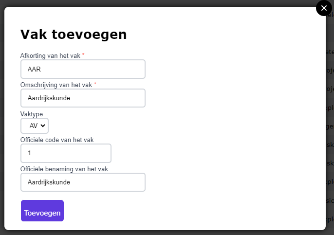

### c. Overzicht met vakken

De toegevoegde vakken verschijnen in het overzicht. In deze tabel kan je alle kolommen sorteren door bovenaan op de gewenste kolomkop te klikken. 

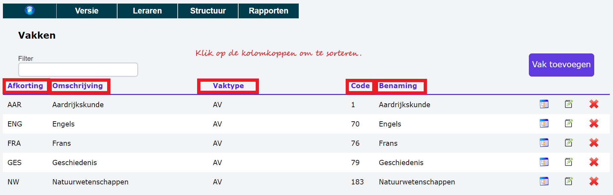

- Gebruik deze actieknop <LegacyAction img="treeview.png"/> om na te gaan aan welke klassen en leraren het betreffende vak gekoppeld is. 

- Gebruik deze actieknop <LegacyAction img="edit.png"/> om de gegevens over het vak te wijzigen. 
- Gebruik deze actieknop <LegacyAction img="remove.png"/> om het vak uit het overzicht te verwijderen.  

### 1.2 Klassen/Groepen

Bij het structuuronderdeel 'Groepen' wordt er een onderscheid gemaakt tussen enerzijds **officiële klasgroepen** en anderzijds **alternatieve groepen**. Die laatste kunnen klasdoorbrekende groepen zijn zoals keuze-uren, CLIL, ... waarbij een aantal leerlingen uit verschillende officiële klassen worden samengezet. Daarnaast kunnen de alternatieve groepen ook gebruikt worden om uren toe te kennen die geen effectieve lesopdracht inhouden, bv. uren voor bijzondere pedagogische taken (BPT), uren aanvangsbegeleiding (AVB), uren ondersteuning kerntaak leraar (OKT), ...

Via het onderdeel **Structuur => Groepen => Groep toevoegen** kan je op dezelfde manier zowel de officiële als de alternatieve groepen aanmaken. De officiële klasgroepen zullen gekenmerkt worden door een groene bol in de kolom 'Klasgroep'. Alternatieve groepen krijgen een oranje bol. 

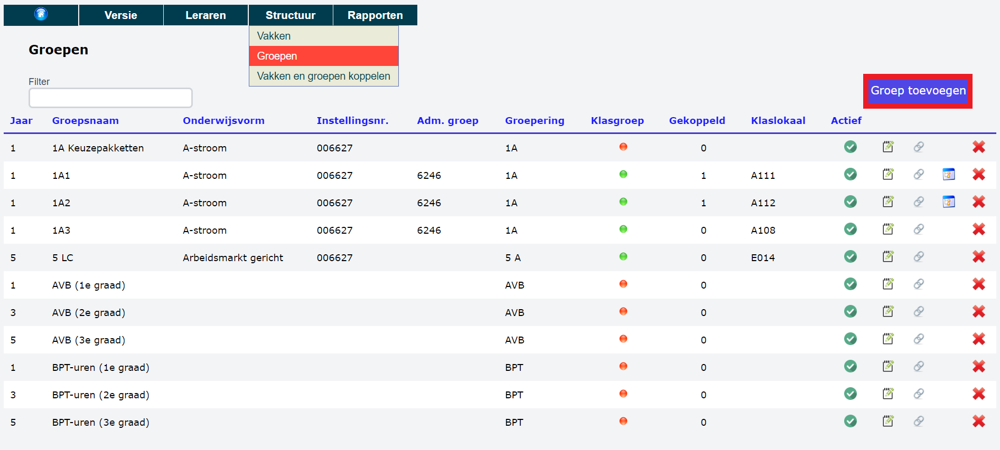

Bij het toevoegen van een nieuwe groep, vul je minimaal volgende velden in: 

- **Jaar**: Het studiejaar van de (klas)groep. Ook voor alternatieve groepen moet er een studiejaar worden ingevuld. In het voorbeeld is het eerste jaar gekozen voor alle BPT-uren in de eerste graad, het derde jaar voor de BPT-uren in de tweede graad en het vijfde jaar voor de BPT-uren in de derde graad. Op basis van de combinatie **vaktype** (zie onderdeel [vakken](/opdrachten/structuur/#b-manueel-toevoegen) hierboven) en het **studiejaar** van de (klas)groep zal het systeem automatisch de juiste noemer van de opdracht hanteren. Bv. een PV-vak in het 5de jaar krijgt noemer 29 terwijl een AV-vak in datzelfde jaar noemer 20 zal krijgen.
- **Naam van de groep**: Klasnaam voorafgegaan door het studiejaar OF de naam voor de alternatieve groep. 
- **Is dit een officiële klas?** Bij een alternatieve groep kies je hier voor 'nee'. De groep verschijnt vervolgens in het overzicht met een oranje bol. Een alternatieve groep kan later (optioneel) aan één of meerdere officiële klasgroepen gekoppeld worden. 

De overige velden zijn optioneel. 
- **Groepering**: Dit is een zelfgekozen groepsnaam waarop je later makkelijk kan zoeken en sorteren. Bv. 1 A als groepsnaam voor alle klassen uit het eerste jaar in de A-stroom. 

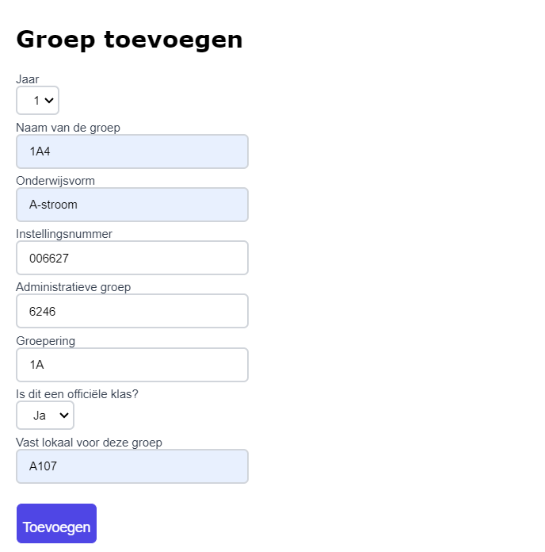

De toegevoegde groepen verschijnen in het overzicht. In deze tabel kan je alle kolommen sorteren door bovenaan op de gewenste kolomkop te klikken. 

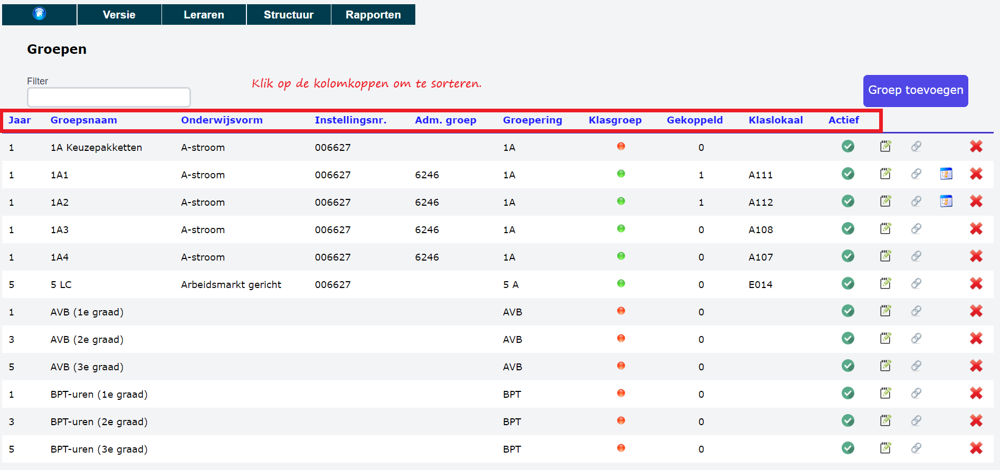

- Gebruik deze actieknop <LegacyAction img="vinkjeGroenRond.png"/> om een groep (tijdelijk) de activeren of deactiveren. 

- Gebruik deze actieknop <LegacyAction img="edit.png"/> om de gegevens over de groep te wijzigen. 
- Gebruik deze actieknop <LegacyAction img="link2.png"/> om aan deze groep een alternatieve groep (oranje bol) te koppelen. In het voorbeeld bevat de alternatieve groep '1A keuzepakketten' alle vakken die bij inschrijving in het eerste jaar als keuzevak genomen kunnen worden, o.a. Stem-Technieken, Stem-Wetenschappen, Voeding & Horeca, Econmie & Organisatie, Maatschappij & Welzijn ... In de praktijk worden tijdens dit keuze-uurtje de leerlingen uit alle 1A-klassen gehergroepeerd op basis van het gekozen pakket. Daarom koppelen we de groep '1A keuzepakketten' aan alle officiële '1A' klasgroepen. In dit voorbeeld is de koppeling enkel nog maar gelegd met de klasgroepen 1A1 en 1A2. In de kolom 'Gekoppeld' zie je bij deze 2 klassen 1 koppeling. 
   
    Klik in de rechterkolom op de alternatieve groep die je wil koppelen. Die groep wordt nu naar de linkerkolom verplaatst. Je maakt de koppeling terug ongedaan door in de linkerkolom opnieuw op de betreffende groepsnaam te klikken, waardoor die terug naar rechts verplaats zal worden en zodoende niet meer gekoppeld zal zijn.

    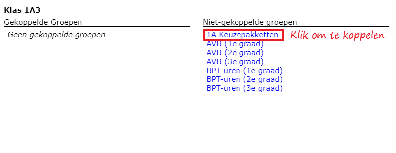

- Gebruik deze actieknop <LegacyAction img="treeview.png"/> om na te gaan hoeveel lesuren er aan deze groep gekoppeld zijn en eventueel ook welke alternatieve groep(en). 

    <Thumbnails img={[
        require('./groep_5.PNG').default, 
    ]} />

- Gebruik deze actieknop <LegacyAction img="remove.png"/> om de groep uit het overzicht te verwijderen.  

:::caution tip
Bezorg ons volgend sjabloon ingevuld terug en wij importeren voor jou alle groepen in de opdrachtenmodule: [sjabloon groepen](./ImportSjabloonGroepen.xlsx)

Kolommen A (jaar), B (groepsnaam) en G (officiële klas: ja = 1 / nee = 0) zijn verplicht in te vullen. De overige kolommen mogen blanco blijven.
:::

### 1.3 Vakken en groepen koppelen

Van zodra er vakken en (klas)groepen zijn aangemaakt, kunnen er koppelingen gelegd worden zodat duidelijk is welke vakken er in welke groepen gegeven worden en voor hoeveel uren. Ga hiervoor naar het onderdeel **Structuur => Vakken en groepen koppelen**.

Aan de linkerkant zie je een overzicht van alle beschikbare groepen, zowel de officiële klasgroepen (groene bol) als de alternatieve groepen (oranje bol). De groepen worden gesorteerd op naam. Numerieke karakters staan bovenaan, van laag naar hoog. De alfabetische sortering van A-Z volgt op de numerieke sortering. Wil je een groep op een andere plaats zien staan, wijzig dan de naam van de groep rekening houdend met de sorteringsmethode. 

- Klik op de naam van de groep om vakken en lesuren te koppelen. 
- Via het grijze driehoekje vooraan kan je de groep 'openklappen' om na te gaan of er alternatieve groepen gekoppeld zijn aan deze groep. 

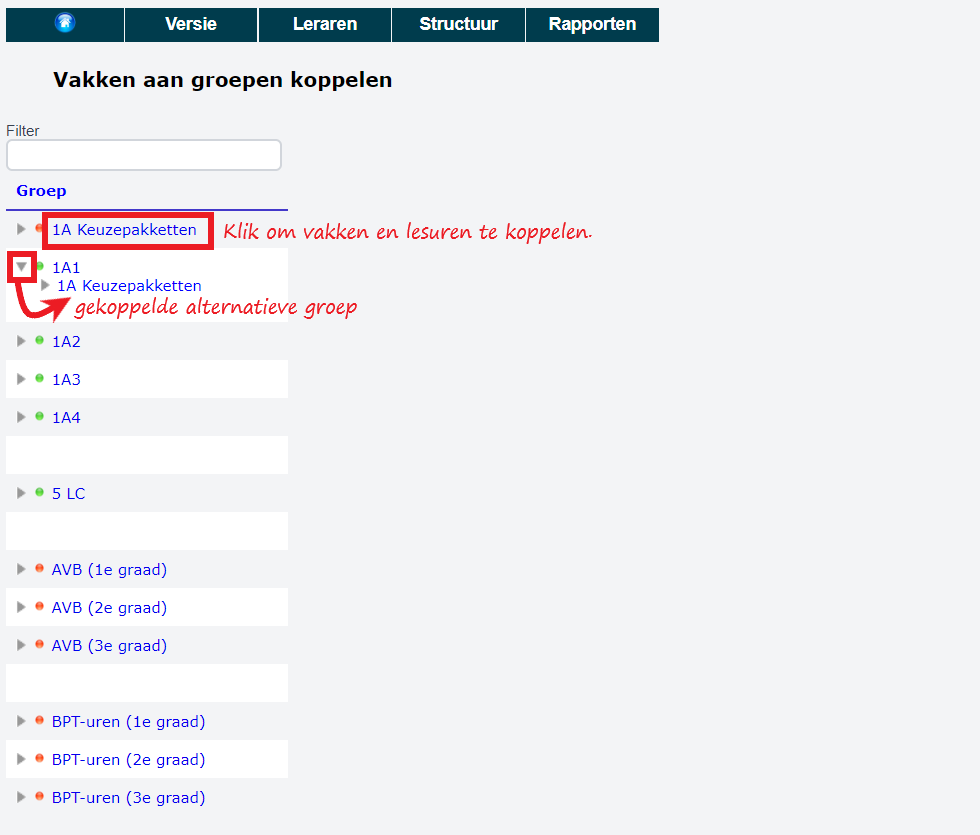

### a. Lessentabel manueel opvullen

- Gebruik de filter rechtsboven om te zoeken op de naam van een vak.
- Klik op de afkorting van het vak om het vak toe te voegen aan de klas. Eens een vak is toegevoegd, kleurt de tekst lichtgrijs. Op die manier is het visueel duidelijk welke vakken reeds zijn toegevoegd aan de groep. Een vak kan nog een tweede keer worden toegevoegd door nogmaals op de lichtgrijze tekst te klikken.
- Herhaal deze stappen voor alle vakken die gekoppeld moeten worden aan de (klas)groep. 

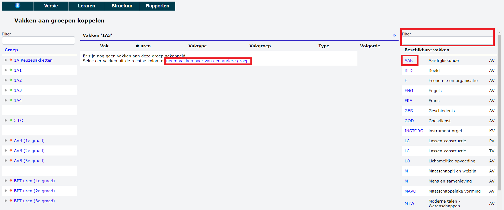

De gekozen vakken verschijnen in een overzicht. 

- **Aantal uren**: Vul in hoeveel lesuren elk vak wordt ingericht in de betreffende klas. 
- **Vaktype**: AV-TV-KV-PV-Admin. wordt automatisch ingevuld indien ingegeven bij 'Structuur => Vakken'. Dat kan hier eventueel nog gewijzigd worden. 
- **Vakgroep**: Dit is een optioneel veld. Door hier te klikken kan je een nieuwe vakgroep aanmaken of een reeds aangemaakte vakgroep selecteren. Wanneer alle lesuren zijn toegewezen, is het achteraf makkelijk om alle leraren van een bepaalde vakgroep op te lijsten. 
- **Type**: Dit is een optioneel veld. Maak je keuze uit:
    - basisvak
    - keuzevak
    - richtingsvak
    - complementair vak

- **Volgorde**: De vakken worden standaard alfabetisch getoond. Je kan de volgorde aanpassen door een nummering toe te kennen aan de vakken. De vakken zullen vervolgens gesorteerd worden op basis van het toegekende nummer en dat van laag naar hoog.

- **Skore**: Voor de export naar Skore (terug te vinden bij Rapporten) worden standaard de vakafkortingen gebruikt. Indien je voor Skore een andere afkorting wil gebruiken kan je die in dit veld ingeven. Laat je het veld leeg, wordt de standaard vakafkorting overgenomen.  

- Via dit icoon <LegacyAction img="remove.png"/> kan je een vak terug verwijderen uit de lessentabel.

- Helemaal onderaan kan je steeds opvolgen hoeveel uren je hebt inricht voor deze (klas)groep. Een volledig overzicht van alle ingerichte uren per groep vind je terug bij **Rapporten => ingerichte uren**. 

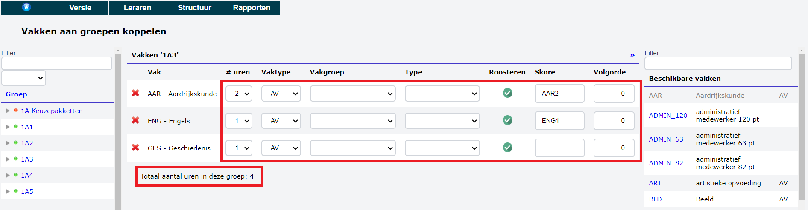

### b. Lessentabel overnemen van een andere groep

Het kan voorkomen dat je meerdere klasgroepen hebt met eenzelfde lessentabel. Het volstaat om deze lessentabel voor 1 klas aan te maken. Daarna kan je die voor elke andere groep overnemen door te klikken op de tekst 'Neem vakken over van een andere groep'.

   

- Selecteer de (klas)groep waarvan je de vakken wil overnemen en klik op 'neem vakken over'. 
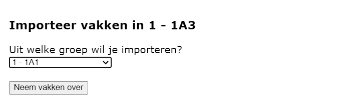

### c. Co-teaching

Uren co-teaching inrichten kan op verschillende manieren: 

- Voeg het vak een tweede keer toe aan de lessentabel. Voordeel: Het is visueel duidelijk dat het vak dubbel is toegevoegd en dat er voor elke lijn een leraar gekoppeld moet worden. 

    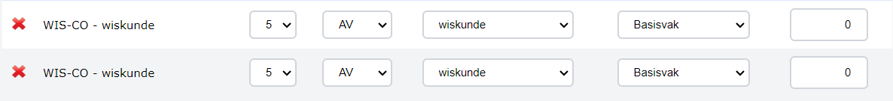
- Verhoog het aantal uren van het vak in de lessentabel. Noot: Bij het toekennen van de uren zal je moeten opletten dat je de toe te wijzen uren verdeelt over 2 leraren. De eerste mogelijkheid (hierboven) geniet dus de voorkeur.

:::tip NOOT
Je kan aparte vakken aanmaken voor co-teaching en hiervoor alternatieve vakbenamingen gebruiken, bv. 'Wiskunde Co-teaching' met als afkoring WIS-CO. 
:::

### d. Klasbegeleiders/klastitularissen aanwijzen

In sommige scholen krijgen klasbegeleiders, ook wel klastitularissen genoemd, hiervoor één of meerdere lesuren toegekend. In andere scholen krijgen ze wel de opdracht toebedeelt, maar zonder dat daar uren tegenover staan. 

In beide gevallen kan je bij de **Structuur => Vakken** manueel het vak 'Klasbegeleider' aanmaken met als afkorting KBG. Een tweede klasbegeleider, hulpbegeleider of hulptitularis kan aangemaakt worden als vak 'Klasbegeleider 2' en afkorting KGB2. Hetzelfde geldt voor 'Klasbegeleider 3' enz. Het volstaat om enkel de naam en de afkoring in te vullen.

Koppel vervolgens het vak 'Klasbegeleider' aan de groepen waarvoor je er één wil aanduiden. Is de rol van klasbegeleider onbezoldigd, laat dan het aantal uren op 0 staan. Wordt de leraar wel vergoed voor deze taak, pas dan het aantal ingerichte uren aan. 

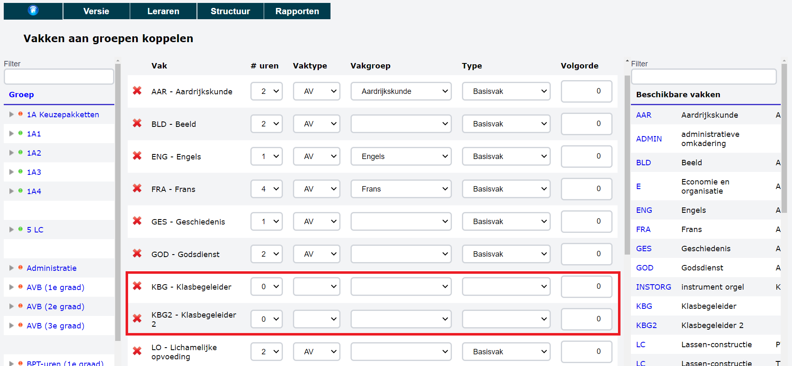
 

Bij het toewijzen van de opdrachten aan de leraren zal je nu ook de taak van klasbegeleider kunnen toewijzen. Na het verdelen van de opdrachten, kan je via het menu **Rapporten => Klasbegeleiders** een overzicht raadplegen van alle klasbegeleiders per klas. 
 

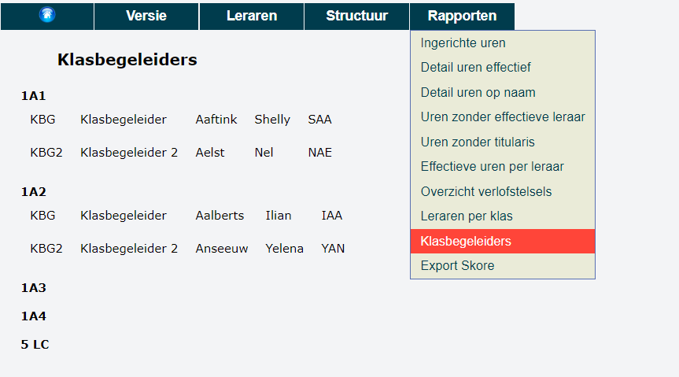