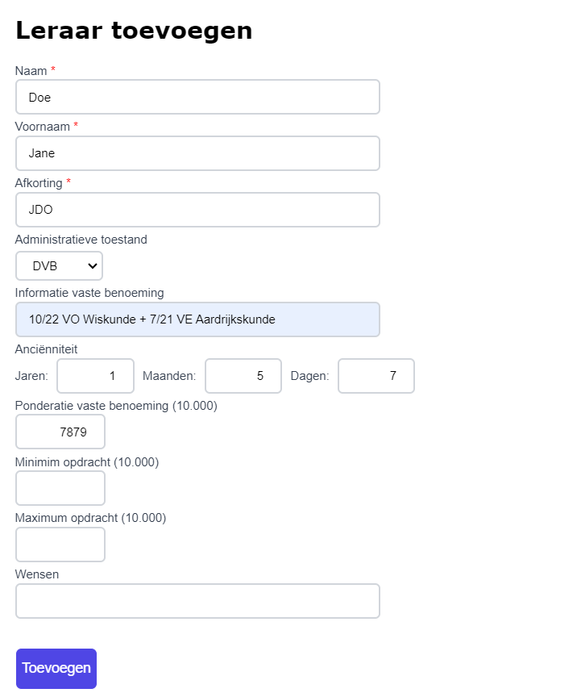
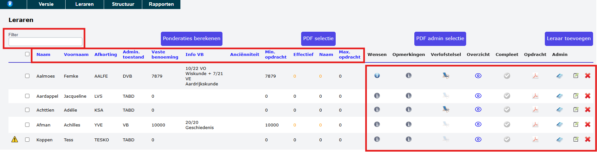
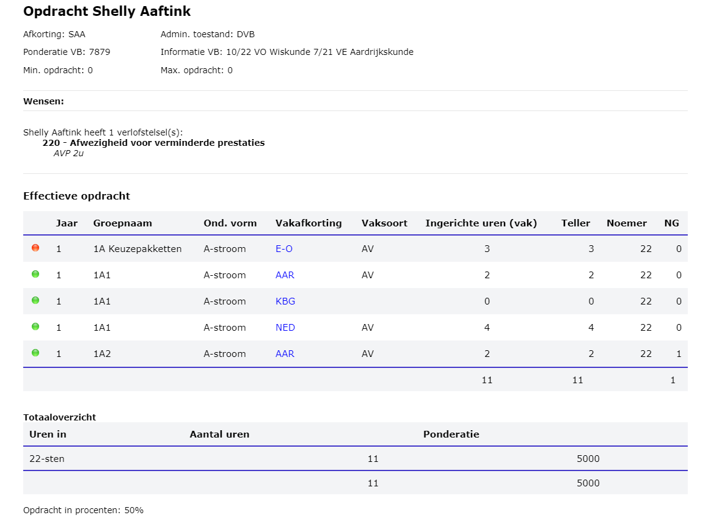
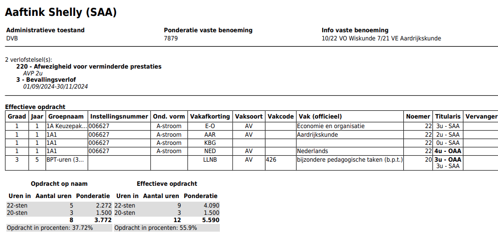
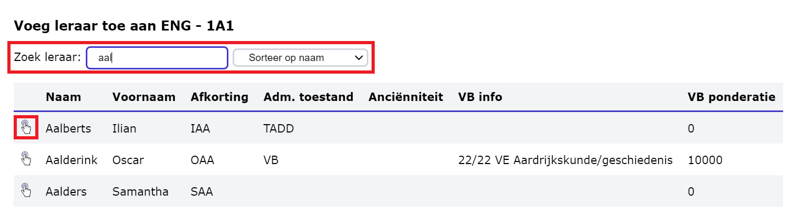

## 1. Leraar toevoegen aan opdrachtenmodule
Vooraleer je lesuren kan toewijzen aan een leraar, moet die leraar toegevoegd zijn aan de opdrachtenmodule. Ga hiervoor naar het menu **Leraren => Leraren => Leraar toevoegen**.

### 1.1 Leraar is gekend in Informat
Toolbox haalt via de module **Synchronisatie leraren** alle leraren op uit het administratief pakket voor personeelsadministratie (nl. Informat of Wisa). Om te synchroniseren met Informat of Wisa voer je de eerste 2 stappen in de synchronisatiemodule uit, nl. 'Informat/Wisa uitlezen' en 'Synchroniseer leraren'. Van zodra dat is gebeurd, kan je deze leraren op een heel eenvoudige manier toevoegen aan de opdrachtenmodule door te klikken op de knop 'Leraar toevoegen'.

Een lijst verschijnt van alle leraren die werden opgehaald uit Informat, maar nog niet zijn toegevoegd aan de opdrachtenmodule. Selecteer de gewenste leraren en klik op 'Voeg geselecteerde leraren toe'.

### 1.2 Leraar is (nog) niet gekend in Informat
Het kan gebeuren dat een leraar nog niet is toegevoegd aan het administratief pakket (Informat/Wisa), maar al wel een opdracht moet krijgen in de opdrachtenmodule. Idealiter voer je dit personeelslid eerst toe aan het administratief pakket en voer je vervolgens in Toolbox een synchronisatie uit. Daarna kan je verderwerken volgens punt 1.1 hierboven. 

Indien het personeelslid om één of andere reden toch nog niet kan toegevoegd worden aan het administratief pakket, kan je het in de opdrachtenmodule manueel toevoegen. Klik daarvoor op de knop 'Leraar toevoegen' en scroll naar beneden. Helemaal onderaan kan je klikken op 'leraar manueel toevoegen'. 

Vul minimaal de verplichte velden in met het rode sterretje. Daarbovenop kan je nog bijkomende info invullen over de administratieve toestand, vaste benoeming, ponderatie en de wensen van de leraar m.b.t. diens opdracht. De optionele info kan je ook op een later moment nog aanvullen. Hoe je dit doet, vind je terug bij punt 2. 

## 2. Aanvullende info over leraren toevoegen

Alle toegevoegde leraren verschijnen in het overzicht. Via de actieknoppen achteraan kan je per personeelslid nog heel wat aanvullende informatie toevoegen door op het bijhorende icoontje te klikken. Informatie over de administratieve toestand en vaste benoeming is eveneens zichtbaar in de overzichtstabel. Alle bijkomende info die wordt ingegeven, is doorheen de opdrachtenmodule op verschillende plekken raadpleegbaar, zo ook bij het toewijzen van de opdrachten. Op die manier kan je makkelijk controleren of het aantal en de aard van de toegekende uren overeenstemt met de beschikbare info zoals wensen, vaste benoeming, verlofstelsel. 

Via de filter bovenaan kan je zoeken op (een stukje uit) de voor- of achternaam van het personeelslid. Verder kan je ook de inhoud van elke kolom sorteren door bovenaan op de betreffende kolomkop te klikken. Een tweede keer klikken geeft de omgekeerde sorteerresultaten. 

### 2.1 Info over administratieve toestand en vaste benoeming

Klik op het potloodje <LegacyAction img="edit.png"/> om meer info over de administratieve toestand en de vaste benoeming in te geven. 
Voor de administratieve toestand kan je kiezen uit:
- TAO = tijdelijke andere opdracht
- TABD = tijdelijke aanstelling van bepaalde duur
- TADD = tijdelijke aanstelling van doorlopende duur
- DVB = deeltijds vastbenoemd 
- VB = volledig vastbenoemd 
- Andere

Het veld voor de info omtrent de vaste benoeming is een tekstveld. Hier kan je vrij in typen. 
Verder kan je nog de gepondereerde vaste benoeming ingeven alsook het minimum en het maximum aantal uren (gepondereerd) dat een leraar kan/moet krijgen.
Tot slot kan je ook nog invoeren welke specifieke wensen een leraar heeft m.b.t. de opdracht. 

### 2.2 Verlofstelsels

- Klik op de strandstoel <LegacyAction img="strandstoel.png"/> om een verlofstelsel te koppelen aan een leraar. 

- Kies een verlofstelsel uit de dropdownlijst. Je kan het zoeken vergemakkelijken door een stukje uit de naam van het verlofstelsel in te typen.
- Klik op het plusteken om het verlofstelsel toe te voegen.

- Geef optioneel een opmerking mee bij het selecteerde verlofstelsel, bv. voor hoeveel uren een leraar een 'VVP afwijkend volume' neemt of wanneer het ouderschapsverlof een einde neemt in de loop van het schooljaar. 

- Klik op 'Bewaar opmerking' of sluit het venster met het kruisje rechtsboven.  
- Een verlofstelsel kan terug verwijderd worden via het rode kruisje linksboven.

### 2.3 Overige actieknoppen

- Klik op <LegacyAction img="info2.png"/> om de **wensen** van de leraar m.b.t. diens opdracht in te geven. Diezelfde wensen kan je ook ineens invoeren bij het ingeven van de details omtrent administratieve toestand en vaste benoeming via het potloodje <LegacyAction img="edit.png"/>.

- Klik op <LegacyAction img="eye.PNG"/> om een **gedetailleerd personeelsfiche** te raadplegen. 
    - Bovenaan op het fiche vind je alle info i.v.m. de administratieve toestand van het personeelslid gevolgd door de persoonlijke wensen en eventuele verlofstelsels. 
    - Vervolgens vind je een detailstaat van de **effectieve opdracht**. Dit zijn enkel de lesuren die de leraar effectief zal geven ongeacht of die titularis of interimaris is van de die uren. 
    - Verder vind je een overzicht van de **opdrachten op naam**. Dit zijn enkel de uren waarvan de leraar titularis is. Dat kan zowel in in ATO2 als in ATO4
    - In het allerlaatste overzicht vind je **alle lesuren** terug die gekoppeld zijn aan deze leraar. Helemaal achteraan kan je aan de hand van de afkoring nagaan wie titularis en wie eventueel interimaris is voor deze uren. In het voorbeeld hieronder zie je dat er voor de uren Aardrijkskunde nog geen titularis (op naam) is. Dat moet dus nog aangepast worden. 
 
    
    

- Klik op <LegacyAction img="pdf.png"/> om in pdf-formaat een overzicht te raadplegen van alle uren die het personeelslid **effectief** zal geven. Indien een personeelslid titulatis is van bepaalde uren, maar deze niet effectief zal geven, staan deze uren NIET mee in het overzicht. 

    
    
- Klik op <LegacyAction img="boek.png"/> om in pdf-formaat een overzicht te raadplegen van de **volledige opdracht** van het personeelslid. Dit overzicht bevat zowel de uren op naam als de uren die het personeelslid ook effectief zal geven. In veel gevallen zal dat 2x dezelfde persoon zijn. Aan de hand van de afkortingen kan je nagaan wie titularis of wie interimaris is van de uren. Daarnaast vind je onderaan ook de ponderatie van zowel de opdracht op naam als de effectieve opdracht terug. 

    

## 3. Opdracht toewijzen aan leraar

Je kan op 2 manieren lesuren toewijzen aan leraren. 
- Je kan vertrekken van de (klas)groep om vervolgens per vak een leraar te koppelen. Volg hiervoor de werkwijze bij [3.1.](/opdrachten/leraren/#31-leraren-koppelen-aan-groepen)
- Je kan ook vertrekken vanuit het vak om zo bv. alle lessen aardrijkskunde in het eerste jaar ineens te verdelen. Volg hiervoor de werkwijze bij [3.2.](/opdrachten/leraren/#32-leraren-koppelen-aan-vakken)

### 3.1 Leraren koppelen aan groepen

- Ga naar het menu **Leraren => Leraren aan groepen koppelen** en selecteer in de lijst links de (klas)groep waarvoor je uren wil toekennen aan een leraar.

- Vervolgens verschijnt er een lijst met vakken die in die (klas)groep ingericht worden. 
- Klik op het vak waaraan je een leraar wil koppelen. 
- Selecteer uit de lijst rechts eerst de leraar die de uren effectief zal geven door te klikken op <LegacyAction img="link2.png"/>. Dat kan dus ook een interimaris zijn. In dat geval zal je de titularis van deze uren in de volgende stap kunnen toevoegen. Je kan bovenaan rechts de filter gebruiken om te zoeken op naam. 

    

- De leraar is nu gekoppeld aan het vak en dit voor het totaal aan ingerichte aantal lesuren in de (klas)groep. Zowel de teller als de noemer van de opdracht kan je hier nog wijzigen. 

- Je kan de leraar terug ontkoppelen door vooraan op het rode kruisje <LegacyAction img="remove.png"/> te klikken. 

:::info ter info
Indien er nog geen interimaris bekend is voor deze uren, kan je het type 'effectief' wijzigen naar 'op naam'. Op die manier zijn de uren al wel toegekend aan de titularis, maar nog niet aan de persoon die effectief de uren zal geven. 
:::

- Klik nogmaals op het icoontje <LegacyAction img="link2.png"/> om de titularis (type = op naam) aan de uren te koppelen. In veel gevallen zal dat hetzelfde personeelslid zijn. Enkel in geval van bv. een verlofstelsel zullen de uren 'effectief' toegekend worden aan een ander personeelslid dan de persoon die de uren 'op naam' (=titularis) heeft. 

    

- Indien je het totaal aantal ingerichte uren wil verdelen over meerdere leraren, pas je de tellers aan en voeg je meerdere leraren toe. 
- Helemaal onderaan kan je te allen tijde opvolgen hoeveel uren er reeds zijn toegekend, zowel effectief als op naam. Indien het aantal toegekende uren hoger ligt dan het aantal ingerichte uren, zal er een melding verschijnen en worden de uren in het oranje weergegeven. 
- De kolom NG laat toe om bepaalde toegekende uren te markeren als **niet-gesubsidieerd (bv. plage-uren of nuluren)**. In onderstaand voorbeeld krijgt de leraar 2 uren aardrijkskunde toegewezen waarvan er 1 uur niet gesubsidieerd is. 
- Via het oogje <LegacyAction img="eye.PNG"/> kan je steeds de personeelsfiche van de leraar raadplegen met daarop alle persoonlijke info en een stand van zaken van de toegekende uren (zowel effectief als op naam). Voor meer info over deze personeelsfiche, zie ook punt [2.3 Overige actieknoppen](/opdrachten/leraren/#23-overige-actieknoppen).

    

### 3.2 Leraren koppelen aan vakken

- Ga naar het menu **Leraren => Leraren aan vakken koppelen**.

- Selecteer het leerjaar en het vak waaraan je een leraar of meerdere leraren wil koppelen. Je krijgt nu een overzicht per (klas)groep van alle ingerichte lesuren voor een bepaald vak in een bepaald jaar. 
- Beweeg met je cursor in de kolom 'Effectief' en klik op de zwarte plus <LegacyAction img="plus.png"/> om een leraar toe te voegen. Dit is de leraar die de lesuren effectief zal geven. Dat zal in het geval van een verlofstelsel de interimaris zijn. 

    

- Zoek de gewenste leraar op naam of afkorting. Enkele letters uit de naam volstaan om een resultatenlijst te verkrijgen. Wil je een lijst van alle leraren zien, vul dan in het zoekveld %%% in. 

- Selecteer m.b.v. dit icoon <LegacyAction img="select.png"/> de gewenste leraar uit de lijst. 

    

- De leraar is nu gekoppeld als 'effectieve lesgever' voor het totaal aantal ingerichte lesuren in de betreffende (klas)groep. 

- Om de titularis te koppelen zijn er twee mogelijkheden:
    - De titularis van de uren is ook de persoon die de uren effectief zal geven. Klik in dat geval op dit icoontje <LegacyAction img="redo.png"/> om de effectieve leraar te dupliceren.

    - De titularis van de uren is een andere leraar dan de effectieve leraar. Klik in dat geval in de kolom 'Op naam' op de zwarte plus <LegacyAction img="plus.png"/> en selecteer volgens de hogervermelde werkwijze een andere leraar. 

    

- Indien je het totaal aantal ingerichte uren wil verdelen over meerdere leraren, pas je het aantal uren aan via dit icoon <LegacyAction img="edit.png"/> en voeg je een extra leraar toe via de zwart plus <LegacyAction img="plus.png"/>. 
- Helemaal onderaan kan je te allen tijde opvolgen hoeveel uren er reeds zijn toegekend, zowel effectief als op naam. Indien het aantal toegekende uren niet overeenkomt met het aantal ingerichte uren, worden de uren in het oranje weergegeven. Wanner de uren wel exact overeenkomen, worden die in het zwart getoond. 

    

- Via de edit-knop <LegacyAction img="edit.png"/> kan je een aantal uren markeren als niet-gesubsidieerd (bv. plage- of nuluren). 
- Door op de blauwe afkorting van een leraar te klikken, kan je steeds de personeelsfiche raadplegen met daarop alle persoonlijke info en een stand van zaken van de toegekende uren (zowel effectief als op naam). Voor meer info over deze personeelsfiche, zie ook [punt 2.3 Overige actieknoppen](/opdrachten/leraren/#23-overige-actieknoppen).

    

## 4. Overzicht effectieve opdrachten
Het is mogelijk om zelf overzichten samen te stellen van de effectieve opdrachten. Dit kan voor één of meerdere vakken gecombineerd met één of meerdere jaren. Aan de hand van het overzicht zie je in één oogopslag welke uren al zijn toegewezen en welke nog niet. 

### 4.1 Nieuwe vakkencluster

- Ga naar **Leraren => Effectieve opdrachten** en maak via de blauwe plus-knop een nieuwe vakkencluster aan. 

    

- Vul een zelfgekozen naam in voor de cluster en klik op 'Maar nieuwe vakkencluster aan'.

    

- Vink aan welke leerjaren er getoond moeten worden in deze vakkencluster.
- Voeg via de blauwe linktekst de gewenste vakken toe. 

    

- Selecteer via de dropdownlijst de gewenste vakken en klik telkens op 'Vak toevoegen'.
- Een geselecteerd vak kan terug verwijderd worden via het rode kruisje <LegacyAction img="remove.png"/>. 

    

### 4.2 Bestaande vakkencluster

- Ga naar **Leraren => Effectieve opdrachten** en selecteer in de dropdownlijst een bestaande vakkencluster. 

    

- Met de actieknoppen bovenaan kan je:
    - <LegacyAction img="edit.png"/> De naam van de vakkencluster wijzigen.

    - <LegacyAction img="pdf.png"/> De vakken in de vakkencluster wijzigen. 

    - <LegacyAction img="list.png"/> Een pdf-overzicht genereren van de reeds toegekende en nog toe te kennen uren in de vakkencluster. 

    - <LegacyAction img="remove.png"/> De vakkencluster volledig verwijderen. 

- In het overzicht zie je in één oogopslag in welke jaren en klassen welke vakken ingericht worden en voor hoeveel uren. 
- Voor vakken die reeds een effectieve leraar hebben, wordt de afkorting van de leraar getoond alsook het aantal toegekende uren (inclusief ponderatie).
- Door op de blauwe afkorting van een leraar te klikken, kan je steeds de personeelsfiche raadplegen met daarop alle persoonlijke info en een stand van zaken van de toegekende uren (zowel effectief als op naam). Voor meer info over deze personeelsfiche, zie ook [punt 2.3 Overige actieknoppen](/opdrachten/leraren/#23-overige-actieknoppen).
- Blokken met uren die nog niet zijn toegewezen, zijn leeg en hebben een witte kleur. Beweeg over het witte vak en een zwarte plus verschijnt. Klik op dit icoon <LegacyAction img="plus.png"/> om van hieruit de effectieve leraar te koppelen. 
- Klassen of jaren waarvoor het betreffende vak niet wordt ingericht, kleuren rood. Hiervoor kunnen/moeten geen leraren gekoppeld worden.

    

- Na het klikken op het edit-icoontje <LegacyAction img="edit.png"/> kan je het aantal toegekende uren wijzigen of aangeven hoeveel uren van het totaal aantal toegekende uren niet-gesubsidieerd zijn. 
- Er verschijnt dan ook een rood kruisje <LegacyAction img="remove.png"/> waarmee je de geselecteerde leraar terug kan verwijderen. 

    
    

:::caution opgelet
Vanuit de vakkenclusters kunnen alleen **effectieve opdrachten** gekoppeld worden. De opdrachten die hier worden toegewezen hebben nog geen titularis. De titularis toewijzen doe je via **Leraren aan groepen koppelen** of **Leraren aan vakken koppelen**. 
:::

