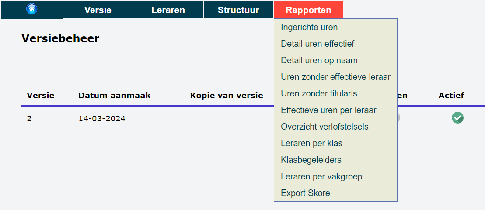

In het onderdeel 'Rapporten' heb je toegang tot heel wat bruikbare informatie zoals een overzicht van alle ingerichte uren, alle uren waarvoor nog geen leraar gevonden is, de leraren per klas, ... Daarbovenop kan je ook exports maken richting andere software.

Ga naar het menu **Rapporten** en klik op het gewenst rapport om het te raadplegen. 

:::danger noot
Het rapport 'Klasbegeleiders' (ook wel klastitularissen genoemd) geeft een overzicht van alle klasbegeleiders per klasgroep. Om dit rapport te kunnen gebruiken, moet je aan de gewenste klasgroepen één of meerdere klasbegeleiders koppelen. Klik [hier](/opdrachten/structuur/#d-klasbegeleidersklastitularissen-aanwijzen) voor meer info over het toewijzen van klasbegeleiders. 
::: 

