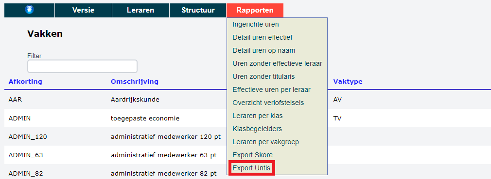

De opdrachten kunnen geëxporteerd worden naar de roosterprogramma's Untis en Mondriaan. 

### 1. Untis

Voor Untis is er een aparte export voorzien in het menu Rapporten. 

    

### 2. Mondriaan

Voor Mondriaan kan de export naar Excel gebruikt worden in het rapport 'Detail uren effectief'.  

 

