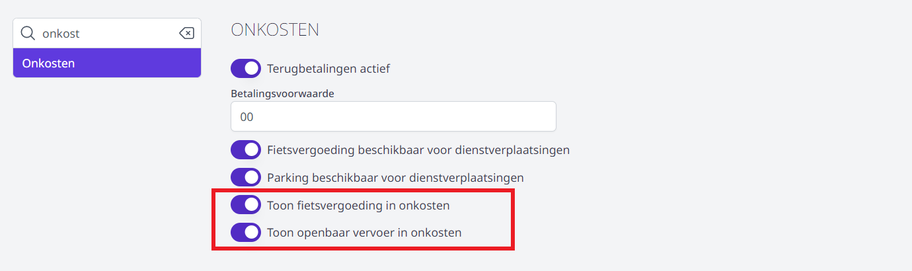
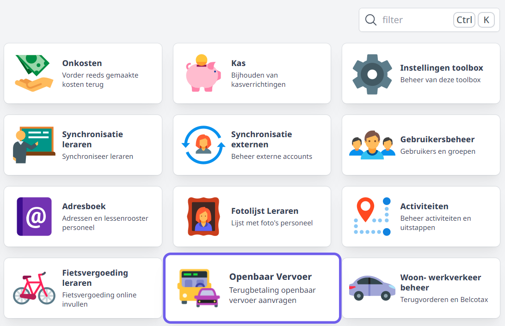
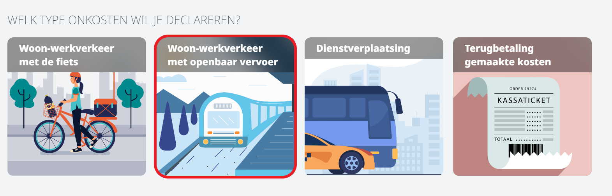
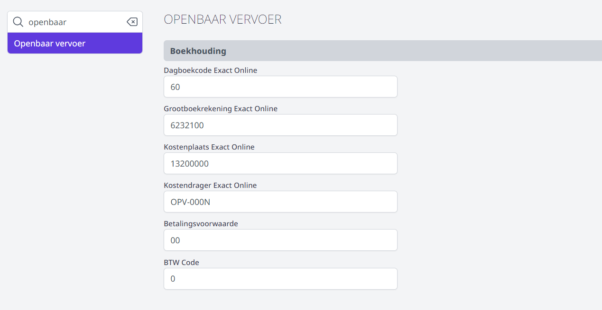

Alvorens de module Openbaar vervoer gebruikt kan worden, moet de Toolboxbeheerder enkele instellingen invullen. Dat gebeurt via de module Instellingen > Openbaar vervoer. Klik rechts bovenaan in Toolbox op het vraagteken om te achterhalen wie beheerder is in jouw Toolbox. 

## 1. Tegel Openbaar vervoer

De tegel Openbaar vervoer is voor personeelsleden op 2 manieren bereikbaar. Het is een aparte tegel in Toolbox, maar de module kan ook geopend worden via de module [Onkosten](/onkosten). Daar worden alle mogelijke aanvragen voor onkostenvergoeding gebundeld onder 1 module. De school kan zelf bepalen op welke manier hun personeelsleden de module moeten kunnen bereiken. Je kan één weg inschakelen en de andere uitschakelen, maar het is ook mogelijk om beide wegen aan te zetten. 

- **Aparte tegel**: De aparte tegel in Toolbox kan in- en uitgeschakeld worden door een beheerder via de module Instellingen > Modules. 
- **Via onkostenmodule**: Het onderdeel Openbaar vervoer (de)activeren in de onkostenmodule kan via de module Instellingen > Onkosten.  

    

**Aparte tegel in Toolbox:**

 

**Geïntegreerd in de module Onkosten:**

## 2. Algemene instellingen

Vul in de module Instellingen > 'Openbaar vervoer' de parameters uit Exact Online in. Wanneer de aanvragen uit Toolbox worden overgezet naar EOL, zullen standaard deze parameters gebruikt worden. De BTW code is steeds 0. De betalingsvoorwaarde kan 0 of 00 zijn. Welke jij moet gebruiken, kan je achterhalen in Exact Online > Stamgegevens > Relaties > Betalingsvoorwaarde. 

Grootboekrekening, kostenplaats, kostendrager en dagboek kunnen ook rechstreeks in de module Openbaar vervoer bij het beheer nog gewijzigd worden. Dit kan handig zijn voor scholen die bv. werken met verschillende kostenplaatsen voor de verschillende campussen. Klik [hier](/openbaar_vervoer/verwerking/) voor meer informatie i.v.m. de verwerking door een beheerder. 

