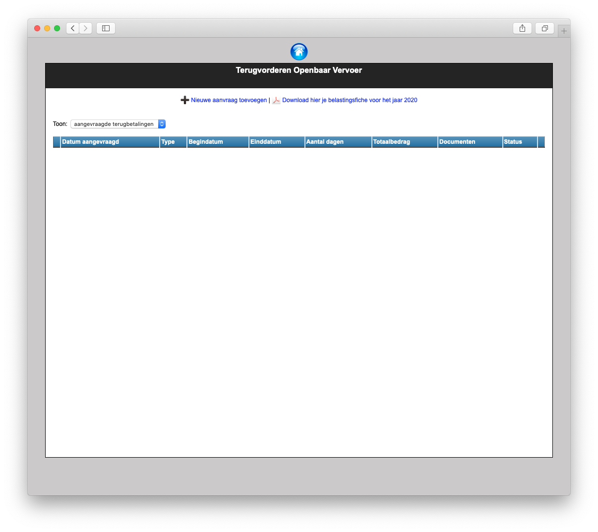
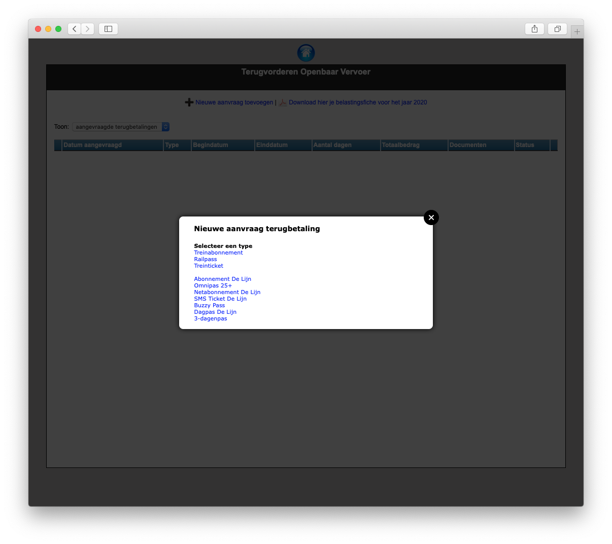
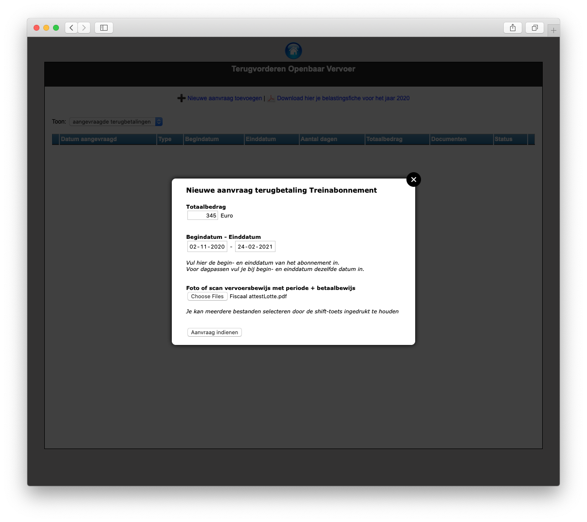
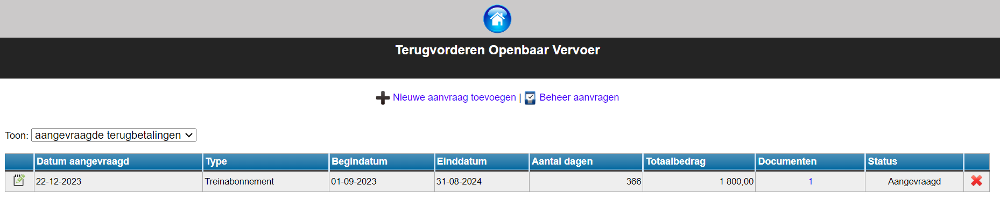
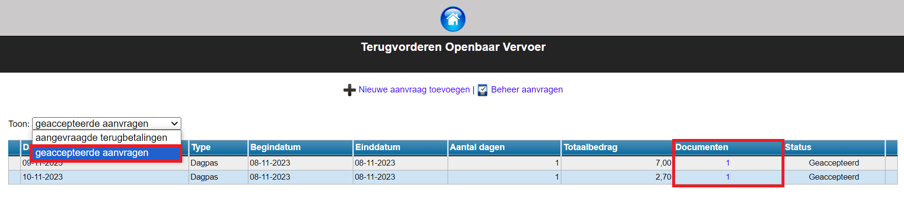

## Nieuwe aanvraag

Van zodra de module Openbaar vervoer is geactiveerd, is die voor elke Toolboxgebruiker beschikbaar. Er moeten dus geen bijkomende rechten worden ingesteld voor de eindgebruikers.

Een terugbetaling aanvragen doe je via de knop 'Nieuwe aanvraag toevoegen'. Vervolgens selecteer je het type abonnement of ticket.

In het volgende scherm vul je het bedrag van het abonnement of vervoersbewijs in. Vul ook de begin- en einddatum in. Gaat het om een dagticket, dan vul je bij begin- én einddatum dezelfde datum in.

Bij de bewijsstukken kan je een scan of foto van het vervoers- of betalingsbewijs toevoegen. Je kan hier meerdere bestanden selecteren.

Klik vervolgens op 'Aanvraag indienen' om de aanvraag te registreren. De aanvraag komt nu bij de Aangevraagde terugbetalingen te staan.

## Aanvraag opvolgen

Bij het openen van de module zie je standaard een overzicht van de aangevraagde terugbetalingen. Die zijn nog niet geaccepteerd of verwerkt. Je kan de aanvraag nog bewerken via het potloodje <LegacyAction img="edit.png"/> of volledig verwijderen via het rode kruisje <LegacyAction img="remove.png"/>.

Bij de geaccepteerde aanvragen kan je enkel nog het document raadplegen. Je kan zelf geen wijzigingen meer aanbrengen. Heb je toch een foutieve aanvraag gedaan? Verwittig dan de boekhoudkundig medewerker van je school. Een beheerder in de module kan de aanvraag nog aanpassen of verwijderen zolang ze niet is overgezet naar het boekhoudpakket. 

